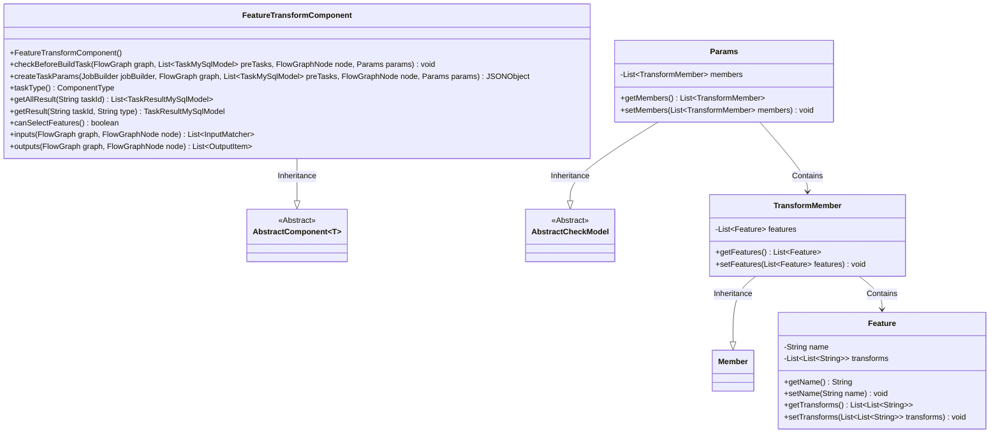
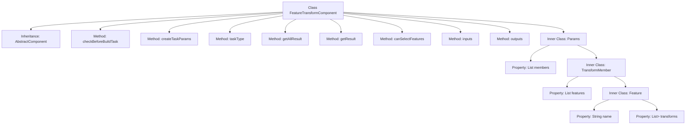
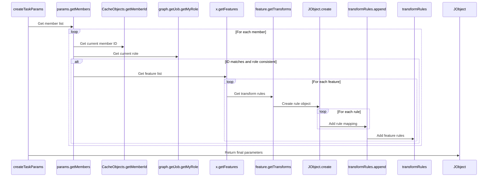

# Basic Information

|      |      |
|------|------|
| Name | FeatureTransformComponent |
| Language | .java |
| Code Path | WeFe/board/board-service/src/main/java/com/welab/wefe/board/service/component/feature/FeatureTransformComponent.java |
| Package Name | com.welab.wefe.board.service.component.feature |
| Dependencies | ['com.alibaba.fastjson.JSONObject', 'com.welab.wefe.board.service.component.base.AbstractComponent', 'com.welab.wefe.board.service.component.base.io.IODataType', 'com.welab.wefe.board.service.component.base.io.InputMatcher', 'com.welab.wefe.board.service.component.base.io.Names', 'com.welab.wefe.board.service.component.base.io.OutputItem', 'com.welab.wefe.board.service.database.entity.job.TaskMySqlModel', 'com.welab.wefe.board.service.database.entity.job.TaskResultMySqlModel', 'com.welab.wefe.board.service.dto.kernel.Member', 'com.welab.wefe.board.service.exception.FlowNodeException', 'com.welab.wefe.board.service.model.FlowGraph', 'com.welab.wefe.board.service.model.FlowGraphNode', 'com.welab.wefe.board.service.model.JobBuilder', 'com.welab.wefe.board.service.service.CacheObjects', 'com.welab.wefe.common.fieldvalidate.AbstractCheckModel', 'com.welab.wefe.common.fieldvalidate.annotation.Check', 'com.welab.wefe.common.util.JObject', 'com.welab.wefe.common.wefe.enums.ComponentType', 'org.springframework.stereotype.Service', 'java.util.Arrays', 'java.util.List'] |
| Brief Description | Feature transformation component, inherits from an abstract class, handles feature transformation tasks. Includes parameter validation, task parameter generation, and input/output definitions. Supports feature selection and transformation rule configuration, returns the transformed dataset. |

# Description

The FeatureTransformComponent is a service class that inherits from AbstractComponent and is used to handle feature transformation tasks. It includes functionalities such as parameter validation, task parameter creation, and input/output definition. The core logic resides in the createTaskParams method, which constructs a transformation rule JSON object by iterating through members and features. The Params inner class defines the structure of member information and feature transformation rules, incorporating necessary validation annotations. The component type is FeatureTransform, supports feature selection, and operates with DataSetInstance as both input and output data types.

# Class Summary

| Name   | Type  | Description |
|-------|------|-------------|
| FeatureTransformComponent | class | The FeatureTransformComponent is a component designed for handling feature transformations, inheriting from AbstractComponent. It encompasses parameter validation, task parameter generation, and input/output definitions. It supports feature selection and transformation rule configuration, outputting the transformed dataset. |

## Class FeatureTransformComponent

|      |      |
|------|------|
| Access Modifier | @Service;public |
| Type | class |
| Name | FeatureTransformComponent |
| Description | The FeatureTransformComponent is a component designed for handling feature transformations, inheriting from AbstractComponent. It encompasses parameter validation, task parameter generation, and input/output definitions. It supports feature selection and transformation rule configuration, outputting the transformed dataset. |

### UML Class Diagram

This code describes a feature transformation component (FeatureTransformComponent) that inherits from the generic abstract class AbstractComponent, primarily used for processing transformation rules of feature data. The core class Params contains a list of TransformMember, where each member contains multiple Feature objects storing the name and transformation rules (2D string list). The component serializes transformation rules into JSON format via the createTaskParams method and implements interface methods such as task type definition and input/output matching. The overall design adopts a layered structure, organizing parameter models through nested classes to support feature-level transformation rule configuration.

### Internal Method Call Graph

The flowchart illustrates the structure of the FeatureTransformComponent class, including its inheritance relationship, main methods, and the hierarchy of its inner class Params. The sequence diagram details the execution flow of the createTaskParams method, showing how member information is extracted from parameters, identity is verified, feature transformation rules are processed, and ultimately task parameter JSON objects are constructed. This component is primarily used for handling feature transformation tasks, encompassing complete parameter validation and transformation rule construction capabilities.

### Field List

| Name  | Type  | Description |
|-------|-------|------|

### Method List

| Name  | Type  | Description |
|-------|-------|------|
| getAllResult | List<TaskResultMySqlModel> | Rewrite the method getAllResult to accept the taskId parameter and return a list of TaskResultMySqlModel, currently returning null. |
| checkBeforeBuildTask | void | The override method checks the preconditions for the build task, with parameters including the flow chart, pre-task list, node, and parameters, and may throw a flow node exception. |
| getResult | TaskResultMySqlModel | The method getResult queries the result based on taskId and type, currently returning null. |
| taskType | ComponentType | Rewriting the parent class method to return the component type as feature transformation. |
| createTaskParams | JSONObject | This method creates a JSON object based on task parameters and processes feature transformation rules. It iterates through the member list, matches the current role and member ID, extracts features and their transformation mappings, and generates a transformation rule JSON. Finally, it returns the JSON object containing the transformation rules. |
| canSelectFeatures | boolean | The method canSelectFeatures returns true, indicating that feature selection is supported. |
| inputs | List<InputMatcher> | Method override, returns a list containing dataset input matchers. |
| outputs | List<OutputItem> | The method `outputs` returns a list of output items containing dataset instances, with parameters being the flowchart and nodes, and may throw a node exception. |

