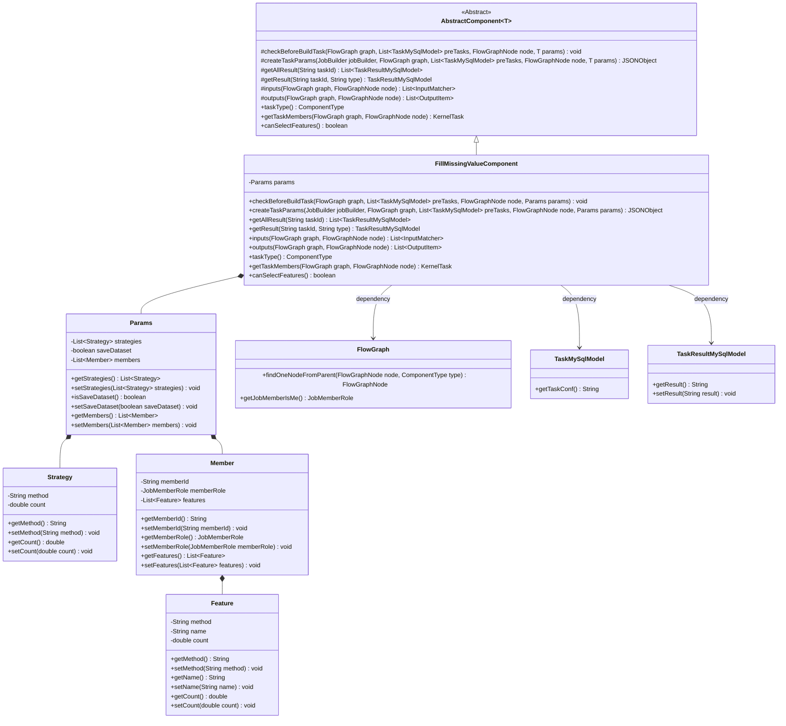
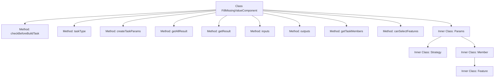
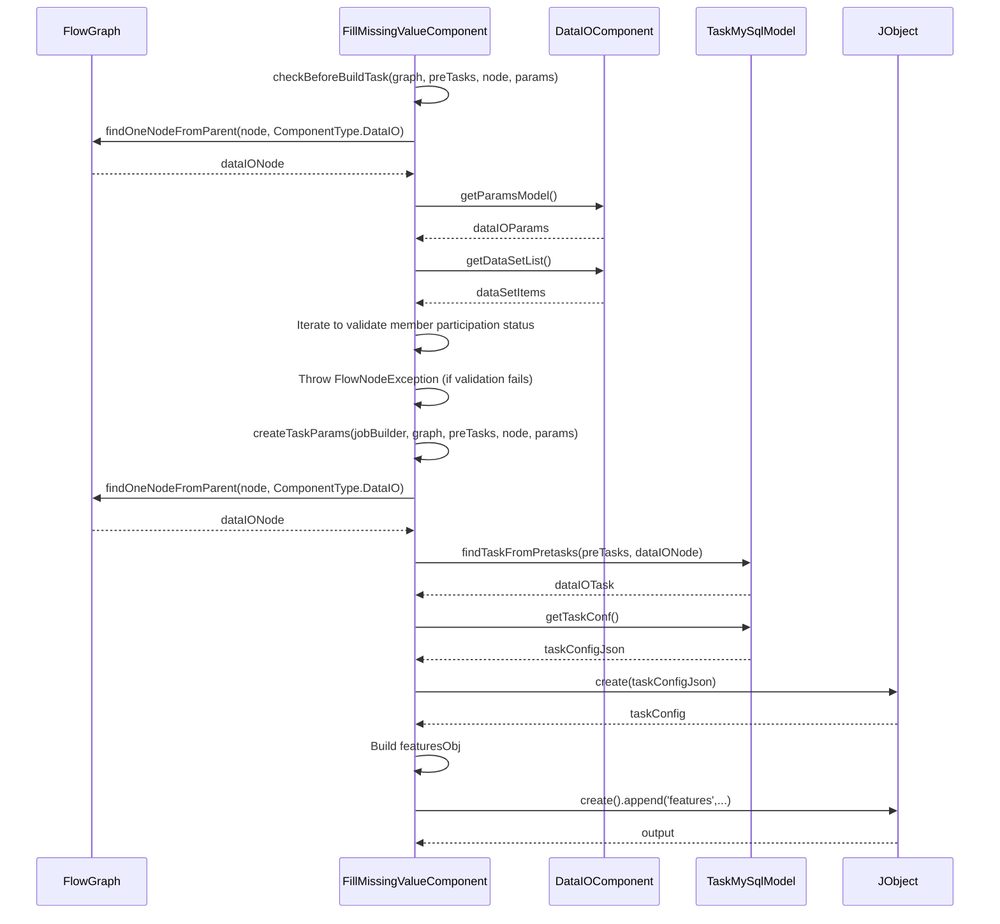

# Basic Information

|      |      |
|------|------|
| Name | FillMissingValueComponent |
| Language | .java |
| Code Path | WeFe/board/board-service/src/main/java/com/welab/wefe/board/service/component/feature/FillMissingValueComponent.java |
| Package Name | com.welab.wefe.board.service.component.feature |
| Dependencies | ['com.alibaba.fastjson.JSONObject', 'com.welab.wefe.board.service.component.DataIOComponent', 'com.welab.wefe.board.service.component.base.AbstractComponent', 'com.welab.wefe.board.service.component.base.io.IODataType', 'com.welab.wefe.board.service.component.base.io.InputMatcher', 'com.welab.wefe.board.service.component.base.io.Names', 'com.welab.wefe.board.service.component.base.io.OutputItem', 'com.welab.wefe.board.service.database.entity.job.TaskMySqlModel', 'com.welab.wefe.board.service.database.entity.job.TaskResultMySqlModel', 'com.welab.wefe.board.service.dto.kernel.Member', 'com.welab.wefe.board.service.dto.kernel.machine_learning.KernelTask', 'com.welab.wefe.board.service.exception.FlowNodeException', 'com.welab.wefe.board.service.model.FlowGraph', 'com.welab.wefe.board.service.model.FlowGraphNode', 'com.welab.wefe.board.service.model.JobBuilder', 'com.welab.wefe.board.service.service.CacheObjects', 'com.welab.wefe.common.fieldvalidate.AbstractCheckModel', 'com.welab.wefe.common.fieldvalidate.annotation.Check', 'com.welab.wefe.common.util.JObject', 'com.welab.wefe.common.web.util.ModelMapper', 'com.welab.wefe.common.wefe.enums.ComponentType', 'com.welab.wefe.common.wefe.enums.JobMemberRole', 'com.welab.wefe.common.wefe.enums.TaskResultType', 'org.apache.commons.collections4.CollectionUtils', 'org.springframework.beans.BeanUtils', 'org.springframework.stereotype.Service', 'java.util.ArrayList', 'java.util.Arrays', 'java.util.List', 'java.util.concurrent.atomic.AtomicInteger'] |
| Brief Description | The FillMissingValueComponent is a component designed for handling missing value imputation, which checks member participation and generates task parameters, supporting feature selection and dataset saving. |

# Description

FillMissingValueComponent is a service class inherited from AbstractComponent, designed to handle missing data value imputation tasks. It includes several key methods: checkBeforeBuildTask verifies whether all members participate in the task, createTaskParams generates a task parameter JSON object, getAllResult and getResult retrieve task results, inputs and outputs define input/output data types, and getTaskMembers obtains task member information. The Params inner class defines the parameter structure for strategies, members, and features, containing fields such as method, name, value, etc., with necessary validations. This class supports feature selection to ensure the integrity and correctness of data imputation operations.

# Class Summary

| Name   | Type  | Description |
|-------|------|-------------|
| FillMissingValueComponent | class | The FillMissingValueComponent is a component designed to handle missing values, check member participation, generate task parameters, and support feature selection and result processing. |

## Class FillMissingValueComponent

|      |      |
|------|------|
| Access Modifier | @Service;public |
| Type | class |
| Name | FillMissingValueComponent |
| Description | The FillMissingValueComponent is a component designed to handle missing values, check member participation, generate task parameters, and support feature selection and result processing. |

### UML Class Diagram

This code describes a FillMissingValueComponent for handling missing value imputation, which inherits from AbstractComponent and implements multiple core methods. The component manages imputation strategies (Strategy), member information (Member), and feature configurations (Feature) through the Params class, encompassing functionalities such as data validation, task parameter generation, and result processing. The class diagram illustrates the composition relationships between the component and parameter classes, along with dependencies on other core classes in the flowchart, clearly demonstrating the division of responsibilities in the data processing pipeline.

### Internal Method Call Graph

This flowchart illustrates the core structure and invocation relationships of the FillMissingValueComponent class. The main class contains 9 primary methods and 4 nested classes, with Params serving as the core configuration class encompassing three subclasses: Strategy, Member, and Feature. The sequence diagram highlights the execution flow of two key methods, checkBeforeBuildTask and createTaskParams, detailing interactions with FlowGraph and DataIOComponent, as well as parameter validation and task configuration construction processes. The overall design is tailored for missing value imputation functionality, emphasizing data validation and the integrity of task parameter generation.

### Field List

| Name  | Type  | Description |
|-------|-------|------|

### Method List

| Name  | Type  | Description |
|-------|-------|------|
| inputs | List<InputMatcher> | This method overrides the parent class method and returns a list containing a single InputMatcher, which matches the input of a dataset instance named NORMAL_DATA_SET. |
| getTaskMembers | KernelTask | The method `getTaskMembers` takes `FlowGraph` and `FlowGraphNode` as parameters, extracts the node member list, converts it into `Member` objects, sets the member names, and returns a `KernelTask`. |
| getResult | TaskResultMySqlModel | This method queries the task result based on the task ID and type, returning null if it does not exist. If it exists, it copies the attributes, processes the member information in the result, adds the member names, updates the result, and returns it. |
| checkBeforeBuildTask | void | Ensure all members participate before checking the build task. Traverse the dataset and member list, match member IDs and roles, and count the number of matches. If the match count does not equal the dataset size, throw an exception indicating all members must participate. |
| outputs | List<OutputItem> | Java method override, returns a list of output items containing dataset instances. |
| getAllResult | List<TaskResultMySqlModel> | Get a list of all results for the specified task ID. |
| taskType | ComponentType | Java method override, returns the task type for filling missing values. |
| canSelectFeatures | boolean | The method canSelectFeatures returns true, indicating that selection functionality is supported. |
| createTaskParams | JSONObject | This method creates a task parameter JSON object, checks whether the DataIO component exists and retrieves the with_label field, iterates through member features to generate a features object, and ultimately returns a JSON containing features, with_label, and save_dataset. |

