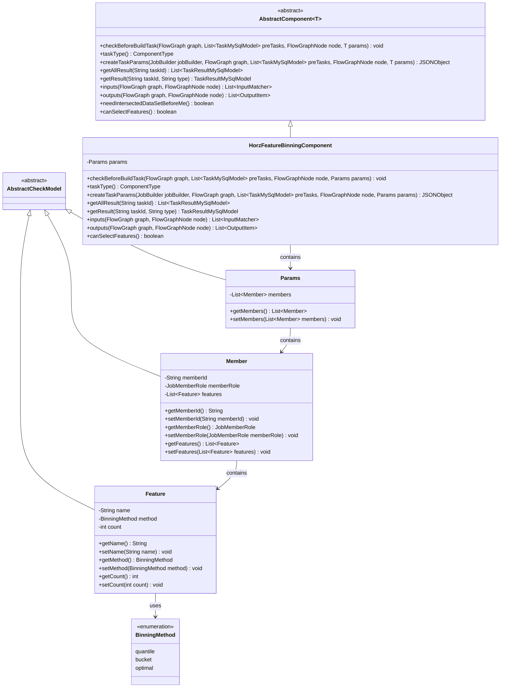
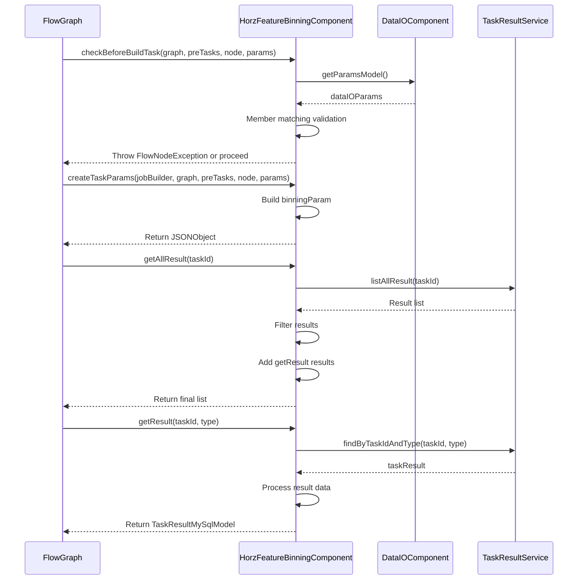

# Basic Information

|      |      |
|------|------|
| Name | HorzFeatureBinningComponent |
| Language | .java |
| Code Path | WeFe/board/board-service/src/main/java/com/welab/wefe/board/service/component/feature/HorzFeatureBinningComponent.java |
| Package Name | com.welab.wefe.board.service.component.feature |
| Dependencies | ['com.alibaba.fastjson.JSONObject', 'com.welab.wefe.board.service.component.DataIOComponent', 'com.welab.wefe.board.service.component.base.AbstractComponent', 'com.welab.wefe.board.service.component.base.io.IODataType', 'com.welab.wefe.board.service.component.base.io.InputMatcher', 'com.welab.wefe.board.service.component.base.io.Names', 'com.welab.wefe.board.service.component.base.io.OutputItem', 'com.welab.wefe.board.service.database.entity.job.TaskMySqlModel', 'com.welab.wefe.board.service.database.entity.job.TaskResultMySqlModel', 'com.welab.wefe.board.service.exception.FlowNodeException', 'com.welab.wefe.board.service.model.FlowGraph', 'com.welab.wefe.board.service.model.FlowGraphNode', 'com.welab.wefe.board.service.model.JobBuilder', 'com.welab.wefe.board.service.service.CacheObjects', 'com.welab.wefe.common.fieldvalidate.AbstractCheckModel', 'com.welab.wefe.common.fieldvalidate.annotation.Check', 'com.welab.wefe.common.util.JObject', 'com.welab.wefe.common.wefe.enums.ComponentType', 'com.welab.wefe.common.wefe.enums.JobMemberRole', 'com.welab.wefe.common.wefe.enums.TaskResultType', 'org.apache.commons.collections4.CollectionUtils', 'org.springframework.beans.BeanUtils', 'org.springframework.stereotype.Service', 'java.util.ArrayList', 'java.util.Arrays', 'java.util.List', 'java.util.concurrent.atomic.AtomicInteger', 'java.util.stream.Collectors'] |
| Brief Description | The HorzFeatureBinningComponent implements feature binning functionality, checks member participation, generates binning parameters, and supports equal frequency, equal width, and chi-square binning methods, outputting the binning model and dataset. |

# Description

The HorzFeatureBinningComponent is a Spring service component that implements horizontal feature binning functionality, inheriting from AbstractComponent. Its core capabilities include: validating parameter validity before task construction (ensuring all members participate in binning), generating binning task parameters (setting bin counts and feature names), and retrieving binning results (processing model parameters and provider outputs). The component defines three nested classes—Params, Member, and Feature—to manage binning configurations, supporting three binning methods: equal frequency, equal width, and chi-square. Input/output types are explicitly specified as dataset instances and binning models, with no requirement for pre-existing dataset intersections declared. This component allows feature selection, with its core logic revolving around member ID validation, role verification, and feature attribute processing.

# Class Summary

| Name   | Type  | Description |
|-------|------|-------------|
| HorzFeatureBinningComponent | class | The HorzFeatureBinningComponent implements feature binning functionality, checks member participation, generates binning parameters, and supports equal frequency, equal width, and chi-square binning methods, outputting both the binning model and dataset. |

## Class HorzFeatureBinningComponent

|      |      |
|------|------|
| Access Modifier | @Service;public |
| Type | class |
| Name | HorzFeatureBinningComponent |
| Description | The HorzFeatureBinningComponent implements feature binning functionality, checks member participation, generates binning parameters, and supports equal frequency, equal width, and chi-square binning methods, outputting both the binning model and dataset. |

### UML Class Diagram

This code implements a horizontal feature binning component, primarily used for binning processing in feature engineering. The class diagram illustrates the core class structure: HorzFeatureBinningComponent inherits from the generic abstract class AbstractComponent, containing the Params parameter class, Member class, and Feature class. The Feature class uses the BinningMethod enumeration to define binning methods, while Params aggregates Features through Members to form a hierarchical structure. This component implements functionalities such as task parameter construction, result processing, and input/output definitions, supporting various binning methods like quantile/equal-width/chi-square, and includes strict parameter validation logic.

### Internal Method Call Graph

```mermaid
graph TD
    A["HorzFeatureBinningComponent"]
    B["checkBeforeBuildTask"]
    C["createTaskParams"]
    D["getAllResult"]
    E["getResult"]
    F["inputs"]
    G["outputs"]
    H["needIntersectedDataSetBeforeMe"]
    I["canSelectFeatures"]

    A --> B
    A --> C
    A --> D
    A --> E
    A --> F
    A --> G
    A --> H
    A --> I

    B --> B1["Check if params.members is empty"]
    B --> B2["Get DataIOComponent parameters"]
    B --> B3["Traverse datasets and count member matches"]
    B --> B4["Validate all members participate"]

    C --> C1["Initialize JSON parameters"]
    C --> C2["Extract features by traversing members"]
    C --> C3["Build binningParam"]

    D --> D1["Filter results of model_binning type"]
    D --> D2["Add getResult results"]

    E --> E1["Query task results"]
    E --> E2["Process binningResult"]
    E --> E3["Process providerResults"]
    E --> E4["Build final result"]
```

This flowchart illustrates the core method invocation relationships of HorzFeatureBinningComponent, including key processes such as parameter validation, task parameter creation, and result retrieval. The sequence diagram details the component's interactions with external systems, particularly the data flow between FlowGraph and TaskResultService. The component primarily handles feature binning processing, encompassing member validation, binning parameter generation, and result processing to ensure the integrity and correctness of the feature binning process.

### Field List

| Name  | Type  | Description |
|-------|-------|------|

### Method List

| Name  | Type  | Description |
|-------|-------|------|
| getAllResult | List<TaskResultMySqlModel> | This method retrieves all results for the specified task ID, filters data of type model_binning, merges the results with another method, and returns a list. |
| needIntersectedDataSetBeforeMe | boolean | This method overrides the parent class logic and explicitly returns false, indicating that the current operation does not require pre-fetching the intersection dataset. |
| outputs | List<OutputItem> | The method outputs returns a list containing two OutputItems: a model named BINNING_MODEL and a dataset named NORMAL_DATA_SET. |
| inputs | List<InputMatcher> | This method returns a list containing a single InputMatcher, which matches the input of a dataset instance named NORMAL_DATA_SET. |
| checkBeforeBuildTask | void | Check preconditions for build task: Ensure the binning strategy exists and all dataset members participate, otherwise throw an exception. |
| taskType | ComponentType | This method overrides the parent class method and returns the component type as horizontal feature binning. |
| canSelectFeatures | boolean | The method returns true, indicating support for the selection feature. |
| getResult | TaskResultMySqlModel | This method queries the results based on the task ID and type, processes them, and returns the model binning results containing member information. If the results do not exist, it returns null. |
| createTaskParams | JSONObject | Method creates task parameters, iterates through member features to generate binning parameters, including the number of bins and the list of names. |

