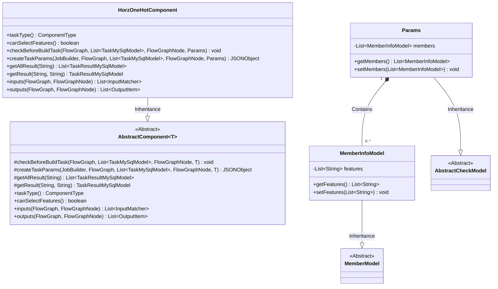
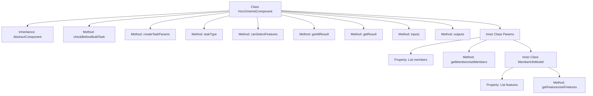

# Basic Information

|      |      |
|------|------|
| Name | HorzOneHotComponent |
| Language | .java |
| Code Path | WeFe/board/board-service/src/main/java/com/welab/wefe/board/service/component/feature/HorzOneHotComponent.java |
| Package Name | com.welab.wefe.board.service.component.feature |
| Dependencies | ['java.util.ArrayList', 'java.util.Arrays', 'java.util.List', 'org.springframework.stereotype.Service', 'com.alibaba.fastjson.JSONObject', 'com.welab.wefe.board.service.component.base.AbstractComponent', 'com.welab.wefe.board.service.component.base.io.IODataType', 'com.welab.wefe.board.service.component.base.io.InputMatcher', 'com.welab.wefe.board.service.component.base.io.Names', 'com.welab.wefe.board.service.component.base.io.OutputItem', 'com.welab.wefe.board.service.database.entity.job.TaskMySqlModel', 'com.welab.wefe.board.service.database.entity.job.TaskResultMySqlModel', 'com.welab.wefe.board.service.dto.entity.MemberModel', 'com.welab.wefe.board.service.exception.FlowNodeException', 'com.welab.wefe.board.service.model.FlowGraph', 'com.welab.wefe.board.service.model.FlowGraphNode', 'com.welab.wefe.board.service.model.JobBuilder', 'com.welab.wefe.board.service.service.CacheObjects', 'com.welab.wefe.common.fieldvalidate.AbstractCheckModel', 'com.welab.wefe.common.fieldvalidate.annotation.Check', 'com.welab.wefe.common.util.JObject', 'com.welab.wefe.common.wefe.enums.ComponentType'] |
| Brief Description | The HorzOneHotComponent implements horizontal OneHot encoding, checks member features, and generates task parameters, supporting feature selection with dataset instances as input and output. |

# Description

HorzOneHotComponent is a service class inherited from AbstractComponent, designed for handling horizontal feature one-hot encoding tasks. This class contains several key methods: checkBeforeBuildTask performs parameter validation before construction, createTaskParams generates task parameters and extracts feature column names of current members, while taskType returns the component type as HorzOneHot. The inputs and outputs methods define the input/output data types as DataSetInstance of NORMAL_DATA_SET respectively. The Params inner class encapsulates member information and feature column configurations, supporting mandatory validation. The component supports feature selection functionality, though its result retrieval method returns null values.

# Class Summary

| Name   | Type  | Description |
|-------|------|-------------|
| HorzOneHotComponent | class | HorzOneHotComponent is a component for processing horizontal OneHot encoding, inheriting from AbstractComponent. It supports feature selection, takes a dataset as input, and outputs the transformed dataset. Params include member information and feature column configuration. |

## Class HorzOneHotComponent

|      |      |
|------|------|
| Access Modifier | @Service;public |
| Type | class |
| Name | HorzOneHotComponent |
| Description | HorzOneHotComponent is a component for processing horizontal OneHot encoding, inheriting from AbstractComponent. It supports feature selection, takes a dataset as input, and outputs the transformed dataset. Params include member information and feature column configuration. |

### UML Class Diagram

This class diagram illustrates the structure of HorzOneHotComponent and its related classes. HorzOneHotComponent inherits from the generic class AbstractComponent<Params>, implementing core methods in the data processing workflow. The Params class contains multiple MemberInfoModel instances, which inherit from MemberModel and extend feature list functionality. The design employs layered abstraction, achieving code reuse through inheritance and composition, with primary functionalities including parameter validation, task parameter generation, and input/output matching.

### Internal Method Call Graph

This code demonstrates a service class named HorzOneHotComponent, which inherits from AbstractComponent and implements multiple core methods. Key functionalities include parameter validation (checkBeforeBuildTask), task parameter generation (createTaskParams), and input/output definitions (inputs/outputs). The inner class Params encapsulates member information and feature column configurations, containing a nested MemberInfoModel class to manage feature lists. This component supports feature selection (canSelectFeatures) and defines the task type for horizontal one-hot encoding (ComponentType.HorzOneHot). The overall structure reflects a component-based design philosophy, achieving specific data processing capabilities through inheritance and composition.

### Field List

| Name  | Type  | Description |
|-------|-------|------|

### Method List

| Name  | Type  | Description |
|-------|-------|------|
| checkBeforeBuildTask | void | Check the parameters and dependencies before the build task to ensure the process nodes execute properly. |
| getResult | TaskResultMySqlModel | Rewrite the method getResult to query the result based on taskId and type, currently returning null. |
| inputs | List<InputMatcher> | Method override, returns a list of input matchers containing dataset instances. |
| outputs | List<OutputItem> | The method `outputs` returns a list of output items containing dataset instances, with parameters `graph` and `node`, and may throw a `FlowNodeException`. |
| createTaskParams | JSONObject | Create task parameters by method, process member characteristics, and generate a JSON object containing transformed column names and saved datasets. |
| taskType | ComponentType | Method override, returns the one-hot encoded component type for the horizontal direction. |
| getAllResult | List<TaskResultMySqlModel> | Java method: Get the task result list based on taskId, currently returns empty. |
| canSelectFeatures | boolean | The method canSelectFeatures returns true, indicating that selection functionality is supported. |

