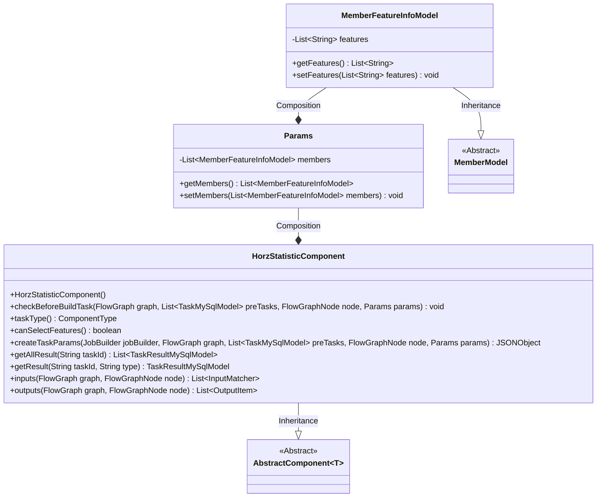
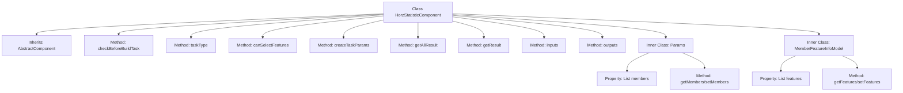

# Basic Information

|      |      |
|------|------|
| Name | HorzStatisticComponent |
| Language | .java |
| Code Path | WeFe/board/board-service/src/main/java/com/welab/wefe/board/service/component/feature/HorzStatisticComponent.java |
| Package Name | com.welab.wefe.board.service.component.feature |
| Dependencies | ['com.alibaba.fastjson.JSONObject', 'com.welab.wefe.board.service.component.base.AbstractComponent', 'com.welab.wefe.board.service.component.base.filter.OutputDataTypesOutputFilter', 'com.welab.wefe.board.service.component.base.io.IODataType', 'com.welab.wefe.board.service.component.base.io.InputMatcher', 'com.welab.wefe.board.service.component.base.io.Names', 'com.welab.wefe.board.service.component.base.io.OutputItem', 'com.welab.wefe.board.service.database.entity.job.TaskMySqlModel', 'com.welab.wefe.board.service.database.entity.job.TaskResultMySqlModel', 'com.welab.wefe.board.service.dto.entity.MemberModel', 'com.welab.wefe.board.service.exception.FlowNodeException', 'com.welab.wefe.board.service.model.FlowGraph', 'com.welab.wefe.board.service.model.FlowGraphNode', 'com.welab.wefe.board.service.model.JobBuilder', 'com.welab.wefe.board.service.service.CacheObjects', 'com.welab.wefe.common.fieldvalidate.AbstractCheckModel', 'com.welab.wefe.common.util.JObject', 'com.welab.wefe.common.wefe.enums.ComponentType', 'com.welab.wefe.common.wefe.enums.TaskResultType', 'org.apache.commons.collections4.CollectionUtils', 'org.springframework.beans.BeanUtils', 'org.springframework.stereotype.Service', 'java.util.Arrays', 'java.util.List', 'java.util.stream.Collectors'] |
| Brief Description | The HorzStatisticComponent is a component designed for handling horizontal statistical tasks, supporting feature selection, generating JSON results, and encompassing member feature processing and result formatting functionalities. |

# Description

The HorzStatisticComponent is a service class inherited from AbstractComponent, designed to handle horizontal statistical tasks. It includes functionalities such as parameter validation, task type definition, feature selection support, task parameter creation, and result retrieval and processing. Key methods involve checking prerequisite tasks, returning component types, supporting feature selection, creating task parameters, obtaining all results or individual results, and defining input-output matchers. The inner classes Params and MemberFeatureInfoModel are used to encapsulate member feature information. Result processing involves data transformation and member information supplementation. It requires NORMAL_DATA_SET type datasets as input and outputs results in JSON format.

# Class Summary

| Name   | Type  | Description |
|-------|------|-------------|
| HorzStatisticComponent | class | The HorzStatisticComponent is a component designed for horizontal statistics processing, supporting feature selection and generating JSON results, with functionalities for member feature handling and result formatting. |

## Class HorzStatisticComponent

|      |      |
|------|------|
| Access Modifier | @Service;public |
| Type | class |
| Name | HorzStatisticComponent |
| Description | The HorzStatisticComponent is a component designed for horizontal statistics processing, supporting feature selection and generating JSON results, with functionalities for member feature handling and result formatting. |

### UML Class Diagram

Class Diagram Description:
This diagram illustrates the structural relationships of HorzStatisticComponent and its associated classes. HorzStatisticComponent inherits from the generic class AbstractComponent<Params>, which incorporates the Params inner class as a parameter model. Params aggregates a list of MemberFeatureInfoModel objects. MemberFeatureInfoModel extends the abstract class MemberModel by adding a features field. The component implements core methods such as task parameter creation, result retrieval, and input/output matching, primarily used for data processing and result transformation in horizontal statistical tasks. Clear responsibility division is formed through inheritance and composition across hierarchies.

### Internal Method Call Graph

This code defines a service class named HorzStatisticComponent, which inherits from the generic AbstractComponent class, primarily used for handling horizontal statistics-related tasks. The class contains multiple core methods: creating task parameters, obtaining task results, defining input/output matchers, and two inner classes Params and MemberFeatureInfoModel for encapsulating member feature data. The createTaskParams method iterates through member feature information to generate JSON parameters, while the getResult method performs data cleaning and supplements member information for statistical results. The entire class is designed to complete feature statistics tasks in data flow processing, supporting feature selection and formatted result output.

### Field List

| Name  | Type  | Description |
|-------|-------|------|

### Method List

| Name  | Type  | Description |
|-------|-------|------|
| getAllResult | List<TaskResultMySqlModel> | Java Method: Retrieve a list of specific type results based on task ID, then merge and return them. |
| getResult | TaskResultMySqlModel | Retrieve task results based on task ID and type, handle infinite value replacement in the results, and return the result model after updating member names. |
| inputs | List<InputMatcher> | This method overrides the parent class method and returns a list containing InputMatcher, which filters matches for NORMAL_DATA_SET and the specified output type. |
| outputs | List<OutputItem> | The method `outputs` returns a list of `OutputItem` containing JSON results, with the input being `FlowGraph` and nodes. |
| taskType | ComponentType | This method overrides taskType() and returns the horizontal statistic component type HorzStatistic. |
| createTaskParams | JSONObject | The method matches the feature list based on the member ID and returns a JSON object containing feature names; if no match is found, it returns an empty object. |
| canSelectFeatures | boolean | The method canSelectFeatures returns true, indicating that selection functionality is supported. |
| checkBeforeBuildTask | void | The method checks the conditions before building the task, with parameters including the flowchart, pre-task list, node, and parameters, and may throw a process node exception. |

