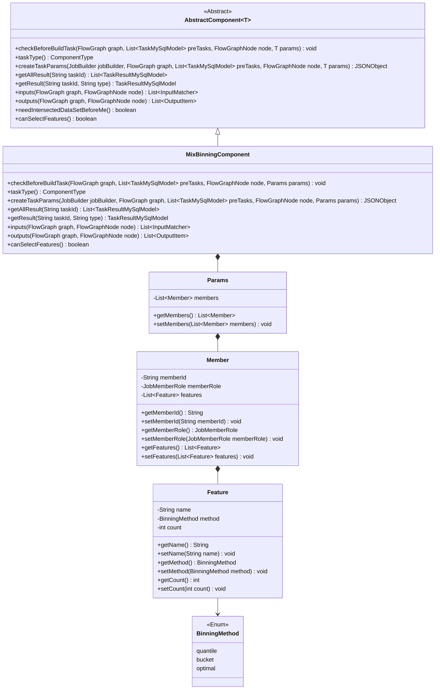
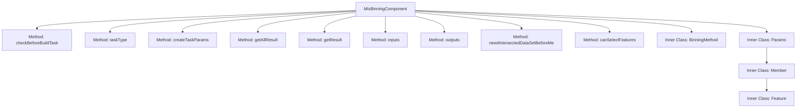
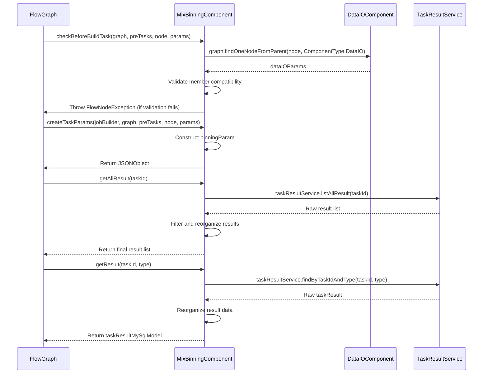

# Basic Information

|      |      |
|------|------|
| Name | MixBinningComponent |
| Language | .java |
| Code Path | WeFe/board/board-service/src/main/java/com/welab/wefe/board/service/component/feature/MixBinningComponent.java |
| Package Name | com.welab.wefe.board.service.component.feature |
| Dependencies | ['com.alibaba.fastjson.JSONObject', 'com.welab.wefe.board.service.component.DataIOComponent', 'com.welab.wefe.board.service.component.base.AbstractComponent', 'com.welab.wefe.board.service.component.base.io.IODataType', 'com.welab.wefe.board.service.component.base.io.InputMatcher', 'com.welab.wefe.board.service.component.base.io.Names', 'com.welab.wefe.board.service.component.base.io.OutputItem', 'com.welab.wefe.board.service.database.entity.job.TaskMySqlModel', 'com.welab.wefe.board.service.database.entity.job.TaskResultMySqlModel', 'com.welab.wefe.board.service.exception.FlowNodeException', 'com.welab.wefe.board.service.model.FlowGraph', 'com.welab.wefe.board.service.model.FlowGraphNode', 'com.welab.wefe.board.service.model.JobBuilder', 'com.welab.wefe.board.service.service.CacheObjects', 'com.welab.wefe.common.fieldvalidate.AbstractCheckModel', 'com.welab.wefe.common.fieldvalidate.annotation.Check', 'com.welab.wefe.common.util.JObject', 'com.welab.wefe.common.wefe.enums.ComponentType', 'com.welab.wefe.common.wefe.enums.JobMemberRole', 'com.welab.wefe.common.wefe.enums.TaskResultType', 'org.apache.commons.collections4.CollectionUtils', 'org.springframework.beans.BeanUtils', 'org.springframework.stereotype.Service', 'java.util.ArrayList', 'java.util.Arrays', 'java.util.List', 'java.util.concurrent.atomic.AtomicInteger', 'java.util.stream.Collectors'] |
| Brief Description | The MixBinningComponent is a component that handles binning strategies, checking member participation and generating binning parameters, supporting various binning methods such as equal frequency, equal width, and chi-square. |

# Description

The MixBinningComponent is a service class that inherits from AbstractComponent and is used for handling mixed binning tasks. It contains several key methods: checkBeforeBuildTask validates binning strategies and member participation; createTaskParams generates binning parameters; getAllResult and getResult process task results; inputs and outputs define input and output. The inner classes Params, Member, and Feature encapsulate binning parameters, member information, and feature attributes respectively, supporting equal frequency, equal width, and chi-square binning methods. This class also provides feature selection functionality.

# Class Summary

| Name   | Type  | Description |
|-------|------|-------------|
| MixBinningComponent | class | The MixBinningComponent is a component that handles binning strategies, checks member participation, and generates binning parameters, supporting various binning methods such as equal frequency, equal width, and chi-square. |

## Class MixBinningComponent

|      |      |
|------|------|
| Access Modifier | @Service;public |
| Type | class |
| Name | MixBinningComponent |
| Description | The MixBinningComponent is a component that handles binning strategies, checks member participation, and generates binning parameters, supporting various binning methods such as equal frequency, equal width, and chi-square. |

### UML Class Diagram

This class diagram illustrates the structure of MixBinningComponent and its related classes. MixBinningComponent inherits from AbstractComponent and implements core logic for data binning functionality. It contains the Params inner class as a parameter container, which in turn consists of Member and Feature classes, forming a multi-level nested structure. The BinningMethod enum defines three binning methods. The relationships between classes include inheritance, composition, and association, clearly demonstrating the data flow and dependencies of the component. This component is primarily responsible for validating member participation, creating binning task parameters, processing task results, and defining input/output data formats.

### Internal Method Call Graph

This flowchart illustrates the complete structure of the MixBinningComponent class, including 9 main methods and 4 inner classes. The sequence diagram highlights three core interaction processes: 1) Pre-build parameter validation involving DataIOComponent; 2) Task parameter creation process; 3) Result retrieval process demonstrating interaction with TaskResultService. The class structure clearly presents the core components of the binning functionality, covering three main modules: parameter validation, task creation, and result processing, along with necessary enumerations and parameter model definitions.

### Field List

| Name  | Type  | Description |
|-------|-------|------|

### Method List

| Name  | Type  | Description |
|-------|-------|------|
| getResult | TaskResultMySqlModel | This method queries results based on task ID and type, processes model binning data, and returns them after supplementing member information. Returns null if the result is empty. |
| canSelectFeatures | boolean | The method canSelectFeatures returns true, indicating that feature selection is supported. |
| needIntersectedDataSetBeforeMe | boolean | The method `needIntersectedDataSetBeforeMe` returns false, indicating no need for a pre-intersected data set. |
| outputs | List<OutputItem> | The method returns two output items: BINNING_MODEL of type ModelFromBinning, and NORMAL_DATA_SET of type DataSetInstance. |
| inputs | List<InputMatcher> | This method overrides the parent class method and returns a list containing a single InputMatcher, which matches the dataset instance named NORMAL_DATA_SET. |
| getAllResult | List<TaskResultMySqlModel> | This method retrieves the model binning results for a specified task ID, first filters existing results, then adds newly assembled data, and finally returns the merged list. |
| createTaskParams | JSONObject | The method generates a JSON object based on input parameters, containing `bin_num` and `bin_names`. `bin_num` defaults to 10, but updates to the number of features if the member ID matches, while `bin_names` is derived from the member's feature name list. |
| checkBeforeBuildTask | void | Check preconditions for build task: Ensure binning policy members exactly match dataset members, otherwise throw an exception. |
| taskType | ComponentType | This method returns an enumeration value with the task type of MixBinning. |

