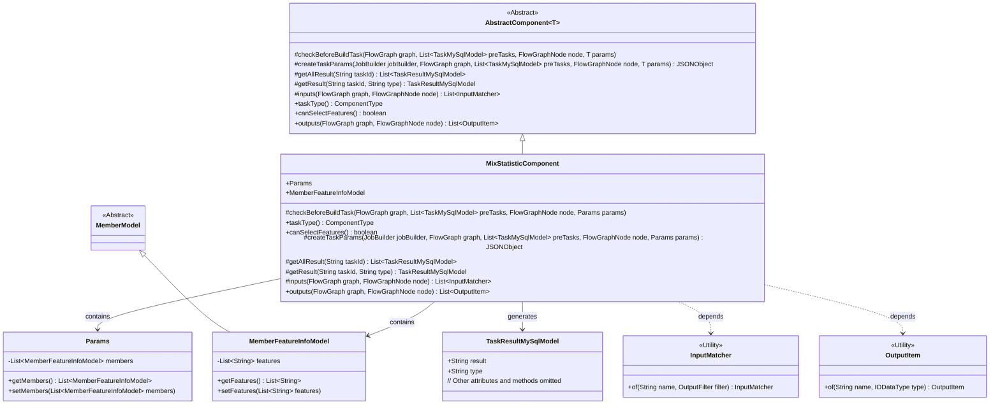

# Basic Information

|      |      |
|------|------|
| Name | MixStatisticComponent |
| Language | .java |
| Code Path | WeFe/board/board-service/src/main/java/com/welab/wefe/board/service/component/feature/MixStatisticComponent.java |
| Package Name | com.welab.wefe.board.service.component.feature |
| Dependencies | ['com.alibaba.fastjson.JSONObject', 'com.welab.wefe.board.service.component.base.AbstractComponent', 'com.welab.wefe.board.service.component.base.filter.OutputDataTypesOutputFilter', 'com.welab.wefe.board.service.component.base.io.IODataType', 'com.welab.wefe.board.service.component.base.io.InputMatcher', 'com.welab.wefe.board.service.component.base.io.Names', 'com.welab.wefe.board.service.component.base.io.OutputItem', 'com.welab.wefe.board.service.database.entity.job.TaskMySqlModel', 'com.welab.wefe.board.service.database.entity.job.TaskResultMySqlModel', 'com.welab.wefe.board.service.dto.entity.MemberModel', 'com.welab.wefe.board.service.model.FlowGraph', 'com.welab.wefe.board.service.model.FlowGraphNode', 'com.welab.wefe.board.service.model.JobBuilder', 'com.welab.wefe.board.service.service.CacheObjects', 'com.welab.wefe.common.fieldvalidate.AbstractCheckModel', 'com.welab.wefe.common.util.JObject', 'com.welab.wefe.common.wefe.enums.ComponentType', 'com.welab.wefe.common.wefe.enums.TaskResultType', 'org.apache.commons.collections4.CollectionUtils', 'org.springframework.beans.BeanUtils', 'org.springframework.stereotype.Service', 'java.util.Arrays', 'java.util.List', 'java.util.stream.Collectors'] |
| Brief Description | The MixStatisticComponent is a component designed for handling mixed statistics, inheriting from AbstractComponent. It supports feature selection, generates JSON results, and includes logic for member feature processing and result reorganization. |

# Description

The MixStatisticComponent is a service class that inherits from AbstractComponent and is designed to handle mixed statistical tasks. It overrides multiple methods, including task type definition, feature selection support, task parameter creation, and result retrieval and processing. This class contains two inner classes, Params and MemberFeatureInfoModel, which are used to encapsulate member feature information. Its primary functionalities include filtering features based on member IDs, processing task result data (such as replacing special values and adding member names), and defining input and output data types. The component supports data feature statistics and can output processed results in JSON format.

# Class Summary

| Name   | Type  | Description |
|-------|------|-------------|
| MixStatisticComponent | class | The MixStatisticComponent is a component designed for handling mixed statistical tasks, supporting feature selection, generating JSON results, and incorporating member feature processing and result reorganization functionalities. |

## Class MixStatisticComponent

|      |      |
|------|------|
| Access Modifier | @Service;public |
| Type | class |
| Name | MixStatisticComponent |
| Description | The MixStatisticComponent is a component designed for handling mixed statistical tasks, supporting feature selection, generating JSON results, and incorporating member feature processing and result reorganization functionalities. |

### UML Class Diagram

This code implements a mixed statistics component `MixStatisticComponent`, which inherits from the generic abstract class `AbstractComponent` and is primarily used for handling feature statistics tasks. The class diagram illustrates the core class structure: `MixStatisticComponent` encapsulates parameters through inner classes `Params` and `MemberFeatureInfoModel`, inherits template methods from `AbstractComponent`, and interacts with auxiliary classes such as `TaskResultMySqlModel` and `InputMatcher`. The component supports feature selection, generates statistical results in JSON format, and handles special value conversions and member information supplementation.

### Internal Method Call Graph

```mermaid
graph TD
    A["Class MixStatisticComponent"]
    B["Inheritance: AbstractComponent<Params>"]
    C["Method: checkBeforeBuildTask"]
    D["Method: taskType --> Returns ComponentType.MixStatistic"]
    E["Method: canSelectFeatures --> Returns true"]
    F["Method: createTaskParams"]
    G["Method: getAllResult"]
    H["Method: getResult"]
    I["Method: inputs"]
    J["Method: outputs"]
    K["Inner Class: Params"]
    L["Inner Class: MemberFeatureInfoModel"]

    A --> B
    A --> C
    A --> D
    A --> E
    A --> F
    A --> G
    A --> H
    A --> I
    A --> J
    A --> K
    A --> L

    F --> F1["Filter params.members for current members"]
    F --> F2["Create JObject containing member features"]
    G --> G1["Filter taskResultService.listAllResult"]
    G --> G2["Add reorganized data to result list"]
    H --> H1["Query taskResult"]
    H --> H2["Process Infinity values"]
    H --> H3["Add member_name to result"]
    I --> I1["Return InputMatcher list"]
    J --> J1["Return OutputItem list"]
    K --> K1["Property: List<MemberFeatureInfoModel> members"]
    L --> L1["Extends MemberModel"]
    L --> L2["Property: List<String> features"]
```

This code implements a mixed statistics component with core functionalities including task parameter creation, result data processing, and input/output type definitions. The flowchart illustrates class inheritance relationships, core method call chains, and the structure of two inner classes. The component constructs task parameters via the createTaskParams method, processes statistical results containing Infinity values through the getResult method, and supplements member name information. The input/output methods define data flow specifications, while the Params and MemberFeatureInfoModel inner classes encapsulate member feature data. The overall design reflects the integration of data processing and type safety.

### Field List

| Name  | Type  | Description |
|-------|-------|------|

### Method List

| Name  | Type  | Description |
|-------|-------|------|
| canSelectFeatures | boolean | The method canSelectFeatures returns true, indicating that feature selection is supported. |
| getAllResult | List<TaskResultMySqlModel> | This method retrieves the data feature statistics for a specified task ID, first filters existing results, then adds and reorganizes the data, and finally returns the merged list. |
| checkBeforeBuildTask | void | The method `checkBeforeBuildTask` is used for pre-build task checks, with parameters including the flowchart, pre-task list, node, and parameters. |
| taskType | ComponentType | This method overrides taskType() and returns the ComponentType enum value of MixStatistic type. |
| createTaskParams | JSONObject | Method override, filter feature information based on member ID and return a JSON object containing the feature list. |
| getResult | TaskResultMySqlModel | The method queries results based on task ID and type, handles infinite value substitution in the results, and returns them after updating member names. |
| inputs | List<InputMatcher> | Method override, returns a list containing input matchers that match the normal dataset and specified output data type filter. |
| outputs | List<OutputItem> | The method outputs returns a list of OutputItems containing JSON results. |

