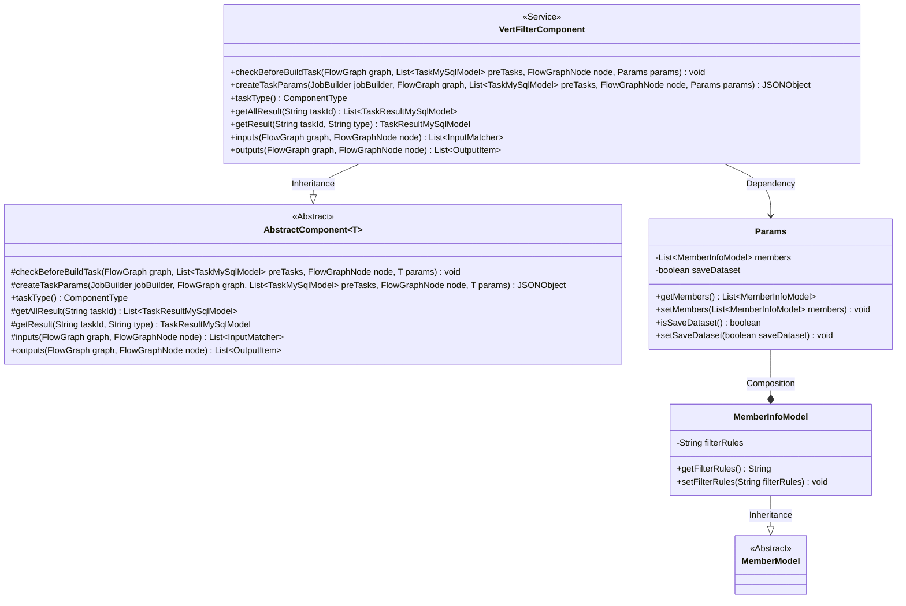
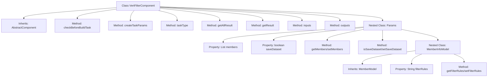

# Basic Information

|      |      |
|------|------|
| Name | VertFilterComponent |
| Language | .java |
| Code Path | WeFe/board/board-service/src/main/java/com/welab/wefe/board/service/component/feature/VertFilterComponent.java |
| Package Name | com.welab.wefe.board.service.component.feature |
| Dependencies | ['com.alibaba.fastjson.JSONObject', 'com.welab.wefe.board.service.component.base.AbstractComponent', 'com.welab.wefe.board.service.component.base.io.IODataType', 'com.welab.wefe.board.service.component.base.io.InputMatcher', 'com.welab.wefe.board.service.component.base.io.Names', 'com.welab.wefe.board.service.component.base.io.OutputItem', 'com.welab.wefe.board.service.database.entity.job.TaskMySqlModel', 'com.welab.wefe.board.service.database.entity.job.TaskResultMySqlModel', 'com.welab.wefe.board.service.dto.entity.MemberModel', 'com.welab.wefe.board.service.exception.FlowNodeException', 'com.welab.wefe.board.service.model.FlowGraph', 'com.welab.wefe.board.service.model.FlowGraphNode', 'com.welab.wefe.board.service.model.JobBuilder', 'com.welab.wefe.board.service.service.CacheObjects', 'com.welab.wefe.common.fieldvalidate.annotation.Check', 'com.welab.wefe.common.util.JObject', 'com.welab.wefe.common.web.dto.AbstractApiInput', 'com.welab.wefe.common.wefe.enums.ComponentType', 'com.welab.wefe.common.wefe.enums.TaskResultType', 'org.apache.commons.lang3.StringUtils', 'org.springframework.stereotype.Service', 'java.util.Arrays', 'java.util.List'] |
| Brief Description | The VertFilterComponent is a service component designed to handle vertical filtering tasks. It inherits from AbstractComponent and includes functionalities such as parameter validation, task parameter creation, and input/output definition. The Params class defines parameters including member information and filtering rules. |

# Description

VertFilterComponent is a service class that inherits from AbstractComponent, designed to handle vertical filtering tasks. It includes functionalities such as parameter validation, task parameter creation, task type definition, result retrieval, and input-output matching. The Params inner class defines member information and parameters for whether to save derived datasets, where MemberInfoModel extends MemberModel and includes filtering rule fields. The component constructs task parameters via the createTaskParams method, generating JSON objects based on member roles and filtering rules. The input requires dataset instances of type NORMAL_DATA_SET, and the output is also dataset instances of the same type.

# Class Summary

| Name   | Type  | Description |
|-------|------|-------------|
| VertFilterComponent | class | The VertFilterComponent is a component that handles vertical filtering, inheriting from AbstractComponent, and includes functions such as parameter checking, task parameter creation, and input/output definition. The Params class contains member information and filtering rules, supporting the saving of derived datasets. |

## Class VertFilterComponent

|      |      |
|------|------|
| Access Modifier | @Service;public |
| Type | class |
| Name | VertFilterComponent |
| Description | The VertFilterComponent is a component that handles vertical filtering, inheriting from AbstractComponent, and includes functions such as parameter checking, task parameter creation, and input/output definition. The Params class contains member information and filtering rules, supporting the saving of derived datasets. |

### UML Class Diagram

Class Diagram Description:
VertFilterComponent is a service class that inherits from the generic abstract class AbstractComponent<Params>, implementing core logic for data filtering. It contains an inner Params class to encapsulate member information and filtering rule parameters, where Params further nests the MemberInfoModel class (inherited from MemberModel) to store member-specific filtering rules. By overriding parent class methods, this class implements functionalities such as task parameter construction and input/output definition, primarily handling dataset filtering operations with support for rule configuration and result persistence.

### Internal Method Call Graph

This code demonstrates the VertFilterComponent class, which inherits from AbstractComponent and implements multiple core methods. The class is primarily used for handling vertical filtering tasks, including parameter validation, task parameter creation, and result retrieval. The internal Params class defines member information and dataset saving flags, while MemberInfoModel extends filtering rule functionality. The flowchart clearly illustrates class inheritance relationships, method call chains, and nested class hierarchies, reflecting component-based design principles.

### Field List

| Name  | Type  | Description |
|-------|-------|------|

### Method List

| Name  | Type  | Description |
|-------|-------|------|
| createTaskParams | JSONObject | This method creates a JSON object based on task parameters, including the dataset saving flag and filtering rules for current members. |
| getAllResult | List<TaskResultMySqlModel> | Override the method `getAllResult`, which takes the `taskId` parameter and returns an empty list. |
| checkBeforeBuildTask | void | Check the preconditions for the build task to ensure that the nodes and prerequisite tasks in the flowchart meet the requirements. |
| inputs | List<InputMatcher> | Java method override, returns a list of input matchers containing dataset instances. |
| outputs | List<OutputItem> | The method outputs returns a list containing OutputItems, where each OutputItem consists of Names.Data.NORMAL_DATA_SET and IODataType.DataSetInstance. |
| taskType | ComponentType | Method override, returns component type as vertical filter. |
| getResult | TaskResultMySqlModel | The method retrieves results based on the task ID and type. If the type is empty, it defaults to metric_train and returns the query results. |

