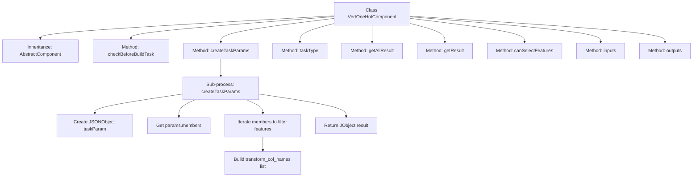

# Basic Information

|      |      |
|------|------|
| Name | VertOneHotComponent |
| Language | .java |
| Code Path | WeFe/board/board-service/src/main/java/com/welab/wefe/board/service/component/feature/VertOneHotComponent.java |
| Package Name | com.welab.wefe.board.service.component.feature |
| Dependencies | ['java.util.ArrayList', 'java.util.Arrays', 'java.util.List', 'org.springframework.stereotype.Service', 'com.alibaba.fastjson.JSONObject', 'com.welab.wefe.board.service.component.base.AbstractComponent', 'com.welab.wefe.board.service.component.base.io.IODataType', 'com.welab.wefe.board.service.component.base.io.InputMatcher', 'com.welab.wefe.board.service.component.base.io.Names', 'com.welab.wefe.board.service.component.base.io.OutputItem', 'com.welab.wefe.board.service.database.entity.job.TaskMySqlModel', 'com.welab.wefe.board.service.database.entity.job.TaskResultMySqlModel', 'com.welab.wefe.board.service.exception.FlowNodeException', 'com.welab.wefe.board.service.model.FlowGraph', 'com.welab.wefe.board.service.model.FlowGraphNode', 'com.welab.wefe.board.service.model.JobBuilder', 'com.welab.wefe.board.service.service.CacheObjects', 'com.welab.wefe.common.util.JObject', 'com.welab.wefe.common.wefe.enums.ComponentType'] |
| Brief Description | VertOneHotComponent inherits from AbstractComponent, implements feature transformation logic, supports feature selection, with dataset instances as input and output. |

# Description

VertOneHotComponent is a service class inherited from AbstractComponent, designed to handle vertical one-hot encoding tasks. It overrides multiple methods, including parameter validation, task parameter creation, and input/output definitions. In the createTaskParams method, it filters feature columns based on member information and roles, generating JSON parameters that include transformation column names and saved datasets. This class supports feature selection, defines the input/output types of datasets, and returns the specific component type VertOneHot. The result retrieval method returns null and requires further implementation.

# Class Summary

| Name   | Type  | Description |
|-------|------|-------------|
| VertOneHotComponent | class | VertOneHotComponent inherits from AbstractComponent, implements feature column name conversion task parameter generation, supports feature selection, with dataset instances as input and output. |


## Class VertOneHotComponent

|      |      |
|------|------|
| Access Modifier | @Service;public |
| Type | class |
| Name | VertOneHotComponent |
| Description | VertOneHotComponent inherits from AbstractComponent, implements feature column name conversion task parameter generation, supports feature selection, with dataset instances as input and output. |


### UML Class Diagram

```mermaid
classDiagram
    class AbstractComponent~T~ {
        <<Abstract>>
        #checkBeforeBuildTask(FlowGraph graph, List~TaskMySqlModel~ preTasks, FlowGraphNode node, T params) void
        #createTaskParams(JobBuilder jobBuilder, FlowGraph graph, List~TaskMySqlModel~ preTasks, FlowGraphNode node, T params) JSONObject
        #getAllResult(String taskId) List~TaskResultMySqlModel~
        #getResult(String taskId, String type) TaskResultMySqlModel
        #inputs(FlowGraph graph, FlowGraphNode node) List~InputMatcher~
        #outputs(FlowGraph graph, FlowGraphNode node) List~OutputItem~
        +taskType() ComponentType
        +canSelectFeatures() boolean
    }

    class VertOneHotComponent {
        +taskType() ComponentType
        +canSelectFeatures() boolean
    }

    class HorzOneHotComponent {
        <<InnerClass>>
        class Params {
            +getMembers() List~MemberInfoModel~
        }
        <<InnerClass>>
        class MemberInfoModel {
            +getMemberId() String
            +getMemberRole() RoleType
            +getFeatures() List~String~
        }
    }

    class FlowGraph {
        +getJob() Job
    }

    class Job {
        +getMyRole() RoleType
    }

    class InputMatcher {
        <<Static>>
        +of(String name, IODataType type) InputMatcher
    }

    class OutputItem {
        <<Static>>
        +of(String name, IODataType type) OutputItem
    }

    AbstractComponent~HorzOneHotComponent.Params~ <|-- VertOneHotComponent
    VertOneHotComponent --> HorzOneHotComponent.Params : uses
    VertOneHotComponent --> FlowGraph : depends
    VertOneHotComponent --> InputMatcher : creates
    VertOneHotComponent --> OutputItem : creates
    FlowGraph --> Job : contains
```

This class diagram illustrates that VertOneHotComponent inherits from the generic class AbstractComponent and implements multiple abstract methods. The class primarily handles vertical One-Hot encoding tasks, retrieving job information through FlowGraph and utilizing member data from HorzOneHotComponent.Params for feature transformation. Key functionalities include parameter validation, task parameter generation, and input/output matching, reflecting a typical design pattern for data preprocessing components in federated learning scenarios.


### Internal Method Call Graph



This flowchart illustrates the complete structure of the VertOneHotComponent class, with emphasis on the internal processing logic of the createTaskParams method. The class inherits from AbstractComponent and implements 8 core methods. The createTaskParams method involves a detailed data processing flow: first creating a JSON object, then retrieving member information, filtering feature columns through conditions, and finally constructing a result object containing transformed column names and save flags. Other methods such as input-output matching and task type definition are also displayed as independent nodes, fully presenting the functional architecture of this component.

### Field List

| Name  | Type  | Description |
|-------|-------|------|

### Method List

| Name  | Type  | Description |
|-------|-------|------|
| canSelectFeatures | boolean | The method returns true, indicating support for the selective feature functionality. |
| inputs | List<InputMatcher> | Method override, returns a list of input matchers containing dataset instances. |
| checkBeforeBuildTask | void | Check the parameters and dependencies before the build task to ensure the process nodes are executed correctly. |
| getAllResult | List<TaskResultMySqlModel> | This is a Java method that overrides the parent class method, returning a list of all task results for the specified taskId, currently returning null. |
| createTaskParams | JSONObject | This method creates parameters for the task, extracts member feature column names, and generates a JSON object containing the transformed column names and the saved dataset. |
| getResult | TaskResultMySqlModel | The method `getResult` queries the result based on `taskId` and `type`, returning a `TaskResultMySqlModel`. The current implementation returns `null`. |
| taskType | ComponentType | This method overrides the parent class method and returns the component type as VertOneHot. |
| outputs | List<OutputItem> | Method override, returns a list of output items containing dataset instances. |


