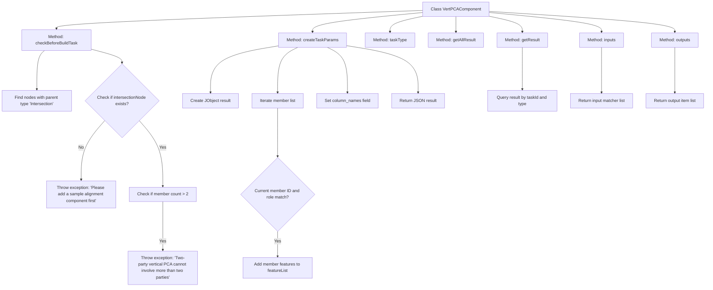

# Basic Information

|      |      |
|------|------|
| Name | VertPCAComponent |
| Language | .java |
| Code Path | WeFe/board/board-service/src/main/java/com/welab/wefe/board/service/component/feature/VertPCAComponent.java |
| Package Name | com.welab.wefe.board.service.component.feature |
| Dependencies | ['com.alibaba.fastjson.JSONObject', 'com.welab.wefe.board.service.component.base.AbstractComponent', 'com.welab.wefe.board.service.component.base.io.IODataType', 'com.welab.wefe.board.service.component.base.io.InputMatcher', 'com.welab.wefe.board.service.component.base.io.Names', 'com.welab.wefe.board.service.component.base.io.OutputItem', 'com.welab.wefe.board.service.database.entity.job.TaskMySqlModel', 'com.welab.wefe.board.service.database.entity.job.TaskResultMySqlModel', 'com.welab.wefe.board.service.exception.FlowNodeException', 'com.welab.wefe.board.service.model.FlowGraph', 'com.welab.wefe.board.service.model.FlowGraphNode', 'com.welab.wefe.board.service.model.JobBuilder', 'com.welab.wefe.board.service.service.CacheObjects', 'com.welab.wefe.common.util.JObject', 'com.welab.wefe.common.wefe.enums.ComponentType', 'com.welab.wefe.common.wefe.enums.TaskResultType', 'org.springframework.stereotype.Service', 'java.util.ArrayList', 'java.util.Arrays', 'java.util.List'] |
| Brief Description | VertPCAComponent is a vertical PCA component that checks pre-sample alignment and ensures the number of participants does not exceed two parties. It generates feature list task parameters, takes a dataset as input, and outputs JSON results. |

# Description

VertPCAComponent is a service class that inherits from AbstractComponent, designed to implement vertical PCA (Principal Component Analysis) functionality. Before constructing a task, this class performs two checks: ensuring the presence of a sample alignment component in the preceding workflow and verifying that no more than two parties are participating. When creating task parameters, it collects the feature lists of current members and encapsulates them as a JSON object. The task type defined by this component is VertPCA, with normal datasets as input requirements and JSON-formatted results as output. Result queries support retrieving specific types of statistical metric results by task ID.

# Class Summary

| Name   | Type  | Description |
|-------|------|-------------|
| VertPCAComponent | class | VertPCAComponent is a vertical PCA component that checks sample alignment and member count, generates feature list task parameters, takes a dataset as input, and outputs JSON results. |


## Class VertPCAComponent

|      |      |
|------|------|
| Access Modifier | @Service;public |
| Type | class |
| Name | VertPCAComponent |
| Description | VertPCAComponent is a vertical PCA component that checks sample alignment and member count, generates feature list task parameters, takes a dataset as input, and outputs JSON results. |


### UML Class Diagram

```mermaid
classDiagram
    class AbstractComponent~T~ {
        <<Abstract>>
        #checkBeforeBuildTask(FlowGraph graph, List~TaskMySqlModel~ preTasks, FlowGraphNode node, T params) void
        #createTaskParams(JobBuilder jobBuilder, FlowGraph graph, List~TaskMySqlModel~ preTasks, FlowGraphNode node, T params) JSONObject
        +taskType() ComponentType
        #getAllResult(String taskId) List~TaskResultMySqlModel~
        #getResult(String taskId, String type) TaskResultMySqlModel
        #inputs(FlowGraph graph, FlowGraphNode node) List~InputMatcher~
        +outputs(FlowGraph graph, FlowGraphNode node) List~OutputItem~
    }

    class VertPCAComponent {
        +checkBeforeBuildTask(FlowGraph graph, List~TaskMySqlModel~ preTasks, FlowGraphNode node, HorzOneHotComponent.Params params) void
        +createTaskParams(JobBuilder jobBuilder, FlowGraph graph, List~TaskMySqlModel~ preTasks, FlowGraphNode node, HorzOneHotComponent.Params params) JSONObject
        +taskType() ComponentType
        +getAllResult(String taskId) List~TaskResultMySqlModel~
        +getResult(String taskId, String type) TaskResultMySqlModel
        +inputs(FlowGraph graph, FlowGraphNode node) List~InputMatcher~
        +outputs(FlowGraph graph, FlowGraphNode node) List~OutputItem~
    }

    class HorzOneHotComponent {
        class Params {
            +List~MemberInfoModel~ members
            +getMembers() List~MemberInfoModel~
        }
        class MemberInfoModel {
            +String memberId
            +MemberRole memberRole
            +List~String~ features
            +getMemberId() String
            +getMemberRole() MemberRole
            +getFeatures() List~String~
        }
    }

    class FlowGraph {
        +findOneNodeFromParent(FlowGraphNode node, ComponentType type) FlowGraphNode
        +getJob() Job
    }

    class TaskResultMySqlModel {
        // ORM model class
    }

    AbstractComponent <|-- VertPCAComponent
    VertPCAComponent --> HorzOneHotComponent.Params : uses
    VertPCAComponent --> FlowGraph : depends
    VertPCAComponent --> TaskResultMySqlModel : returns
```

Class diagram description: VertPCAComponent is a vertical PCA processing component inherited from AbstractComponent, configured via generic parameters using HorzOneHotComponent.Params. Key functionalities include pre-build validation (checkBeforeBuildTask), task parameter creation (createTaskParams), and result processing (getResult). It interacts with FlowGraph to obtain node information and relies on HorzOneHotComponent's inner classes Params and MemberInfoModel to manage member feature data. The component outputs JSON-formatted results and requires standardized datasets as input.


### Internal Method Call Graph



Flowchart Description:
This flowchart illustrates the core method invocation relationships of the VertPCAComponent class. It includes 8 main methods, where checkBeforeBuildTask handles pre-validation, including checking the existence of sample alignment components and member quantity limits; createTaskParams manages task parameter creation, involving member feature collection and JSON construction; other methods like taskType return component types, getResult implements result queries, and inputs/outputs define data interfaces. The flow clearly presents the critical logic chain and exception handling paths of the vertical PCA component.

### Field List

| Name  | Type  | Description |
|-------|-------|------|

### Method List

| Name  | Type  | Description |
|-------|-------|------|
| taskType | ComponentType | This method overrides the parent class method and returns the component type as VertPCA. |
| getAllResult | List<TaskResultMySqlModel> | The method `getAllResult` retrieves the list of task results based on the `taskId`, currently returning `null`. |
| checkBeforeBuildTask | void | Check preconditions for the build task: A sample alignment component must exist, and the number of vertical PCA members must not exceed two parties. |
| createTaskParams | JSONObject | The method creates task parameters, verifies the member ID and role match, then adds the feature list to the result object and returns it. |
| getResult | TaskResultMySqlModel | Rewrite the method getResult to query the taskResultService using taskId and type, returning a TaskResultMySqlModel. |
| inputs | List<InputMatcher> | Method override, returns a list containing dataset input matchers, with parameters as flowchart and node, may throw a node exception. |
| outputs | List<OutputItem> | The method `outputs` returns a list of `OutputItem` containing JSON results, with parameters `graph` and `node`, and may throw a `FlowNodeException`. |


