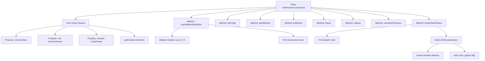
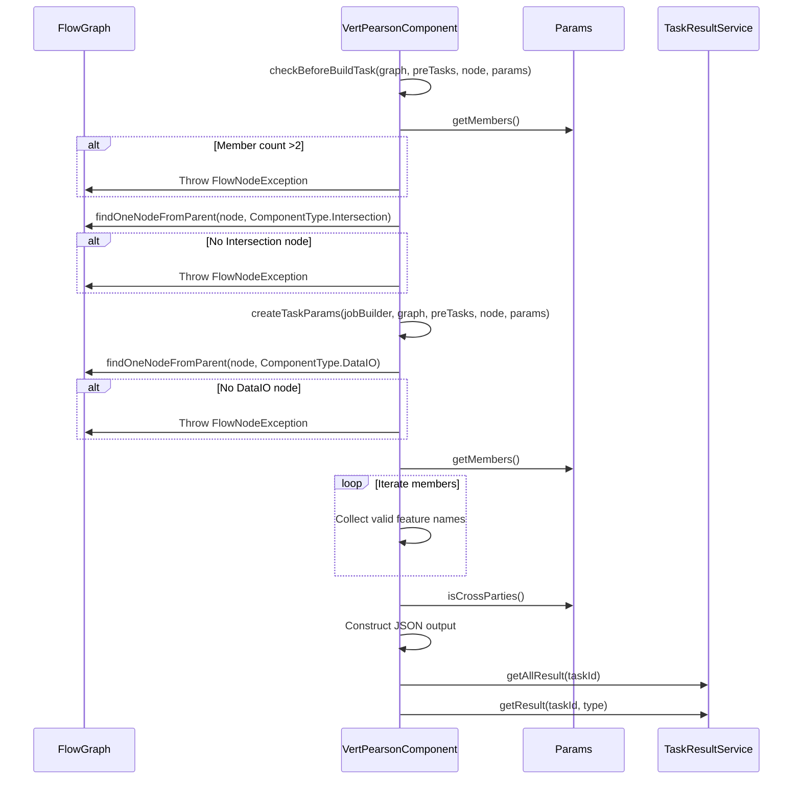

# Basic Information

|      |      |
|------|------|
| Name | VertPearsonComponent |
| Language | .java |
| Code Path | WeFe/board/board-service/src/main/java/com/welab/wefe/board/service/component/feature/VertPearsonComponent.java |
| Package Name | com.welab.wefe.board.service.component.feature |
| Dependencies | ['com.alibaba.fastjson.JSONObject', 'com.welab.wefe.board.service.component.base.AbstractComponent', 'com.welab.wefe.board.service.component.base.io.IODataType', 'com.welab.wefe.board.service.component.base.io.InputMatcher', 'com.welab.wefe.board.service.component.base.io.Names', 'com.welab.wefe.board.service.component.base.io.OutputItem', 'com.welab.wefe.board.service.database.entity.job.TaskMySqlModel', 'com.welab.wefe.board.service.database.entity.job.TaskResultMySqlModel', 'com.welab.wefe.board.service.dto.entity.MemberFeatureInfoModel', 'com.welab.wefe.board.service.exception.FlowNodeException', 'com.welab.wefe.board.service.model.FlowGraph', 'com.welab.wefe.board.service.model.FlowGraphNode', 'com.welab.wefe.board.service.model.JobBuilder', 'com.welab.wefe.board.service.service.CacheObjects', 'com.welab.wefe.common.fieldvalidate.AbstractCheckModel', 'com.welab.wefe.common.fieldvalidate.annotation.Check', 'com.welab.wefe.common.util.JObject', 'com.welab.wefe.common.util.StringUtil', 'com.welab.wefe.common.wefe.enums.ComponentType', 'com.welab.wefe.common.wefe.enums.TaskResultType', 'org.springframework.stereotype.Service', 'java.util.ArrayList', 'java.util.Arrays', 'java.util.List'] |
| Brief Description | The VertPearsonComponent is a module designed for computing Pearson correlation, requiring no more than two parties as members and necessitating pre-aligned samples along with the DataIO component. It supports feature selection and cross-party computation, outputting results in JSON format. |

# Description

The VertPearsonComponent is a service class inherited from AbstractComponent, designed for calculating Pearson correlation. Its key functionalities include: validating input parameters to ensure no more than two parties are involved and that a sample alignment component exists; creating task parameters that must include a DataIO component and handle feature column names; defining input/output data types as datasets and JSON; and providing methods for querying task results. The internal Params class contains parameters such as member feature information, column indices, and cross-party computation flags, while also supporting feature selection capabilities.

# Class Summary

| Name   | Type  | Description |
|-------|------|-------------|
| VertPearsonComponent | class | VertPearsonComponent is a component for calculating Pearson correlation, requiring no more than two parties and necessitating prior sample alignment and the DataIO component, with output in JSON format. It supports feature selection and cross-party computation. |


## Class VertPearsonComponent

|      |      |
|------|------|
| Access Modifier | @Service;public |
| Type | class |
| Name | VertPearsonComponent |
| Description | VertPearsonComponent is a component for calculating Pearson correlation, requiring no more than two parties and necessitating prior sample alignment and the DataIO component, with output in JSON format. It supports feature selection and cross-party computation. |


### UML Class Diagram

```mermaid
classDiagram
    class VertPearsonComponent {
        +VertPearsonComponent$Params~Params~
        +checkBeforeBuildTask(FlowGraph graph, List~TaskMySqlModel~ preTasks, FlowGraphNode node, Params params) void
        +createTaskParams(JobBuilder jobBuilder, FlowGraph graph, List~TaskMySqlModel~ preTasks, FlowGraphNode node, Params params) JSONObject
        +taskType() ComponentType
        +getAllResult(String taskId) List~TaskResultMySqlModel~
        +getResult(String taskId, String type) TaskResultMySqlModel
        +inputs(FlowGraph graph, FlowGraphNode node) List~InputMatcher~
        +outputs(FlowGraph graph, FlowGraphNode node) List~OutputItem~
        +canSelectFeatures() boolean
    }

    class AbstractComponent~T~ {
        <<Abstract>>
        #checkBeforeBuildTask(FlowGraph graph, List~TaskMySqlModel~ preTasks, FlowGraphNode node, T params) void
        #createTaskParams(JobBuilder jobBuilder, FlowGraph graph, List~TaskMySqlModel~ preTasks, FlowGraphNode node, T params) JSONObject
        +taskType() ComponentType
        #getAllResult(String taskId) List~TaskResultMySqlModel~
        #getResult(String taskId, String type) TaskResultMySqlModel
        +inputs(FlowGraph graph, FlowGraphNode node) List~InputMatcher~
        +outputs(FlowGraph graph, FlowGraphNode node) List~OutputItem~
    }

    class VertPearsonComponent$Params {
        -List~MemberFeatureInfoModel~ members
        -List~String~ columnIndexes
        -boolean crossParties
        +getMembers() List~MemberFeatureInfoModel~
        +setMembers(List~MemberFeatureInfoModel~ members) void
        +getColumnIndexes() List~String~
        +setColumnIndexes(List~String~ columnIndexes) void
        +isCrossParties() boolean
        +setCrossParties(boolean crossParties) void
    }

    class AbstractCheckModel {
        <<Abstract>>
    }

    VertPearsonComponent --|> AbstractComponent~VertPearsonComponent$Params~ : Inheritance
    VertPearsonComponent$Params --|> AbstractCheckModel : Inheritance
    VertPearsonComponent --> VertPearsonComponent$Params : Contains
```

Class Diagram Description:
The diagram illustrates the structure of VertPearsonComponent and its related classes. VertPearsonComponent inherits from the generic class AbstractComponent<Params>, implementing functionalities such as flow validation and task parameter creation. The inner class Params inherits from AbstractCheckModel and contains attributes like member features and column indexes. The class diagram clearly reflects inheritance relationships and component dependencies, showcasing the core design of the vertical Pearson correlation calculation component.


### Internal Method Call Graph





This code implements a vertical Pearson correlation calculation component, primarily containing parameter validation, task parameter construction, and result query functionalities. The flowchart illustrates the class structure and method invocation relationships, while the sequence diagram details the parameter checking, node lookup, and task parameter construction processes. The component strictly limits participants to no more than 2 parties, requires pre-alignment of samples, and supports feature selection and cross-party computation. The inner class Params encapsulates configuration parameters such as member features, column indexes, and cross-party computation flags.

### Field List

| Name  | Type  | Description |
|-------|-------|------|

### Method List

| Name  | Type  | Description |
|-------|-------|------|
| getAllResult | List<TaskResultMySqlModel> | This is a Java method that overrides the parent class method to retrieve a list of all task results for a specified taskId through taskResultService. |
| createTaskParams | JSONObject | Method creates task parameters, checks if the DataIO component exists, iterates through parameter members to extract feature names, sets cross-party flags, and returns a JSON object. |
| checkBeforeBuildTask | void | Check preconditions for build task: Number of members does not exceed 2, and sample alignment component must exist. |
| taskType | ComponentType | Method override, returns component type as VertPearson. |
| getResult | TaskResultMySqlModel | Rewrite the method to query task results by task ID and type, returning a MySQL model object. |
| inputs | List<InputMatcher> | This method overrides the parent class logic and returns a list containing a single input matcher, where the matcher specifies the data name as NORMAL_DATA_SET and the data type as DataSetInstance. |
| outputs | List<OutputItem> | This method returns a list of output items containing JSON results. |
| canSelectFeatures | boolean | The method returns true, indicating that feature selection is allowed. |


