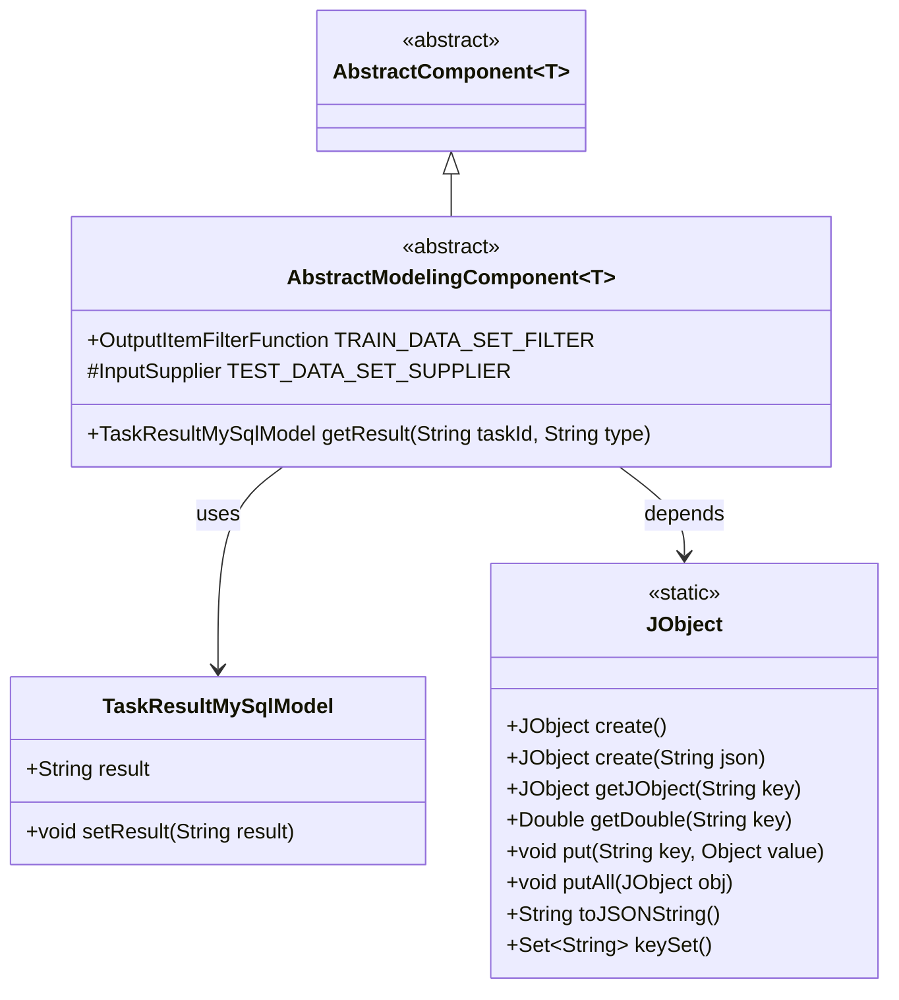
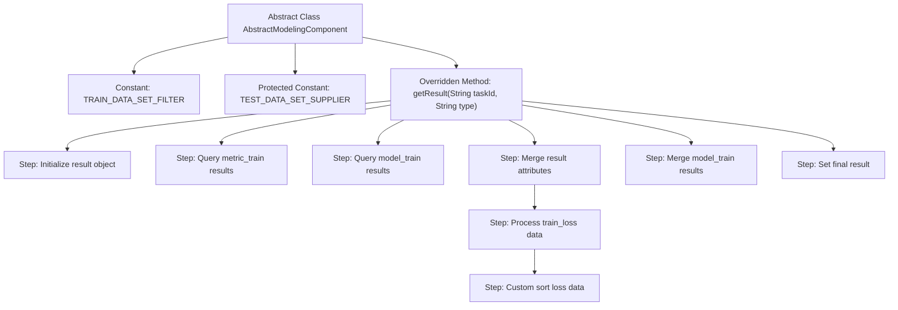

# Basic Information

|      |      |
|------|------|
| Name | AbstractModelingComponent |
| Language | .java |
| Code Path | WeFe/board/board-service/src/main/java/com/welab/wefe/board/service/component/modeling/AbstractModelingComponent.java |
| Package Name | com.welab.wefe.board.service.component.modeling |
| Dependencies | ['com.welab.wefe.board.service.component.base.AbstractComponent', 'com.welab.wefe.board.service.component.base.filter.OutputItemFilterFunction', 'com.welab.wefe.board.service.component.base.io', 'com.welab.wefe.board.service.database.entity.job.TaskResultMySqlModel', 'com.welab.wefe.board.service.model.FlowGraphNode', 'com.welab.wefe.common.fieldvalidate.AbstractCheckModel', 'com.welab.wefe.common.util.JObject', 'com.welab.wefe.common.wefe.enums.ComponentType', 'com.welab.wefe.common.wefe.enums.TaskResultType', 'org.springframework.beans.BeanUtils', 'java.util.ArrayList', 'java.util.Comparator', 'java.util.List', 'java.util.stream.Collectors'] |
| Brief Description | The abstract class AbstractModelingComponent defines the training dataset filter and test/validation dataset provider, including methods for obtaining task results, handling training loss data sorting, and result merging. |

# Description

This is an abstract modeling component class that inherits from the generic AbstractComponent base class. Its main functionalities include: 1) Defining a training dataset filter TRAIN_DATA_SET_FILTER for identifying Segment-type components; 2) Providing input supply logic TEST_DATA_SET_SUPPLIER for test/validation datasets, which prioritizes searching for validation set nodes followed by Segment nodes; 3) Overriding the getResult method, which merges results from both metric_train and model_train tasks and performs special processing on training loss data, including data extraction, sorting, and reorganization. The final result is merged into a JObject and returned.

# Class Summary

| Name   | Type  | Description |
|-------|------|-------------|
| AbstractModelingComponent | class | The abstract class AbstractModelingComponent defines the training dataset filter and test/validation dataset provider, including methods for obtaining task results, handling training loss data sorting, and result merging logic. |

## Class AbstractModelingComponent

|      |      |
|------|------|
| Access Modifier | public abstract |
| Type | class |
| Name | AbstractModelingComponent |
| Description | The abstract class AbstractModelingComponent defines the training dataset filter and test/validation dataset provider, including methods for obtaining task results, handling training loss data sorting, and result merging logic. |

### UML Class Diagram

This code demonstrates an abstract modeling component class `AbstractModelingComponent`, which inherits from the generic abstract class `AbstractComponent`. Its main functionalities include: 1) processing datasets through `TRAIN_DATA_SET_FILTER` and `TEST_DATA_SET_SUPPLIER`; 2) implementing the `getResult` method to merge training metrics and model results. The class diagram clearly illustrates the inheritance relationships, member variables and methods, as well as the dependencies with `TaskResultMySqlModel` and `JObject`, reflecting the core logic of data processing and result merging.

### Internal Method Call Graph

This code defines an abstract modeling component class with two core parts: 1) Dataset filter and supplier definitions for handling training and test datasets; 2) A result retrieval method that queries and merges different types of result data, with special processing for training loss data. The flowchart illustrates the entire process from initialization to final result generation, including key steps such as data querying, attribute merging, and custom sorting. The method ultimately returns a TaskResultMySqlModel object containing all merged result data.

### Field List

| Name  | Type  | Description |
|-------|-------|------|
| TEST_DATA_SET_SUPPLIER = (graph, node) -> {        // Find validation set        FlowGraphNode validationNode = graph.findValidationDataSetFromParent(node, taskType());        if (validationNode != null) {            return new NodeOutputItem(validationNode, OutputItem.of(Names.Data.EVALUATION_DATA_SET, IODataType.DataSetInstance));        }        // Find data cutting        FlowGraphNode segmentNode = graph.findOneNodeFromParent(node, ComponentType.Segment);        if (segmentNode != null) {            return new NodeOutputItem(segmentNode, OutputItem.of(Names.Data.EVALUATION_DATA_SET, IODataType.DataSetInstance));        }        return null;    } | InputSupplier | Defined an input supply method that first searches for validation dataset from the parent node, if not found then searches segmented node data, and returns null if neither exists. |
| TRAIN_DATA_SET_FILTER = (n, item) -> ComponentType.Segment == n.getComponentType() | OutputItemFilterFunction | Define the filter function TRAIN_DATA_SET_FILTER to check whether the node type is Segment. |

### Method List

| Name  | Type  | Description |
|-------|-------|------|
| getResult | TaskResultMySqlModel | The method retrieves training results based on task ID and type, prioritizing the merging of metrics and model results, processes the training loss data after sorting, and returns the output. |

