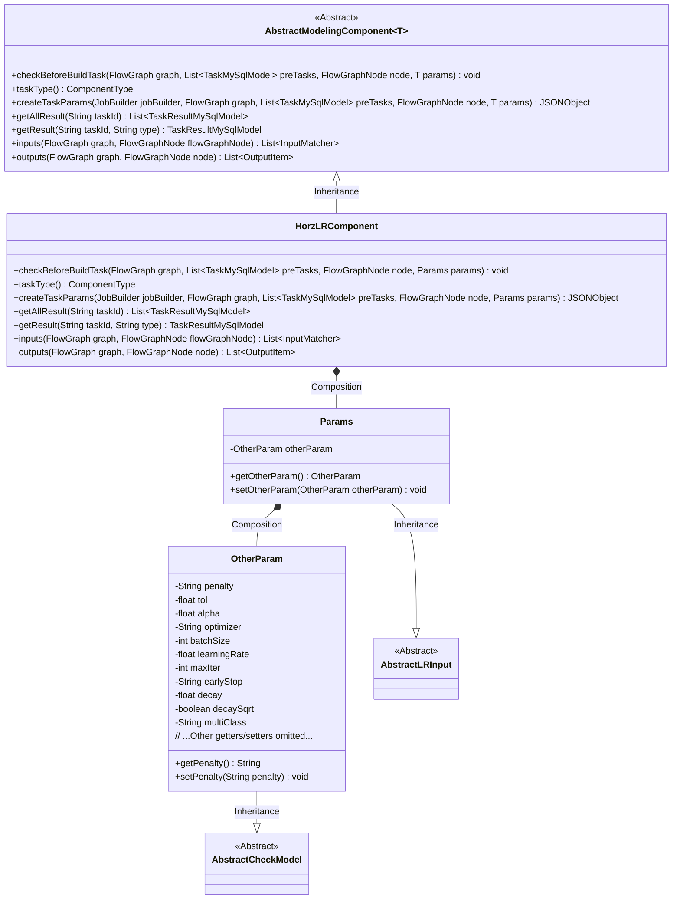
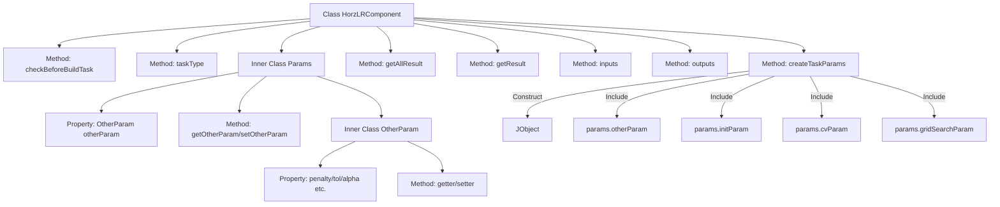

# Basic Information

|      |      |
|------|------|
| Name | HorzLRComponent |
| Language | .java |
| Code Path | WeFe/board/board-service/src/main/java/com/welab/wefe/board/service/component/modeling/HorzLRComponent.java |
| Package Name | com.welab.wefe.board.service.component.modeling |
| Dependencies | ['com.alibaba.fastjson.JSONObject', 'com.welab.wefe.board.service.component.base.io.IODataType', 'com.welab.wefe.board.service.component.base.io.InputMatcher', 'com.welab.wefe.board.service.component.base.io.Names', 'com.welab.wefe.board.service.component.base.io.OutputItem', 'com.welab.wefe.board.service.database.entity.job.TaskMySqlModel', 'com.welab.wefe.board.service.database.entity.job.TaskResultMySqlModel', 'com.welab.wefe.board.service.exception.FlowNodeException', 'com.welab.wefe.board.service.model.FlowGraph', 'com.welab.wefe.board.service.model.FlowGraphNode', 'com.welab.wefe.board.service.model.JobBuilder', 'com.welab.wefe.common.fieldvalidate.AbstractCheckModel', 'com.welab.wefe.common.fieldvalidate.annotation.Check', 'com.welab.wefe.common.util.JObject', 'com.welab.wefe.common.web.dto.AbstractLRInput', 'com.welab.wefe.common.wefe.enums.ComponentType', 'org.springframework.stereotype.Service', 'java.util.Arrays', 'java.util.List'] |
| Brief Description | The HorzLRComponent is a horizontal logistic regression component that inherits from AbstractModelingComponent. It includes functionalities such as parameter validation, task parameter generation, and input-output definition, primarily handling training data and model output. |

# Description

HorzLRComponent is a service class that inherits from AbstractModelingComponent, specifically designed for horizontal logistic regression tasks. It defines the task type as ComponentType.HorzLR and implements several key methods. This class includes functionalities such as parameter validation, task parameter creation, result retrieval, and input-output matching. The Params inner class encapsulates various parameters required for logistic regression, including penalty method, convergence tolerance, penalty coefficient, optimization algorithm, batch size, learning rate, maximum iterations, etc. These parameters are all validated for necessity through the @Check annotation. The createTaskParams method converts the parameters into JSON format, containing initialization methods, cross-validation parameters, and grid search parameters. The input requires training datasets and evaluation datasets, while the output includes ordinary datasets and the trained logistic regression model.

# Class Summary

| Name   | Type  | Description |
|-------|------|-------------|
| HorzLRComponent | class | HorzLRComponent is a horizontal logistic regression component that inherits from AbstractModelingComponent, handling parameter validation, task parameter generation, and input-output matching. It includes training parameters such as penalty method, learning rate, etc., and outputs datasets and models. |

## Class HorzLRComponent

|      |      |
|------|------|
| Access Modifier | @Service;public |
| Type | class |
| Name | HorzLRComponent |
| Description | HorzLRComponent is a horizontal logistic regression component that inherits from AbstractModelingComponent, handling parameter validation, task parameter generation, and input-output matching. It includes training parameters such as penalty method, learning rate, etc., and outputs datasets and models. |

### UML Class Diagram

This code implements a Horizontal Logistic Regression component (HorzLRComponent) that inherits from a generic abstract modeling component, primarily used for machine learning task parameter processing and result management. The class diagram shows a four-layer structure: the top-level abstract component defines basic interfaces, the second layer is the concrete implementation class HorzLRComponent, the third layer includes the parameter class Params and its nested class OtherParam, and the bottom layer consists of abstract classes related to parameter validation. The component converts parameters into JSON format via the createTaskParams method and defines matching rules for input and output data, supporting advanced features such as cross-validation and grid search.

### Internal Method Call Graph

This code demonstrates a service class named HorzLRComponent, which inherits from AbstractModelingComponent and is primarily used for handling horizontal logistic regression tasks. Core functionalities include parameter validation (checkBeforeBuildTask), task type identification (taskType), task parameter construction (createTaskParams), and input/output definitions (inputs/outputs). The inner class Params encapsulates algorithm parameters, containing the OtherParam subclass that defines 12 machine learning hyperparameters. The flowchart clearly presents the class structure, method invocation relationships, and parameter composition, particularly illustrating how the createTaskParams method aggregates different parameter modules to construct complete task parameters.

### Field List

| Name  | Type  | Description |
|-------|-------|------|

### Method List

| Name  | Type  | Description |
|-------|-------|------|
| getAllResult | List<TaskResultMySqlModel> | This method overrides the parent class logic by invoking the `listAllResult` method of `taskResultService` to retrieve all task results based on the `taskId` and return them as a list. |
| getResult | TaskResultMySqlModel | Rewrite the getResult method to invoke the parent class implementation and return a TaskResultMySqlModel object, with taskId and type as parameters. |
| taskType | ComponentType | Rewrite the taskType method to return the horizontal layout type ComponentType.HorzLR. |
| createTaskParams | JSONObject | Method creates a task parameter JSON, containing model parameters such as penalty coefficients, tolerance, learning rate, as well as cross-validation and grid search configurations. |
| checkBeforeBuildTask | void | Check the preconditions for the build task to ensure that the nodes and prerequisite tasks in the flowchart meet the requirements. |
| inputs | List<InputMatcher> | Rewrite the inputs method to return an InputMatcher list containing both the training dataset and the evaluation dataset. |
| outputs | List<OutputItem> | The method outputs returns two OutputItems: NORMAL_DATA_SET (data type DataSetInstance) and TRAIN_MODEL (data type ModelFromLr). |

