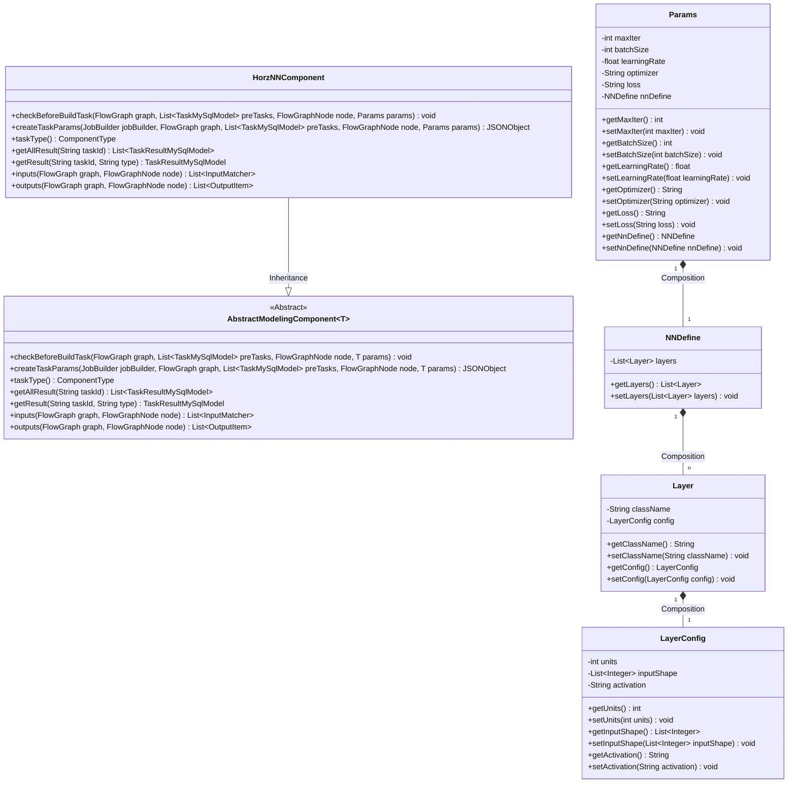
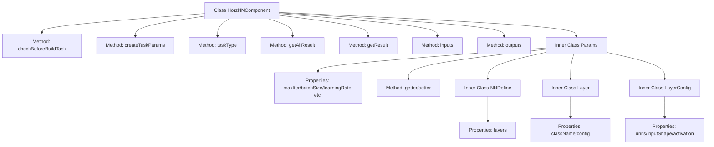
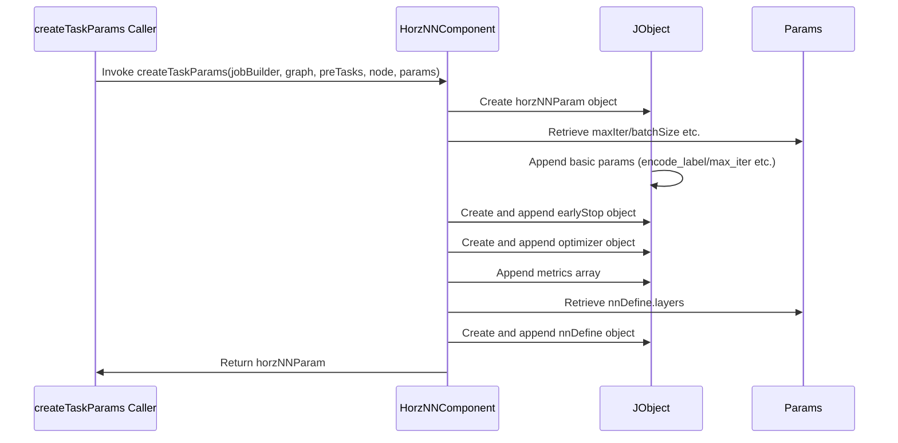

# Basic Information

|      |      |
|------|------|
| Name | HorzNNComponent |
| Language | .java |
| Code Path | WeFe/board/board-service/src/main/java/com/welab/wefe/board/service/component/modeling/HorzNNComponent.java |
| Package Name | com.welab.wefe.board.service.component.modeling |
| Dependencies | ['com.alibaba.fastjson.JSONObject', 'com.welab.wefe.board.service.component.base.io.IODataType', 'com.welab.wefe.board.service.component.base.io.InputMatcher', 'com.welab.wefe.board.service.component.base.io.Names', 'com.welab.wefe.board.service.component.base.io.OutputItem', 'com.welab.wefe.board.service.database.entity.job.TaskMySqlModel', 'com.welab.wefe.board.service.database.entity.job.TaskResultMySqlModel', 'com.welab.wefe.board.service.exception.FlowNodeException', 'com.welab.wefe.board.service.model.FlowGraph', 'com.welab.wefe.board.service.model.FlowGraphNode', 'com.welab.wefe.board.service.model.JobBuilder', 'com.welab.wefe.common.fieldvalidate.AbstractCheckModel', 'com.welab.wefe.common.fieldvalidate.annotation.Check', 'com.welab.wefe.common.util.JObject', 'com.welab.wefe.common.wefe.enums.ComponentType', 'org.springframework.stereotype.Service', 'java.util.ArrayList', 'java.util.Arrays', 'java.util.List'] |
| Brief Description | HorzNNComponent is a horizontal neural network component that inherits from AbstractModelingComponent, encompassing parameter validation, task creation, input/output definition, and neural network layer configuration. |

# Description

The HorzNNComponent is a Spring service class that inherits from AbstractModelingComponent, designed to implement horizontal neural network modeling tasks. This class defines model parameters through the Params inner class, including maximum iterations, batch size, learning rate, optimizer, loss function, and neural network layer definitions. The createTaskParams method constructs a JSON object containing training parameters, such as encoded labels, iteration configuration, optimizer settings, evaluation metrics, and neural network architecture definitions. The inputs and outputs methods respectively define the required input data (training set and evaluation set) and output results (dataset and trained model) for the component. The component type is HorzNN and supports fetching task results. Neural network layer definitions include class names and configuration parameters, such as dimensions, input shapes, and activation functions.

# Class Summary

| Name   | Type  | Description |
|-------|------|-------------|
| HorzNNComponent | class | HorzNNComponent is a horizontal neural network component that inherits from AbstractModelingComponent, handling task parameter generation and input-output matching. It includes parameters such as maximum iterations, batch size, and learning rate, supports Keras configuration, and outputs datasets and models. |

## Class HorzNNComponent

|      |      |
|------|------|
| Access Modifier | @Service;public |
| Type | class |
| Name | HorzNNComponent |
| Description | HorzNNComponent is a horizontal neural network component that inherits from AbstractModelingComponent, handling task parameter generation and input-output matching. It includes parameters such as maximum iterations, batch size, and learning rate, supports Keras configuration, and outputs datasets and models. |

### UML Class Diagram

This code describes a horizontal neural network component `HorzNNComponent`, which inherits from the generic abstract class `AbstractModelingComponent` and implements several key methods for task parameter construction, input-output matching, etc. The inner class `Params` defines hyperparameters required for neural network training (such as iteration count, batch size, etc.), and through nested classes `NNDefine`, `Layer`, and `LayerConfig`, it achieves structured definition of neural network layers. The overall design follows a layered pattern, with parameter validation implemented via `@Check` annotations, reflecting a configurable deep learning component implementation.

### Internal Method Call Graph

This flowchart presents the complete structure of the HorzNNComponent class, including 7 main methods and 4 levels of nested parameter classes. The sequence diagram details the execution process of the createTaskParams method, which constructs a JSON structure containing neural network training parameters via JObject. The structure includes basic parameters, early_stop configuration, optimizer settings, evaluation metrics, and neural network layer definitions, ultimately returning a complete parameter object. Parameters are retrieved layer by layer through the Params class and its nested classes NNDefine/Layer/LayerConfig.

### Field List

| Name  | Type  | Description |
|-------|-------|------|

### Method List

| Name  | Type  | Description |
|-------|-------|------|
| createTaskParams | JSONObject | The method creates horizontal neural network task parameters, including the number of iterations, batch size, early stopping conditions, optimizer settings, loss function, evaluation metrics, and neural network definition. Returns a JSON-formatted parameter object. |
| getResult | TaskResultMySqlModel | Rewrite the method getResult to invoke the parent class method for obtaining the task result. |
| getAllResult | List<TaskResultMySqlModel> | This method overrides the parent class method and retrieves a list of all task results for the specified taskId by invoking the listAllResult method of taskResultService. |
| checkBeforeBuildTask | void | This is a Java method override used for pre-build task validation, with parameters including the flow chart, predecessor task list, node, and parameters, which may throw a process node exception. |
| taskType | ComponentType | Method override, returns component type as horizontal neural network. |
| inputs | List<InputMatcher> | The code overrides the parent class method, returning two InputMatcher objects that match the training dataset and the evaluation dataset, respectively. |
| outputs | List<OutputItem> | The method outputs returns two OutputItem objects, containing the dataset and model output items, and may throw a FlowNodeException. |

