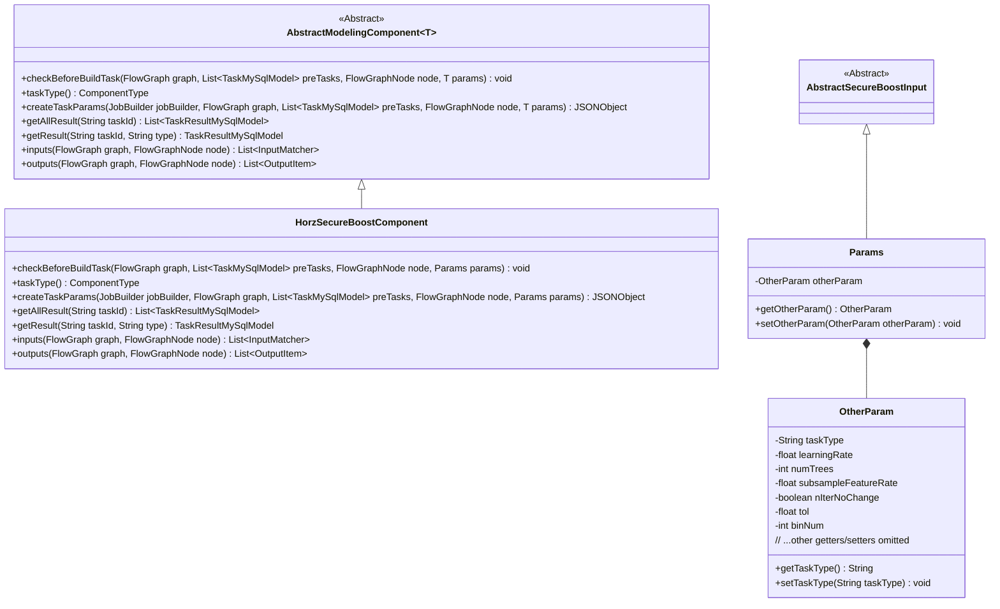
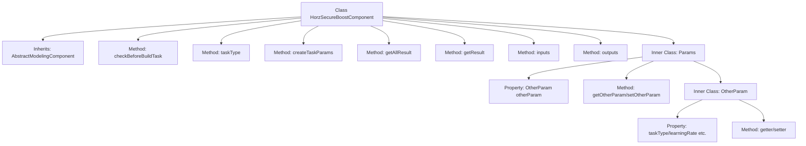
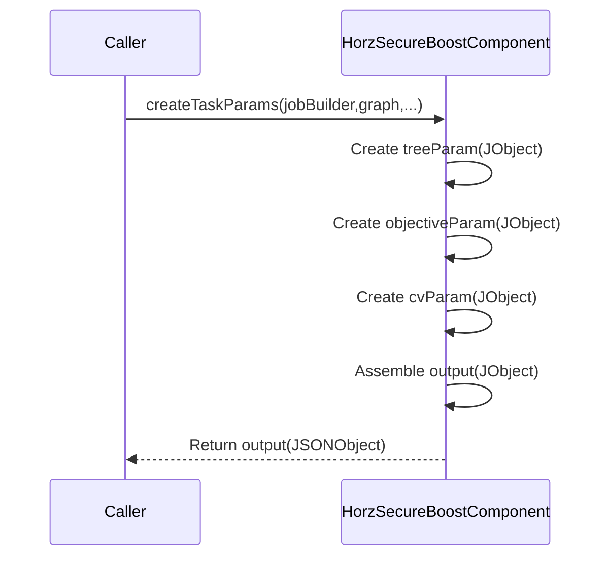

# Basic Information

|      |      |
|------|------|
| Name | HorzSecureBoostComponent |
| Language | .java |
| Code Path | WeFe/board/board-service/src/main/java/com/welab/wefe/board/service/component/modeling/HorzSecureBoostComponent.java |
| Package Name | com.welab.wefe.board.service.component.modeling |
| Dependencies | ['com.alibaba.fastjson.JSONObject', 'com.welab.wefe.board.service.component.base.io.IODataType', 'com.welab.wefe.board.service.component.base.io.InputMatcher', 'com.welab.wefe.board.service.component.base.io.Names', 'com.welab.wefe.board.service.component.base.io.OutputItem', 'com.welab.wefe.board.service.database.entity.job.TaskMySqlModel', 'com.welab.wefe.board.service.database.entity.job.TaskResultMySqlModel', 'com.welab.wefe.board.service.exception.FlowNodeException', 'com.welab.wefe.board.service.model.FlowGraph', 'com.welab.wefe.board.service.model.FlowGraphNode', 'com.welab.wefe.board.service.model.JobBuilder', 'com.welab.wefe.common.fieldvalidate.AbstractCheckModel', 'com.welab.wefe.common.fieldvalidate.annotation.Check', 'com.welab.wefe.common.util.JObject', 'com.welab.wefe.common.web.dto.AbstractSecureBoostInput', 'com.welab.wefe.common.wefe.enums.ComponentType', 'org.springframework.stereotype.Service', 'java.util.Arrays', 'java.util.List'] |
| Brief Description | The HorzSecureBoostComponent is a horizontal security-enhanced component based on XGBoost, designed for building machine learning models. It includes functionalities such as parameter validation, task parameter generation, and input-output definitions, supporting configurations for tree parameters, objective parameters, and cross-validation parameters, while outputting datasets and trained models. |

# Description

The content describes a Java service class named HorzSecureBoostComponent, which extends AbstractModelingComponent and is used to implement horizontally secure enhanced machine learning tasks. The class includes task type definitions, parameter validation, task parameter construction, and input-output configuration. Key functionalities involve creating JSON objects containing tree parameters, target parameters, and cross-validation parameters, processing task results, and defining input and output data types. The Params inner class encapsulates critical parameters such as task type, learning rate, and number of trees, with necessity validation through annotations. The overall design supports secure enhanced tree model training and evaluation in horizontal federated learning scenarios.

# Class Summary

| Name   | Type  | Description |
|-------|------|-------------|
| HorzSecureBoostComponent | class | HorzSecureBoostComponent is a horizontal secure boosting component that inherits from AbstractModelingComponent. It is used to create XGBoost task parameters, including tree parameters, objective parameters, and cross-validation parameters. The inputs are training and evaluation datasets, and the outputs are datasets and an XGBoost model. |

## Class HorzSecureBoostComponent

|      |      |
|------|------|
| Access Modifier | @Service;public |
| Type | class |
| Name | HorzSecureBoostComponent |
| Description | HorzSecureBoostComponent is a horizontal secure boosting component that inherits from AbstractModelingComponent. It is used to create XGBoost task parameters, including tree parameters, objective parameters, and cross-validation parameters. The inputs are training and evaluation datasets, and the outputs are datasets and an XGBoost model. |

### UML Class Diagram

This class diagram illustrates the inheritance relationships and internal structure of HorzSecureBoostComponent. The component inherits from the generic class AbstractModelingComponent<Params>, where Params is a static nested class containing the OtherParam nested class. Key functionalities include task parameter validation (createTaskParams), result retrieval (getAllResult/getResult), and input/output definitions (inputs/outputs). The Params class encapsulates all configuration parameters for the horizontal secure boosting tree model, including tree parameters, objective function parameters, and cross-validation parameters, with parameter validation implemented through the OtherParam nested class. The overall design follows the Template Method pattern, where the abstract base class defines the framework and subclasses implement specific business logic.

### Internal Method Call Graph

This code implements a horizontal secure boosting component (HorzSecureBoostComponent), primarily used for building secure enhanced machine learning tasks. The flowchart illustrates the class inheritance relationships and main method structures, including parameter validation, task creation, and result retrieval functionalities. The sequence diagram highlights the invocation process of the createTaskParams method, which creates tree parameters, objective parameters, and cross-validation parameters, ultimately assembling them into JSON-formatted task parameters for return. The inner class Params and its nested class OtherParam encapsulate task configuration parameters, containing key training parameters such as learning rate and tree count.

### Field List

| Name  | Type  | Description |
|-------|-------|------|

### Method List

| Name  | Type  | Description |
|-------|-------|------|
| taskType | ComponentType | This method overrides the parent class method and returns the task type as a horizontal security enhancement component. |
| getResult | TaskResultMySqlModel | Rewrite the method getResult to call the parent class method for retrieving the result corresponding to taskId and type. |
| checkBeforeBuildTask | void | Check the preconditions of the build task to ensure that the nodes and prerequisite tasks in the flowchart meet the requirements; otherwise, throw an exception. |
| createTaskParams | JSONObject | Method to create JSON task parameters, including tree parameters (such as max_depth), target parameters (such as objective), cross-validation parameters (such as n_splits), and other parameters (such as learning_rate), finally returning the merged JSON object. |
| getAllResult | List<TaskResultMySqlModel> | This is a Java method that overrides the parent class method, retrieving a list of all task results for a specified taskId by calling the listAllResult method of taskResultService. |
| outputs | List<OutputItem> | This method returns a list containing two OutputItems: a dataset instance named NORMAL_DATA_SET and an XGBoost model named TRAIN_MODEL. |
| inputs | List<InputMatcher> | Method override, returns the input matcher list containing the matching conditions for both the training dataset and the evaluation dataset. |

