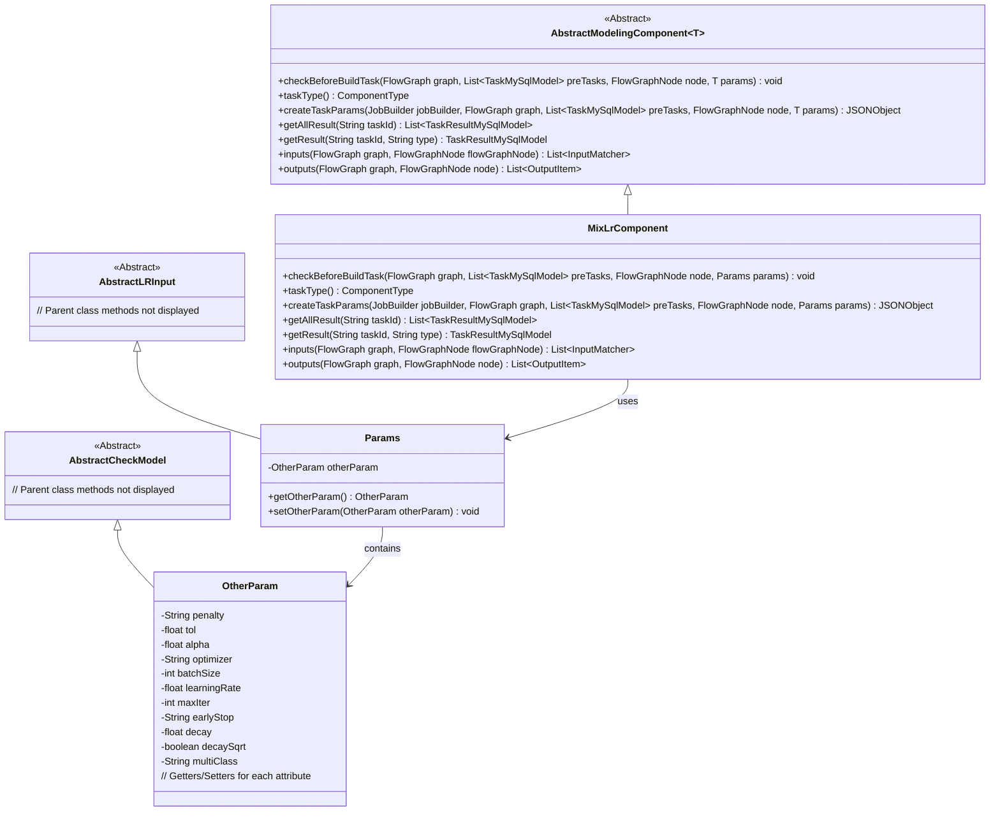
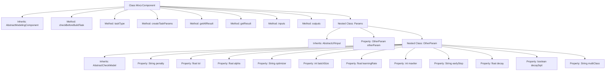

# Basic Information

|      |      |
|------|------|
| Name | MixLrComponent |
| Language | .java |
| Code Path | WeFe/board/board-service/src/main/java/com/welab/wefe/board/service/component/modeling/MixLrComponent.java |
| Package Name | com.welab.wefe.board.service.component.modeling |
| Dependencies | ['com.alibaba.fastjson.JSONObject', 'com.welab.wefe.board.service.component.base.io.IODataType', 'com.welab.wefe.board.service.component.base.io.InputMatcher', 'com.welab.wefe.board.service.component.base.io.Names', 'com.welab.wefe.board.service.component.base.io.OutputItem', 'com.welab.wefe.board.service.database.entity.job.TaskMySqlModel', 'com.welab.wefe.board.service.database.entity.job.TaskResultMySqlModel', 'com.welab.wefe.board.service.model.FlowGraph', 'com.welab.wefe.board.service.model.FlowGraphNode', 'com.welab.wefe.board.service.model.JobBuilder', 'com.welab.wefe.common.fieldvalidate.AbstractCheckModel', 'com.welab.wefe.common.fieldvalidate.annotation.Check', 'com.welab.wefe.common.util.JObject', 'com.welab.wefe.common.web.dto.AbstractLRInput', 'com.welab.wefe.common.wefe.enums.ComponentType', 'org.springframework.stereotype.Service', 'java.util.Arrays', 'java.util.List'] |
| Brief Description | The MixLrComponent is a mixed logistic regression component that inherits from AbstractModelingComponent. It includes functionalities such as parameter validation, task construction, and result retrieval, defining input/output data and model types. Parameters include training configurations like optimizer and learning rate. |

# Description

The MixLrComponent is a service class inherited from AbstractModelingComponent, specifically designed for mixed logic regression tasks. Its core functionalities include parameter validation, task parameter generation, and result processing. The class defines an internal Params class containing the OtherParam subclass, which stores various parameters required for model training, such as penalty methods, convergence tolerance, optimization algorithms, etc. All parameters undergo necessity validation via the @Check annotation. The createTaskParams method converts parameters into JSON-formatted output, including training parameters, initialization parameters, and cross-validation parameters. The component defines input and output specifications: the input must include training and evaluation datasets, while the output comprises standard datasets and trained models. The component type is identified as ComponentType.MixLR and provides task result query functionality.

# Class Summary

| Name   | Type  | Description |
|-------|------|-------------|
| MixLrComponent | class | MixLrComponent is a service class that inherits from AbstractModelingComponent and is used for mixed logistic regression tasks. It defines the task type as MixLR and handles task parameter creation, result retrieval, and input-output matching. Parameters include penalty methods, learning rate, etc., and the output consists of datasets and models. |

## Class MixLrComponent

|      |      |
|------|------|
| Access Modifier | @Service;public |
| Type | class |
| Name | MixLrComponent |
| Description | MixLrComponent is a service class that inherits from AbstractModelingComponent and is used for mixed logistic regression tasks. It defines the task type as MixLR and handles task parameter creation, result retrieval, and input-output matching. Parameters include penalty methods, learning rate, etc., and the output consists of datasets and models. |

### UML Class Diagram

This code demonstrates the class structure of a Mixed Logistic Regression component (MixLrComponent), which inherits from the AbstractModelingComponent. The component primarily handles mixed logistic regression models in machine learning tasks, including parameter validation, task creation, and result retrieval. The Params class encapsulates various parameters required for model training, such as optimizer settings and learning rate adjustments, with detailed parameter management through the nested OtherParam class. The class diagram clearly illustrates the inheritance and composition relationships between components.

### Internal Method Call Graph

This flowchart illustrates the complete structure of the MixLrComponent class, including its inheritance relationships, key method implementations, and detailed composition of the nested Params class. Core functionalities encompass task parameter validation (createTaskParams), result retrieval (getAllResult/getResult), and input/output definitions (inputs/outputs). The nested Params class encapsulates critical machine learning hyperparameters such as learning rate and batch size through OtherParam, with validation logic implemented via annotations. The overall design embodies component-based modeling principles, enabling hierarchical management of algorithm parameters, data flow control, and model training processes.

### Field List

| Name  | Type  | Description |
|-------|-------|------|

### Method List

| Name  | Type  | Description |
|-------|-------|------|
| createTaskParams | JSONObject | This method creates a task parameter JSON object, which includes model parameters such as penalty coefficients, tolerance, learning rate, as well as configurations for initialization, cross-validation, and grid search. |
| taskType | ComponentType | This method returns the component type enumeration value for task type MixLR. |
| getAllResult | List<TaskResultMySqlModel> | Java Method: Retrieve all task results by taskId, calling the listAllResult method of taskResultService to return a list. |
| checkBeforeBuildTask | void | Check the preconditions for the build task, including flowcharts, prerequisite tasks, nodes, and parameters. |
| inputs | List<InputMatcher> | Java method override, returns an InputMatcher list containing training and evaluation datasets. |
| outputs | List<OutputItem> | The method outputs returns two output items: the NORMAL_DATA_SET dataset and the TRAIN_MODEL model, specifying the data types as DataSetInstance and ModelFromLr respectively. |
| getResult | TaskResultMySqlModel | Rewrite the method getResult, call the parent class method and return a TaskResultMySqlModel object, with parameters taskId and type. |

