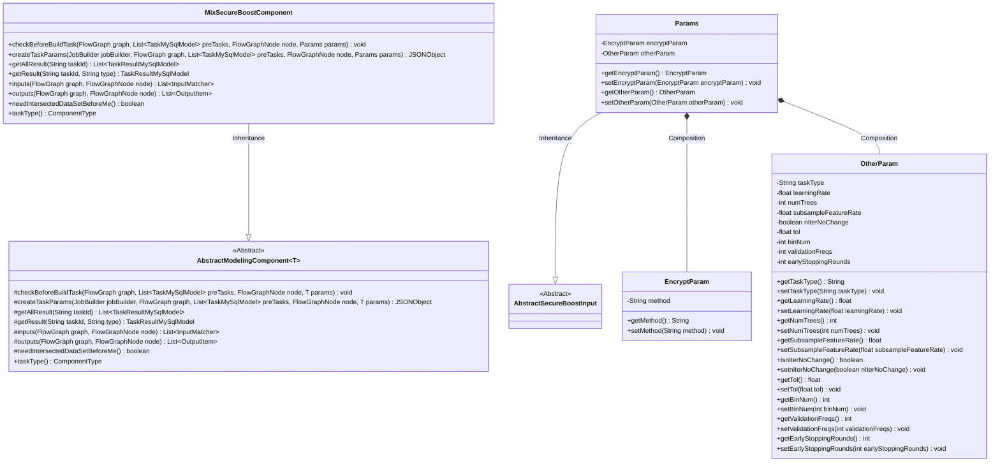

# Basic Information

|      |      |
|------|------|
| Name | MixSecureBoostComponent |
| Language | .java |
| Code Path | WeFe/board/board-service/src/main/java/com/welab/wefe/board/service/component/modeling/MixSecureBoostComponent.java |
| Package Name | com.welab.wefe.board.service.component.modeling |
| Dependencies | ['com.alibaba.fastjson.JSONObject', 'com.welab.wefe.board.service.component.base.filter.IntersectedOutputFilter', 'com.welab.wefe.board.service.component.base.io.IODataType', 'com.welab.wefe.board.service.component.base.io.InputMatcher', 'com.welab.wefe.board.service.component.base.io.Names', 'com.welab.wefe.board.service.component.base.io.OutputItem', 'com.welab.wefe.board.service.database.entity.job.TaskMySqlModel', 'com.welab.wefe.board.service.database.entity.job.TaskResultMySqlModel', 'com.welab.wefe.board.service.exception.FlowNodeException', 'com.welab.wefe.board.service.model.FlowGraph', 'com.welab.wefe.board.service.model.FlowGraphNode', 'com.welab.wefe.board.service.model.JobBuilder', 'com.welab.wefe.common.fieldvalidate.AbstractCheckModel', 'com.welab.wefe.common.fieldvalidate.annotation.Check', 'com.welab.wefe.common.util.JObject', 'com.welab.wefe.common.web.dto.AbstractSecureBoostInput', 'com.welab.wefe.common.wefe.enums.ComponentType', 'org.springframework.stereotype.Service', 'java.util.Arrays', 'java.util.List'] |
| Brief Description | MixSecureBoostComponent is a hybrid security enhancement component, inherited from AbstractModelingComponent, designed for constructing security-enhanced tasks. It incorporates parameter validation, task parameter generation, result retrieval, and input-output matching functionalities, supporting the XGBoost algorithm, homomorphic encryption, and cross-validation. |

# Description

The MixSecureBoostComponent is a hybrid secure enhancement modeling component based on XGBoost, inherited from the AbstractModelingComponent. It includes functionalities such as parameter validation, task parameter creation, result retrieval, and input-output definitions. Core parameters consist of encryption parameters (specifying homomorphic encryption algorithms), tree parameters (e.g., maximum depth, minimum samples for split, etc.), objective function parameters, cross-validation parameters, and other parameters (such as learning rate, number of trees, feature sampling ratio, etc.). The component requires training and evaluation datasets as input, outputs plain datasets and XGBoost-trained models, and supports grid search parameter configuration. All parameters undergo strict validation to ensure mandatory fields are complete.

# Class Summary

| Name   | Type  | Description |
|-------|------|-------------|
| MixSecureBoostComponent | class | The MixSecureBoostComponent is a hybrid security enhancement component based on XGBoost, which includes encryption parameters, tree parameters, objective parameters, and cross-validation parameters. It supports configurations such as task type, learning rate, and number of trees, and outputs datasets and trained models. |

## Class MixSecureBoostComponent

|      |      |
|------|------|
| Access Modifier | @Service;public |
| Type | class |
| Name | MixSecureBoostComponent |
| Description | The MixSecureBoostComponent is a hybrid security enhancement component based on XGBoost, which includes encryption parameters, tree parameters, objective parameters, and cross-validation parameters. It supports configurations such as task type, learning rate, and number of trees, and outputs datasets and trained models. |

### UML Class Diagram

This code describes a mixed secure boosting component `MixSecureBoostComponent`, which inherits from the abstract modeling component `AbstractModelingComponent` and is primarily used for handling secure machine learning tasks. The component includes a parameter class `Params`, which encapsulates encryption parameters `EncryptParam` and other task parameters `OtherParam` for configuring XGBoost-related parameters, cross-validation settings, and encryption methods. The component implements core functionalities such as task parameter generation, input-output matching, and result retrieval, supporting dataset cross-validation and model training process control.

### Internal Method Call Graph

```mermaid
graph TD
    A["Class MixSecureBoostComponent"]
    B["Method: checkBeforeBuildTask"]
    C["Method: taskType"]
    D["Method: createTaskParams"]
    E["Method: getAllResult"]
    F["Method: getResult"]
    G["Method: inputs"]
    H["Method: outputs"]
    I["Method: needIntersectedDataSetBeforeMe"]
    J["Inner Class: Params"]
    K["Property: EncryptParam encryptParam"]
    L["Property: OtherParam otherParam"]
    M["Method: getEncryptParam/setEncryptParam"]
    N["Inner Class: EncryptParam"]
    O["Property: String method"]
    P["Method: getMethod/setMethod"]
    Q["Inner Class: OtherParam"]
    R["Property: String taskType"]
    S["Property: float learningRate"]
    T["Property: int numTrees"]
    U["Property: float subsampleFeatureRate"]
    V["Property: boolean nIterNoChange"]
    W["Property: float tol"]
    X["Property: int binNum"]
    Y["Property: int validationFreqs"]
    Z["Property: int earlyStoppingRounds"]

    A --> B
    A --> C
    A --> D
    A --> E
    A --> F
    A --> G
    A --> H
    A --> I
    A --> J
    J --> K
    J --> L
    J --> M
    J --> N
    N --> O
    N --> P
    J --> Q
    Q --> R
    Q --> S
    Q --> T
    Q --> U
    Q --> V
    Q --> W
    Q --> X
    Q --> Y
    Q --> Z
```

This flowchart illustrates the structure of the MixSecureBoostComponent class, detailing its main methods and the composition of its inner Params class. The Params class contains two inner classes, EncryptParam and OtherParam, which manage encryption parameters and other task parameters respectively. The createTaskParams method serves as the core function responsible for constructing the task parameter JSON object, while the inputs/outputs methods define data input-output specifications. The overall design reflects the implementation of a security-enhanced tree model component in federated learning scenarios.

### Field List

| Name  | Type  | Description |
|-------|-------|------|

### Method List

| Name  | Type  | Description |
|-------|-------|------|
| createTaskParams | JSONObject | The method creates a task parameter JSON, including tree parameters (such as max_depth), target parameters, encryption parameters, cross-validation parameters, and other parameters (such as learning_rate), and finally returns the combined JSON object. |
| getResult | TaskResultMySqlModel | Rewrite the getResult method to call the parent class implementation for obtaining the task result. |
| checkBeforeBuildTask | void | The method checks the conditions before building the task, with parameters including the flowchart, pre-task list, node, and parameters, and may throw a process node exception. |
| taskType | ComponentType | This method overrides taskType() and returns the MixSecureBoost component type. |
| getAllResult | List<TaskResultMySqlModel> | This is a Java method that overrides the parent class method to retrieve a list of all task results for a specified taskId through the taskResultService. |
| inputs | List<InputMatcher> | The overridden method `inputs` returns two `InputMatcher`s: `TRAIN_DATA_SET` uses `IntersectedOutputFilter`, and `EVALUATION_DATA_SET` uses `TEST_DATA_SET_SUPPLIER`. |
| outputs | List<OutputItem> | This method returns two output items: NORMAL_DATA_SET (data type is DataSetInstance) and TRAIN_MODEL (data type is ModelFromXGBoost). |
| needIntersectedDataSetBeforeMe | boolean | The method returns true, indicating that the intersection dataset needs to be obtained first. |

