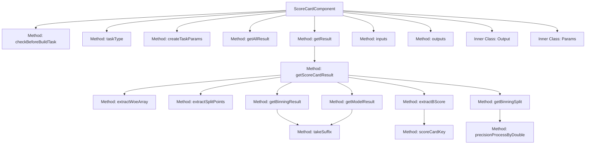

# Basic Information

|      |      |
|------|------|
| Name | ScoreCardComponent |
| Language | .java |
| Code Path | WeFe/board/board-service/src/main/java/com/welab/wefe/board/service/component/modeling/ScoreCardComponent.java |
| Package Name | com.welab.wefe.board.service.component.modeling |
| Dependencies | ['com.alibaba.fastjson.JSONObject', 'com.welab.wefe.board.service.component.base.io.IODataType', 'com.welab.wefe.board.service.component.base.io.InputMatcher', 'com.welab.wefe.board.service.component.base.io.Names', 'com.welab.wefe.board.service.component.base.io.OutputItem', 'com.welab.wefe.board.service.database.entity.job.TaskMySqlModel', 'com.welab.wefe.board.service.database.entity.job.TaskResultMySqlModel', 'com.welab.wefe.board.service.exception.FlowNodeException', 'com.welab.wefe.board.service.model.FlowGraph', 'com.welab.wefe.board.service.model.FlowGraphNode', 'com.welab.wefe.board.service.model.JobBuilder', 'com.welab.wefe.common.fieldvalidate.AbstractCheckModel', 'com.welab.wefe.common.fieldvalidate.annotation.Check', 'com.welab.wefe.common.util.JObject', 'com.welab.wefe.common.wefe.enums.ComponentType', 'com.welab.wefe.common.wefe.enums.TaskResultType', 'org.apache.commons.compress.utils.Lists', 'org.springframework.stereotype.Service', 'java.math.BigDecimal', 'java.util.Arrays', 'java.util.List'] |
| Brief Description | The ScoreCardComponent is a scoring card component. The prerequisite workflow must include binning and logistic regression components to generate scoring card results and process the output. |

# Description

The ScoreCardComponent is a scoring card component that inherits from AbstractModelingComponent. Before building a task, it checks whether the preceding workflow includes a Binning or logistic regression component; otherwise, it throws an exception. This component generates task parameters through the createTaskParams method, which includes the baseline score p0 and pdo values. The getScoreCardResult method is responsible for calculating the scoring card results, integrating binning results, model weights, and WOE values, and ultimately outputting a JSON result containing bin intervals, WOE values, scores, and weights. The component defines input-output matchers, where the input must include a binning model and dataset, and the output is a JSON-formatted result. The Params class includes two mandatory parameters: the baseline score p0 and pdo.

# Class Summary

| Name   | Type  | Description |
|-------|------|-------------|
| ScoreCardComponent | class | The ScoreCardComponent is a scoring card component. The prerequisite workflow must include binning and logistic regression components to process parameter generation task results, calculate scoring card points, and output JSON results. |

## Class ScoreCardComponent

|      |      |
|------|------|
| Access Modifier | @Service;public |
| Type | class |
| Name | ScoreCardComponent |
| Description | The ScoreCardComponent is a scoring card component. The prerequisite workflow must include binning and logistic regression components to process parameter generation task results, calculate scoring card points, and output JSON results. |

### UML Class Diagram

```mermaid
classDiagram
    class AbstractModelingComponent~T~ {
        <<Abstract>>
        #void checkBeforeBuildTask(FlowGraph graph, List~TaskMySqlModel~ preTasks, FlowGraphNode node, T params)
        #JSONObject createTaskParams(JobBuilder jobBuilder, FlowGraph graph, List~TaskMySqlModel~ preTasks, FlowGraphNode node, T params)
        #List~TaskResultMySqlModel~ getAllResult(String taskId)
        #TaskResultMySqlModel getResult(String taskId, String type)
        #List~InputMatcher~ inputs(FlowGraph graph, FlowGraphNode flowGraphNode)
        #List~OutputItem~ outputs(FlowGraph graph, FlowGraphNode node)
        +ComponentType taskType()
    }

    class ScoreCardComponent {
        -String getScoreCardResult(TaskResultMySqlModel taskResult)
        -List~Double~ extractWoeArray(JObject obj)
        -List~Double~ extractSplitPoints(JObject obj)
        -JObject getBinningResult(TaskResultMySqlModel taskResult)
        -String takeSuffix(String value)
        -JObject getModelResult(TaskResultMySqlModel taskResult)
        +String scoreCardKey(String name)
        -double extractBScore(TaskResultMySqlModel taskResult)
        -String getBinningSplit(List~Double~ list, int i)
        -String precisionProcessByDouble(double value)
    }

    class Output {
        -String binning
        -Double woe
        -Double score
        -Double weight
        +String getBinning()
        +void setBinning(String binning)
        +Double getWoe()
        +void setWoe(Double woe)
        +Double getScore()
        +void setScore(Double score)
        +Double getWeight()
        +void setWeight(Double weight)
    }

    class Params {
        -double p0
        -double pdo
        +double getP0()
        +void setP0(double p0)
        +double getPdo()
        +void setPdo(double pdo)
    }

    class FlowGraph {
        +FlowGraphNode findOneNodeFromParent(FlowGraphNode node, ComponentType type)
    }

    class TaskResultMySqlModel {
        -String result
        -String jobId
        -String role
        -String name
        +String getResult()
        +void setResult(String result)
        +String getJobId()
        +String getRole()
        +String getName()
    }

    class JObject {
        +JObject create(String json)
        +JObject append(String key, Object value)
        +List~Double~ getJSONList(String key, Class~Double~ clazz)
        +JObject getJObjectByPath(String path)
        +Double getDouble(String key)
        +Double getDoubleByPath(String path)
        +String toJSONString()
    }

    ScoreCardComponent --|> AbstractModelingComponent~Params~ : Inheritance
    ScoreCardComponent --> FlowGraph : Uses
    ScoreCardComponent --> TaskResultMySqlModel : Uses
    ScoreCardComponent --> JObject : Uses
    ScoreCardComponent .. Output : Creates
    ScoreCardComponent .. Params : Inner Class
    Params --|> AbstractCheckModel : Inheritance
```

This class diagram illustrates the core structure of the Score Card component. The ScoreCardComponent inherits from the generic abstract class AbstractModelingComponent, implementing the core logic for building the scorecard model, including parameter validation (checkBeforeBuildTask), task parameter generation (createTaskParams), and result processing (getScoreCardResult). The component manages workflow nodes through FlowGraph, processes JSON data using JObject, and internally defines the Params parameter class and Output class. The overall design reflects the Template Method pattern, where concrete business logic is implemented by inheriting from the abstract class while maintaining strong dependencies on task results (TaskResultMySqlModel) and flow graphs.

### Internal Method Call Graph

This code represents the implementation of the ScoreCardComponent class, primarily used for building scorecard models. It inherits from AbstractModelingComponent and includes several key methods: checkBeforeBuildTask for validating the existence of prerequisite components, createTaskParams for generating task parameters, and getScoreCardResult for calculating scorecard results. The inner class Params stores base score and PDO parameters, while the Output class encapsulates scorecard output items. The flowchart illustrates the method invocation relationships and internal class structure, demonstrating the end-to-end process from parameter validation to result generation.

### Field List

| Name  | Type  | Description |
|-------|-------|------|

### Method List

| Name  | Type  | Description |
|-------|-------|------|
| inputs | List<InputMatcher> | Method override, returns a list of input matchers, including both model and dataset types of inputs. |
| outputs | List<OutputItem> | Java method override, returns a list of OutputItem containing JSON results. |
| checkBeforeBuildTask | void | Before checking the build task, ensure the presence of either a Binning, HorzFeatureBinning, or MixBinning component, as well as a HorzLR, VertLR, or MixLR component. Otherwise, throw an exception prompting to add them. |
| taskType | ComponentType | This method overrides the parent class method and returns the component type as ScoreCard. |
| extractWoeArray | List<Double> | Extract the `woeArray` field from the JSON object and convert it into a list of Doubles. |
| getAllResult | List<TaskResultMySqlModel> | This is a Java method that overrides the parent class method, which retrieves a list of all task results for a specified taskId by calling the listAllResult method of taskResultService. |
| getBinningSplit | String | Method to generate bin interval strings, with input as a numeric list and indices, output format as "lower bound, upper bound". For the first item, the lower bound is set to -∞, while for the remaining items, the lower bound takes the value of the previous item in the list, and the upper bound takes the value of the current item. |
| getModelResult | JObject | The method `getModelResult` retrieves model parameters based on task results. It first queries the list of eligible model results. If there is only one entry, it directly extracts the weights; otherwise, it matches the name suffix before extracting the weights. It returns the weight portion of the model parameters. |
| getScoreCardResult | String | The method `getScoreCardResult` calculates the scoring card result based on the task outcome. It extracts the B score, binning results, and model results, iterates through the binning data to compute the split points, WOE values, scores, and weights for each bin, and finally returns the scoring card result in JSON format. |
| extractSplitPoints | List<Double> | Extract the splitPoints list from the JSON object and convert it to Double type for return. |
| extractBScore | double | This method extracts the B-score from the task results: it parses the JSON results, generates a path based on the task name, and returns the double-precision numerical value at the specified path. |
| takeSuffix | String | Methods to extract the second-to-last character of a string. |
| getBinningResult | JObject | Retrieve Binning Results: Query the binning task results based on task ID, type, and role, then return the data under the binning result path after matching the name suffix. |
| createTaskParams | JSONObject | Create task parameters by method, generating a JSON object containing p0 and pdo. |
| scoreCardKey | String | This method generates and returns a string key prefixed with "score_", where the key name is determined by the input parameter name. |
| precisionProcessByDouble | String | This method converts a double-precision floating-point number into a string with two decimal places, applying rounding rules for processing. |
| getResult | TaskResultMySqlModel | Rewrite the method to fetch task results. If the result exists after querying the database, update and return it; otherwise, return null. |

