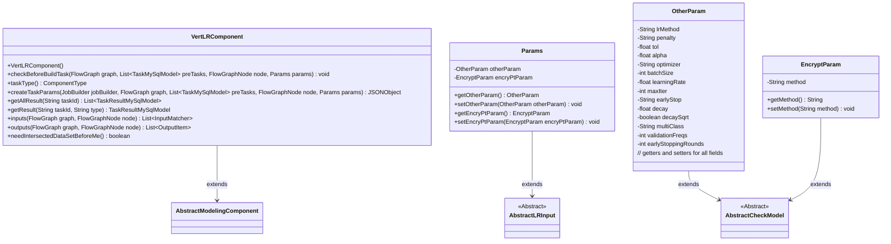

# Basic Information

|      |      |
|------|------|
| Name | VertLRComponent |
| Language | .java |
| Code Path | WeFe/board/board-service/src/main/java/com/welab/wefe/board/service/component/modeling/VertLRComponent.java |
| Package Name | com.welab.wefe.board.service.component.modeling |
| Dependencies | ['com.alibaba.fastjson.JSONObject', 'com.welab.wefe.board.service.component.base.io.IODataType', 'com.welab.wefe.board.service.component.base.io.InputMatcher', 'com.welab.wefe.board.service.component.base.io.Names', 'com.welab.wefe.board.service.component.base.io.OutputItem', 'com.welab.wefe.board.service.database.entity.job.JobMemberMySqlModel', 'com.welab.wefe.board.service.database.entity.job.TaskMySqlModel', 'com.welab.wefe.board.service.database.entity.job.TaskResultMySqlModel', 'com.welab.wefe.board.service.exception.FlowNodeException', 'com.welab.wefe.board.service.model.FlowGraph', 'com.welab.wefe.board.service.model.FlowGraphNode', 'com.welab.wefe.board.service.model.JobBuilder', 'com.welab.wefe.common.fieldvalidate.AbstractCheckModel', 'com.welab.wefe.common.fieldvalidate.annotation.Check', 'com.welab.wefe.common.util.JObject', 'com.welab.wefe.common.web.dto.AbstractLRInput', 'com.welab.wefe.common.wefe.enums.ComponentType', 'com.welab.wefe.common.wefe.enums.TaskResultType', 'org.springframework.stereotype.Service', 'java.util.Arrays', 'java.util.List', 'java.util.stream.Collectors'] |
| Brief Description | VertLRComponent is a vertical logistic regression component that inherits from AbstractModelingComponent. It checks the pre-alignment sample component, supports parameter configurations such as optimizer and learning rate, and outputs datasets and models. SSHE-LR only supports two-party participation. |

# Description

The VertLRComponent is a vertical logistic regression component inherited from AbstractModelingComponent, primarily designed for handling multi-party machine learning tasks. Before constructing a task, this component performs pre-checks, including verifying the existence of a sample alignment component and ensuring the number of participating parties meets requirements. It generates a JSON object containing various parameters through the createTaskParams method, including training parameters such as penalty terms, optimizers, and learning rates, as well as encryption methods and cross-validation settings. The component defines input-output matchers to ensure data flow correctness and supports the retrieval of model training results. The Params inner class encapsulates configuration items such as algorithm parameters and encryption parameters, with all parameters undergoing necessity validation through annotations.

# Class Summary

| Name   | Type  | Description |
|-------|------|-------------|
| VertLRComponent | class | VertLRComponent is a vertical logistic regression component that inherits from AbstractModelingComponent. Its main functionalities include: checking the pre-sample alignment component, validating participant count limits, generating task parameters (such as learning rate, batch size, etc.), and processing input/output datasets and models. It supports various parameter configurations, such as optimization algorithms and multi-classification strategies. |

## Class VertLRComponent

|      |      |
|------|------|
| Access Modifier | @Service;public |
| Type | class |
| Name | VertLRComponent |
| Description | VertLRComponent is a vertical logistic regression component that inherits from AbstractModelingComponent. Its main functionalities include: checking the pre-sample alignment component, validating participant count limits, generating task parameters (such as learning rate, batch size, etc.), and processing input/output datasets and models. It supports various parameter configurations, such as optimization algorithms and multi-classification strategies. |

### UML Class Diagram

Class Diagram Description:
VertLRComponent is a service class that inherits from AbstractModelingComponent and implements vertical logistic regression functionality. It includes methods for parameter validation, task creation, and result retrieval. Params is its internal parameter class, containing two nested classes, OtherParam and EncryptParam, which store algorithm parameters and encryption parameters respectively. These parameter classes all inherit from the abstract base class AbstractCheckModel, providing parameter validation capabilities. The entire class diagram illustrates the core structure and parameter system of the vertical logistic regression component.

### Internal Method Call Graph

This code implements a Vertical Logistic Regression Component (VertLRComponent) with core functionalities including: 1) Pre-check (checkBeforeBuildTask) to ensure existence of data intersection component and valid participant count; 2) Task parameter creation (createTaskParams) constructing JSON objects containing penalty terms, optimizer, learning rate, etc.; 3) Result processing (getAllResult/getResult) for retrieving training metrics and models; 4) Definition of input/output data specifications (inputs/outputs). The inner Params class encapsulates algorithm parameters, including regular parameters (OtherParam) and encryption parameters (EncryptParam). This component inherits from AbstractModelingComponent and belongs to machine learning modeling components in workflow nodes.

### Field List

| Name  | Type  | Description |
|-------|-------|------|

### Method List

| Name  | Type  | Description |
|-------|-------|------|
| checkBeforeBuildTask | void | Check preconditions for the build task: Ensure the sample alignment component exists, and if the sshe-lr method is used, the number of participants must not exceed two. |
| getAllResult | List<TaskResultMySqlModel> | This method retrieves all results by task ID, filters data of types metric_train and model_train, and returns a list after supplementing with reorganized data of both types. |
| getResult | TaskResultMySqlModel | Rewrite the method getResult to call the parent class method and return a TaskResultMySqlModel object, with parameters taskId and type. |
| taskType | ComponentType | Method override, returning component type as vertical layout. |
| createTaskParams | JSONObject | This method creates a task parameter JSON object, which includes machine learning parameters such as penalty coefficients, tolerance, learning rate, and optimizers, as well as configurations like encryption methods and cross-validation. |
| inputs | List<InputMatcher> | Method override, returns two InputMatcher instances that match the training dataset and evaluation dataset respectively, using preset filters. |
| outputs | List<OutputItem> | The method `outputs` returns two `OutputItem` objects, containing the output items and corresponding data types for `NORMAL_DATA_SET` and `TRAIN_MODEL` respectively. |
| needIntersectedDataSetBeforeMe | boolean | The method `needIntersectedDataSetBeforeMe` returns `true`, indicating that the intersection data set needs to be obtained first. |

