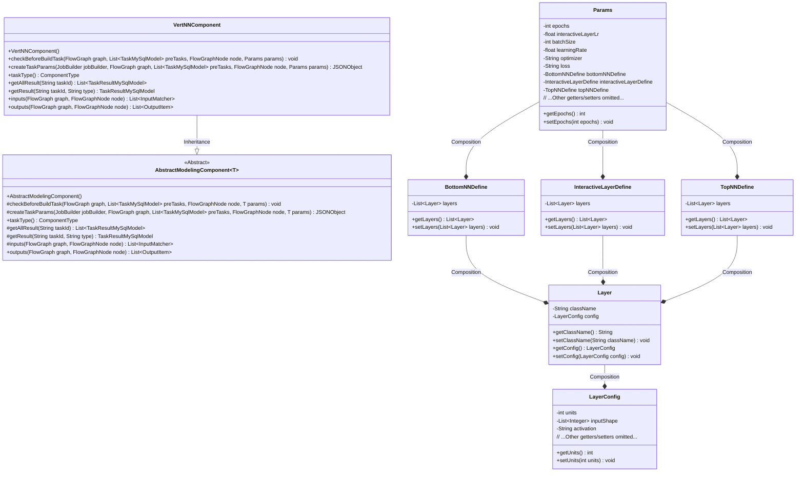
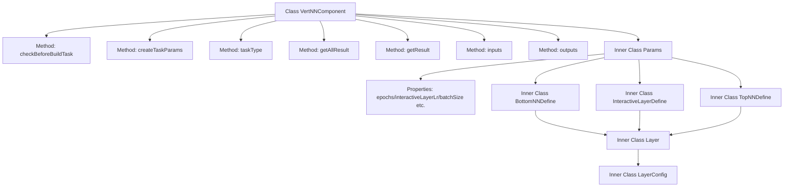
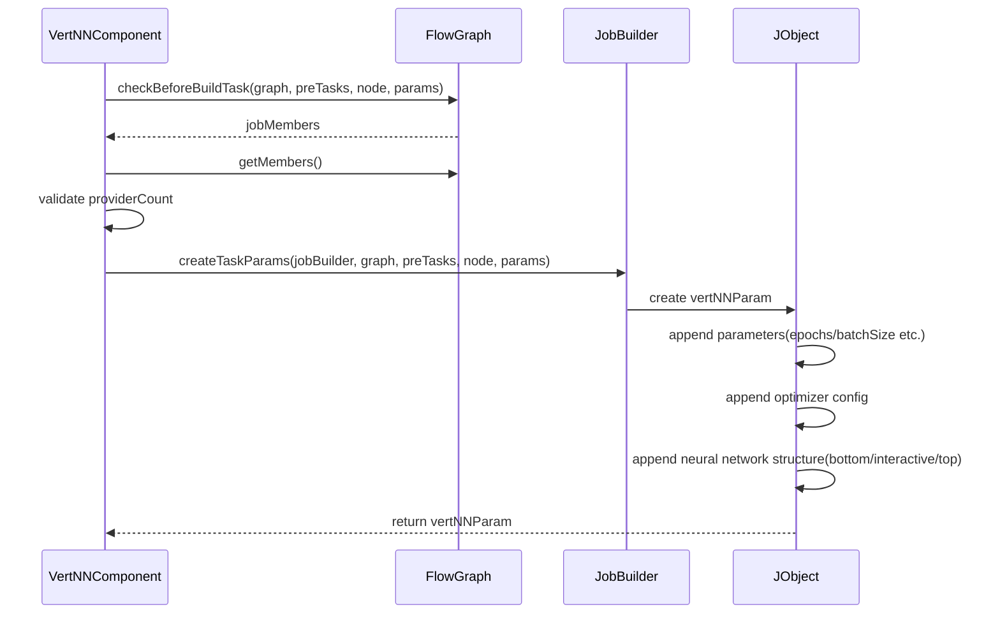

# Basic Information

|      |      |
|------|------|
| Name | VertNNComponent |
| Language | .java |
| Code Path | WeFe/board/board-service/src/main/java/com/welab/wefe/board/service/component/modeling/VertNNComponent.java |
| Package Name | com.welab.wefe.board.service.component.modeling |
| Dependencies | ['com.alibaba.fastjson.JSONObject', 'com.welab.wefe.board.service.component.base.io.IODataType', 'com.welab.wefe.board.service.component.base.io.InputMatcher', 'com.welab.wefe.board.service.component.base.io.Names', 'com.welab.wefe.board.service.component.base.io.OutputItem', 'com.welab.wefe.board.service.database.entity.job.JobMemberMySqlModel', 'com.welab.wefe.board.service.database.entity.job.TaskMySqlModel', 'com.welab.wefe.board.service.database.entity.job.TaskResultMySqlModel', 'com.welab.wefe.board.service.exception.FlowNodeException', 'com.welab.wefe.board.service.model.FlowGraph', 'com.welab.wefe.board.service.model.FlowGraphNode', 'com.welab.wefe.board.service.model.JobBuilder', 'com.welab.wefe.common.fieldvalidate.AbstractCheckModel', 'com.welab.wefe.common.fieldvalidate.annotation.Check', 'com.welab.wefe.common.util.JObject', 'com.welab.wefe.common.wefe.enums.ComponentType', 'com.welab.wefe.common.wefe.enums.JobMemberRole', 'org.springframework.stereotype.Service', 'java.util.ArrayList', 'java.util.Arrays', 'java.util.List'] |
| Brief Description | VertNNComponent is a vertical deep learning component that checks the number of collaborating parties and generates task parameters, including training parameters, neural network structure definitions, and input-output configurations. |

# Description

VertNNComponent is a vertical deep learning component that inherits from AbstractModelingComponent and is used to construct deep learning tasks. Before building a task, it checks the number of collaborating parties to ensure it does not exceed one. The component generates task parameters through the createTaskParams method, including configurations such as training epochs, learning rate, batch size, optimizer, loss function, etc., and defines the neural network structures for the bottom, interactive, and top layers. Inputs include training and evaluation datasets, while outputs consist of dataset instances and trained models. The Params class contains all necessary training parameters and network layer definitions, with each layer including the class name and configuration parameters such as dimensions, activation functions, etc.

# Class Summary

| Name   | Type  | Description |
|-------|------|-------------|
| VertNNComponent | class | VertNNComponent is a vertical deep learning component that verifies the number of collaborating parties and generates task parameters, including model architecture, optimizer, and training configuration. |

## Class VertNNComponent

|      |      |
|------|------|
| Access Modifier | @Service;public |
| Type | class |
| Name | VertNNComponent |
| Description | VertNNComponent is a vertical deep learning component that verifies the number of collaborating parties and generates task parameters, including model architecture, optimizer, and training configuration. |

### UML Class Diagram

Class diagram description: This diagram illustrates the inheritance relationship where the VertNNComponent class extends the generic class AbstractModelingComponent~Params~. The Params class internally contains multiple neural network definition classes (BottomNNDefine, InteractiveLayerDefine, TopNNDefine), which in turn contain Layer objects. Layers further encapsulate LayerConfig configuration items. The overall structure presents the parameter system and hierarchical relationships of a vertical deep learning component, demonstrating its capability for parameterized configuration of neural network architectures.

### Internal Method Call Graph

This flowchart demonstrates the core structure of the VertNNComponent class and its key method invocation relationships. As a vertical deep learning component, it validates input data compliance through checkBeforeBuildTask, and constructs a JSON object containing neural network architecture and optimizer parameters via createTaskParams. The inner Params class and its nested classes define a comprehensive neural network parameter system, including layer configurations and optimization strategies essential for deep learning. The sequence diagram highlights the parameter validation and configuration generation process during task creation.

### Field List

| Name  | Type  | Description |
|-------|-------|------|

### Method List

| Name  | Type  | Description |
|-------|-------|------|
| getAllResult | List<TaskResultMySqlModel> | This is a Java method that overrides the getAllResult method of the parent class, retrieving a list of all task results for a specified taskId through the listAllResult method of taskResultService. |
| taskType | ComponentType | Method override, returns component type as VertNN. |
| createTaskParams | JSONObject | Method to create a task parameter JSON object, including training parameters such as epochs, batch_size, optimizer settings, loss function, evaluation metrics, as well as neural network structure definitions (bottom, interactive, top layers), with configuration type set to keras. |
| checkBeforeBuildTask | void | Verify the number of collaborating parties before checking the build task, and if it exceeds 1, report an error indicating that only a single collaborating party is supported. |
| getResult | TaskResultMySqlModel | Override the parent class method to retrieve MySQL model results based on task ID and type. |
| inputs | List<InputMatcher> | Method override, returns two input matchers: the training dataset and the evaluation dataset, corresponding to the filter and the provider respectively. |
| outputs | List<OutputItem> | Method override, returns a list of output items containing dataset instances and neural network models. |

