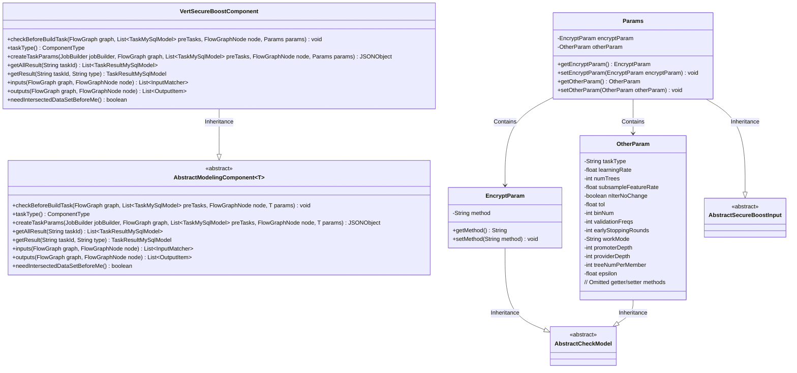
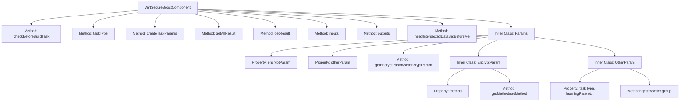
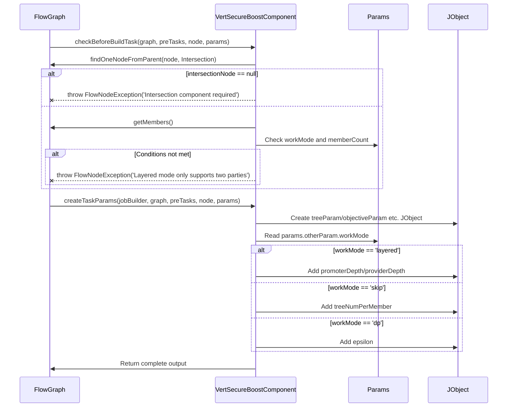

# Basic Information

|      |      |
|------|------|
| Name | VertSecureBoostComponent |
| Language | .java |
| Code Path | WeFe/board/board-service/src/main/java/com/welab/wefe/board/service/component/modeling/VertSecureBoostComponent.java |
| Package Name | com.welab.wefe.board.service.component.modeling |
| Dependencies | ['com.alibaba.fastjson.JSONObject', 'com.welab.wefe.board.service.component.base.filter.IntersectedOutputFilter', 'com.welab.wefe.board.service.component.base.io.IODataType', 'com.welab.wefe.board.service.component.base.io.InputMatcher', 'com.welab.wefe.board.service.component.base.io.Names', 'com.welab.wefe.board.service.component.base.io.OutputItem', 'com.welab.wefe.board.service.database.entity.job.JobMemberMySqlModel', 'com.welab.wefe.board.service.database.entity.job.TaskMySqlModel', 'com.welab.wefe.board.service.database.entity.job.TaskResultMySqlModel', 'com.welab.wefe.board.service.exception.FlowNodeException', 'com.welab.wefe.board.service.model.FlowGraph', 'com.welab.wefe.board.service.model.FlowGraphNode', 'com.welab.wefe.board.service.model.JobBuilder', 'com.welab.wefe.common.fieldvalidate.AbstractCheckModel', 'com.welab.wefe.common.fieldvalidate.annotation.Check', 'com.welab.wefe.common.util.JObject', 'com.welab.wefe.common.web.dto.AbstractSecureBoostInput', 'com.welab.wefe.common.wefe.enums.ComponentType', 'org.springframework.stereotype.Service', 'java.util.Arrays', 'java.util.List'] |
| Brief Description | VertSecureBoostComponent is a security-enhanced implementation of XGBoost that supports multiple working modes (normal/layered/skip/dp), including parameter validation, task creation, and result processing functions, requiring a preceding sample alignment component. |

# Description

VertSecureBoostComponent is a security-enhanced modeling component based on XGBoost, inherited from AbstractModelingComponent. It includes parameter validation logic, requires a preceding sample alignment component, and restricts the layered mode to only two participants. The component supports multiple working modes (normal/layered/skip/dp), each corresponding to different parameter configurations. Core functionalities encompass creating task parameters (learning rate, number of trees, encryption methods, etc.), obtaining task results, and defining input/output data formats. The parameter class Params encapsulates configuration items such as encryption parameters, tree parameters, and objective function parameters, containing strict parameter validation annotations. The component output includes datasets and XGBoost models, requiring that input data must undergo alignment processing beforehand.

# Class Summary

| Name   | Type  | Description |
|-------|------|-------------|
| VertSecureBoostComponent | class | The VertSecureBoostComponent is a security-enhanced vertical federated learning component that inherits from AbstractModelingComponent. It implements functions such as parameter validation, task parameter construction, and input/output definition, supports multiple working modes (normal, layered, skip, dp), and includes configurations for tree parameters, objective parameters, and encryption parameters. |

## Class VertSecureBoostComponent

|      |      |
|------|------|
| Access Modifier | @Service;public |
| Type | class |
| Name | VertSecureBoostComponent |
| Description | The VertSecureBoostComponent is a security-enhanced vertical federated learning component that inherits from AbstractModelingComponent. It implements functions such as parameter validation, task parameter construction, and input/output definition, supports multiple working modes (normal, layered, skip, dp), and includes configurations for tree parameters, objective parameters, and encryption parameters. |

### UML Class Diagram

This code demonstrates a secure enhanced gradient boosting tree component VertSecureBoostComponent, which inherits from AbstractModelingComponent and implements various parameter validation and task creation functions. The class diagram clearly illustrates the inheritance and containment relationships between the component and parameter classes, including the core parameter class Params and its nested classes EncryptParam and OtherParam. This component is primarily used for secure tree model construction in federated learning scenarios, supporting multiple work modes (normal/layered/skip/dp) and parameter configurations, ensuring model construction reliability through strict input validation.

### Internal Method Call Graph

This flowchart illustrates the core structure and invocation relationships of VertSecureBoostComponent, including 8 main methods and nested Params parameter class. The sequence diagram focuses on the execution flow of two key methods: checkBeforeBuildTask verifies preconditions and participant count, while createTaskParams dynamically constructs task parameters based on different workModes. The component implements secure boosting tree algorithm in federated learning, ensuring data security and algorithmic effectiveness during multi-party collaboration through strict parameter validation and flexible work mode configuration.

### Field List

| Name  | Type  | Description |
|-------|-------|------|

### Method List

| Name  | Type  | Description |
|-------|-------|------|
| getAllResult | List<TaskResultMySqlModel> | This method overrides the parent class functionality by invoking the listAllResult method of taskResultService to retrieve all task result lists associated with the specified taskId. |
| getResult | TaskResultMySqlModel | Rewrite the getResult method to call the parent class implementation and return a TaskResultMySqlModel object, with taskId and type as parameters. |
| createTaskParams | JSONObject | This method creates a JSON object for XGBoost task parameters, including tree parameters, objective parameters, encryption parameters, cross-validation parameters, etc., and adds different fields based on the working mode. |
| checkBeforeBuildTask | void | Check preconditions for build task: A sample alignment component must exist; if in layered mode and involving more than two parties, an error should be reported. |
| taskType | ComponentType | Method override, returning component type as VertSecureBoost. |
| inputs | List<InputMatcher> | This method overrides the inputs method, returning two InputMatcher objects that match the training dataset and evaluation dataset respectively, processed using IntersectedOutputFilter and TEST_DATA_SET_SUPPLIER. |
| outputs | List<OutputItem> | The method outputs returns two output items: the NORMAL_DATA_SET dataset and the XGBoost model of TRAIN_MODEL. |
| needIntersectedDataSetBeforeMe | boolean | The method `needIntersectedDataSetBeforeMe` returns `true`, indicating that the intersection data set needs to be obtained before executing the current operation. |

