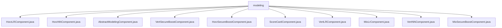

# Basic Information

|      |      |
|------|------|
| Name | modeling |
| Language | .java |
| Code Path | WeFe/board/board-service/src/main/java/com/welab/wefe/board/service/component/modeling |
| Package Name | docs.board.board-service.src.main.java.com.welab.wefe.board.service.component.modeling |
| Brief Description | Multiple machine learning component classes inheriting from AbstractModelingComponent, including logistic regression, neural networks, secure enhanced tree models, scorecards, etc., implement parameter validation, task creation, and result processing functions, supporting various federated learning scenarios. |

# Description

## Overview  
This module is a collection of federated learning modeling components, with its core responsibility being the implementation of distributed training for various machine learning algorithms, including logistic regression, neural networks, XGBoost, etc. It supports horizontal, vertical, and hybrid data partitioning scenarios. The interface specification uniformly employs `createTaskParams` to construct JSON parameters, encapsulating algorithm configurations through internal `Params` classes, such as the penalty coefficient in `HorzLRComponent` or the neural network layer definitions in `VertNNComponent`. Key data structures include training parameters (e.g., learning rate, iteration count), model architecture (e.g., tree depth, network layers), and validation annotations. External dependencies include JSON processing libraries, the XGBoost framework, and the Spring service container. For example, `ScoreCardComponent` relies on binning models, while `VertSecureBoostComponent` requires pre-aligned samples.

## Primary Business Scenarios  
The module supports the entire federated learning workflow, with typical scenarios such as horizontal logistic regression training (`HorzLRComponent`) or vertical XGBoost modeling (`VertSecureBoostComponent`). The interaction mode is standardized as: input training/evaluation datasets → parameter validation → generate JSON task configuration → output models and metrics. Functional completeness is reflected in supported algorithms (e.g., logistic regression, scorecards), training modes (e.g., DP encryption), and evaluation processes. For instance, `MixSecureBoostComponent` supports grid search, while `VertNNComponent` defines a three-layer network structure. API types encompass parameter construction, result merging (similar to MapReduce), and pre-validation. Integration examples include `HorzNNComponent`'s TensorFlow interface and `ScoreCardComponent`'s WOE value transformation.

### Package Internal Structure View

This flowchart illustrates the class structure relationships of the modeling component within the board-service module of the WeFe project. All component classes are directly subordinate to the modeling directory, encompassing implementations of various horizontal/vertical machine learning algorithms (e.g., HorzLRComponent, VertSecureBoostComponent, etc.) as well as the abstract base class AbstractModelingComponent. The 10 leaf nodes comprehensively cover all specified path information.

# File List

| Name   | Type  | Description |
|-------|------|-------------|
| [HorzLRComponent.java](HorzLRComponent.md) | file | HorzLRComponent is a horizontal logistic regression component that inherits from AbstractModelingComponent. It includes functionalities such as parameter validation, task parameter generation, and input-output definition, primarily handling training data and model output. |
| [HorzNNComponent.java](HorzNNComponent.md) | file | HorzNNComponent is a horizontal neural network component that inherits from AbstractModelingComponent, encompassing parameter validation, task creation, input/output definition, and neural network layer configuration. |
| [AbstractModelingComponent.java](AbstractModelingComponent.md) | file | The abstract class AbstractModelingComponent defines a training dataset filter and a test/validation dataset provider, including methods for obtaining task results, handling training loss data sorting, and merging results. |
| [VertSecureBoostComponent.java](VertSecureBoostComponent.md) | file | VertSecureBoostComponent is a security-enhanced implementation of XGBoost that supports multiple working modes (normal/layered/skip/dp), including parameter validation, task creation, and result processing functionalities, requiring a preceding sample alignment component. |
| [HorzSecureBoostComponent.java](HorzSecureBoostComponent.md) | file | The HorzSecureBoostComponent is a horizontally secure enhanced component based on XGBoost, designed for building machine learning models. It includes functions such as parameter validation, task parameter generation, and input-output definitions, supporting configurations for tree parameters, objective parameters, and cross-validation parameters, while outputting datasets and trained models. |
| [ScoreCardComponent.java](ScoreCardComponent.md) | file | The ScoreCardComponent is a scorecard component. The prerequisite process must include binning and logistic regression components to generate scorecard results and handle the output. |
| [VertLRComponent.java](VertLRComponent.md) | file | VertLRComponent is a vertical logistic regression component that inherits from AbstractModelingComponent. It checks the pre-sample alignment component, supports parameter configurations such as optimizer and learning rate, and outputs datasets and models. SSHE-LR only supports two-party participation. |
| [MixLrComponent.java](MixLrComponent.md) | file | The MixLrComponent is a mixed logistic regression component that inherits from AbstractModelingComponent. It includes functionalities such as parameter validation, task construction, and result retrieval, defines input/output data and model types, and incorporates parameters like optimizer and learning rate for training configuration. |
| [VertNNComponent.java](VertNNComponent.md) | file | VertNNComponent is a vertical deep learning component that checks the number of collaborating parties and generates task parameters, including training parameters, neural network structure definitions, and input-output configurations. |
| [MixSecureBoostComponent.java](MixSecureBoostComponent.md) | file | The MixSecureBoostComponent is a hybrid security enhancement component that inherits from AbstractModelingComponent and is used to construct security enhancement tasks. It includes parameter validation, task parameter generation, result retrieval, and input-output matching functionalities, supporting the XGBoost algorithm, homomorphic encryption, and cross-validation. |

