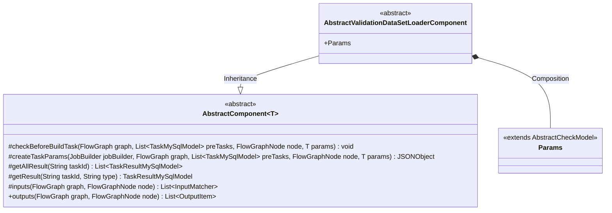
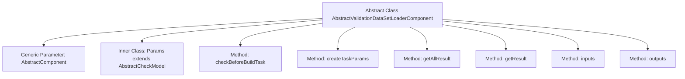

# Basic Information

|      |      |
|------|------|
| Name | AbstractValidationDataSetLoaderComponent |
| Language | .java |
| Code Path | WeFe/board/board-service/src/main/java/com/welab/wefe/board/service/component/temp/AbstractValidationDataSetLoaderComponent.java |
| Package Name | com.welab.wefe.board.service.component.temp |
| Dependencies | ['com.alibaba.fastjson.JSONObject', 'com.welab.wefe.board.service.component.base.AbstractComponent', 'com.welab.wefe.board.service.component.base.io.IODataType', 'com.welab.wefe.board.service.component.base.io.InputMatcher', 'com.welab.wefe.board.service.component.base.io.Names', 'com.welab.wefe.board.service.component.base.io.OutputItem', 'com.welab.wefe.board.service.database.entity.job.TaskMySqlModel', 'com.welab.wefe.board.service.database.entity.job.TaskResultMySqlModel', 'com.welab.wefe.board.service.exception.FlowNodeException', 'com.welab.wefe.board.service.model.FlowGraph', 'com.welab.wefe.board.service.model.FlowGraphNode', 'com.welab.wefe.board.service.model.JobBuilder', 'com.welab.wefe.common.fieldvalidate.AbstractCheckModel', 'java.util.Arrays', 'java.util.List'] |
| Brief Description | The abstract class `AbstractValidationDataSetLoaderComponent` extends `AbstractComponent` and implements methods such as task parameter creation, result retrieval, and input-output matching, including a static `Params` class. |

# Description

This is an abstract class AbstractValidationDataSetLoaderComponent, which inherits from AbstractComponent with a generic parameter of the inner class Params. The class primarily defines the functionality for loading validation datasets and includes multiple overridden methods: checkBeforeBuildTask for pre-build checks, createTaskParams for creating task parameters, getAllResult and getResult for retrieving task results, inputs defining input matchers (requiring BoardDataSet of type NORMAL_DATA_SET), and outputs returning null values. The inner static class Params inherits from AbstractCheckModel and is used for parameter passing. The overall structure provides a foundational framework for data processing nodes in flowcharts.

# Class Summary

| Name   | Type  | Description |
|-------|------|-------------|
| AbstractValidationDataSetLoaderComponent | class | The abstract class `AbstractValidationDataSetLoaderComponent` inherits from `AbstractComponent` and includes methods such as parameter validation, task parameter creation, result retrieval, and input/output definitions, with `Params` being an internal static class. |

## Class AbstractValidationDataSetLoaderComponent

|      |      |
|------|------|
| Access Modifier | public abstract |
| Type | class |
| Name | AbstractValidationDataSetLoaderComponent |
| Description | The abstract class `AbstractValidationDataSetLoaderComponent` inherits from `AbstractComponent` and includes methods such as parameter validation, task parameter creation, result retrieval, and input/output definitions, with `Params` being an internal static class. |

### UML Class Diagram

This code describes an abstract class `AbstractValidationDataSetLoaderComponent` that inherits from the generic class `AbstractComponent<Params>` and implements multiple data processing-related methods. The `Params` is an internal static class extending `AbstractCheckModel`. This class is primarily used for loading validation datasets, featuring input/output matching, task parameter creation, and result querying functionalities, embodying a component-based design approach. All methods are either protected or public abstract methods requiring concrete implementation by subclasses.

### Internal Method Call Graph

This flowchart illustrates the class structure of an abstract data validation set loading component. The core is an abstract class inheriting from AbstractComponent, containing 6 main methods: pre-check, task parameter creation, result query (batch/single), and input/output definitions. The inner class Params handles parameter validation, with all methods centered around flowchart construction and validation, reflecting a component-based design philosophy.

### Field List

| Name  | Type  | Description |
|-------|-------|------|

### Method List

| Name  | Type  | Description |
|-------|-------|------|
| outputs | List<OutputItem> | Rewrite the outputs method to return an empty list, accepting FlowGraph and FlowGraphNode parameters. |
| getAllResult | List<TaskResultMySqlModel> | The method getAllResult retrieves the list of task results based on taskId, currently returning null. |
| checkBeforeBuildTask | void | Check preconditions for build tasks, including flowcharts, prerequisite tasks, nodes, and parameters, which may throw exceptions. |
| getResult | TaskResultMySqlModel | Method override, retrieves results based on task ID and type, currently returns empty. |
| inputs | List<InputMatcher> | Java method override, returns an InputMatcher list containing Data.NORMAL_DATA_SET and BoardDataSet types. |
| createTaskParams | JSONObject | The method `createTaskParams` is used to generate task parameters and returns a `JSONObject`. The parameters include `JobBuilder`, `FlowGraph`, a list of predecessor tasks, nodes, and parameters. The current implementation returns `null`. |

