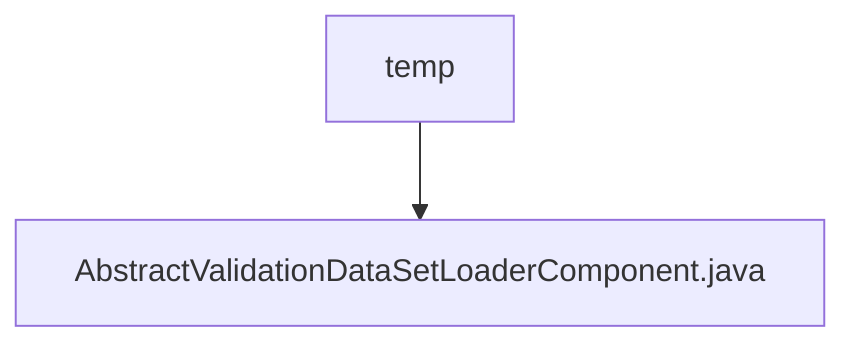

# Basic Information

|      |      |
|------|------|
| Name | temp |
| Language | .java |
| Code Path | WeFe/board/board-service/src/main/java/com/welab/wefe/board/service/component/temp |
| Package Name | docs.board.board-service.src.main.java.com.welab.wefe.board.service.component.temp |
| Brief Description | The abstract class `AbstractValidationDataSetLoaderComponent` extends `AbstractComponent` and implements methods such as task parameter creation, result retrieval, and input-output matching, including a static `Params` class. |

# Description

This is an abstract class `AbstractValidationDataSetLoaderComponent`, which inherits from `AbstractComponent` with the generic parameter being the inner class `Params`. The class primarily defines the functionality for loading validation datasets and includes multiple overridden methods: `checkBeforeBuildTask` for pre-build checks, `createTaskParams` for creating task parameters, `getAllResult` and `getResult` for retrieving task results, `inputs` defining input matchers (requiring `BoardDataSet` of type `NORMAL_DATA_SET`), and `outputs` returning null. The inner static class `Params` inherits from `AbstractCheckModel` and is used for parameter passing. The overall structure provides a foundational framework for data processing nodes in flowcharts.

### Package Internal Structure View

This flowchart illustrates the structural relationship of a temporary component directory in the WeFe project. The root node "temp" represents the temporary component directory, which contains a specific Java implementation file "AbstractValidationDataSetLoaderComponent.java". Such a structure is commonly found in directories storing temporary or experimental code during project development, typically used for feature development or testing phases.

# File List

| Name   | Type  | Description |
|-------|------|-------------|
| [AbstractValidationDataSetLoaderComponent.java](AbstractValidationDataSetLoaderComponent.md) | file | The abstract class `AbstractValidationDataSetLoaderComponent` extends `AbstractComponent`, implementing methods such as task parameter creation, result retrieval, and input-output matching, and includes a static `Params` class. |

