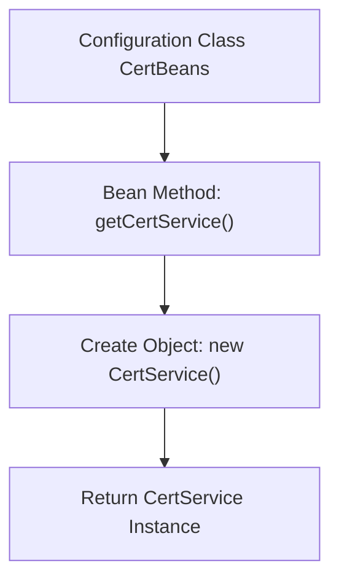

# Basic Information

|      |      |
|------|------|
| Name | CertBeans |
| Language | .java |
| Code Path | WeFe/board/board-service/src/main/java/com/welab/wefe/board/service/config/CertBeans.java |
| Package Name | com.welab.wefe.board.service.config |
| Dependencies | ['com.webank.cert.toolkit.service.CertService', 'org.springframework.context.annotation.Bean', 'org.springframework.context.annotation.Configuration'] |
| Brief Description | The Java configuration class CertBeans defines a Bean method getCertService, which returns a CertService instance. |

# Description

This is a Java configuration class named CertBeans, marked with the @Configuration annotation. The class defines a Bean method named getCertService, annotated with @Bean. This method creates and returns a new instance of CertService. The purpose of this configuration class is to provide the Bean definition of CertService for management by the Spring container. The entire configuration is concise and straightforward, with no additional dependencies or parameter settings.

# Class Summary

| Name   | Type  | Description |
|-------|------|-------------|
| CertBeans | class | The Java configuration class CertBeans defines a Bean method getCertService, which returns a CertService instance. |


## Class CertBeans

|      |      |
|------|------|
| Access Modifier | @Configuration;public |
| Type | class |
| Name | CertBeans |
| Description | The Java configuration class CertBeans defines a Bean method getCertService, which returns a CertService instance. |


### UML Class Diagram

```mermaid
classDiagram
    class CertBeans {
        +CertService getCertService() CertService
    }
    class CertService {
    }
    CertBeans --> CertService : <<create>> 
    // The CertBeans configuration class is responsible for creating CertService instances
    // The @Bean annotation integrates CertService into Spring container management
```

This code demonstrates a Spring configuration class CertBeans, which defines a factory method getCertService() via the @Bean annotation to create and return a CertService instance. The class diagram clearly illustrates the creation dependency relationship between CertBeans and CertService, aligning with Spring IoC container management. This configuration enables CertService to be utilized by other components through dependency injection, embodying the core inversion-of-control feature of the Spring framework. The structure is concise yet complete, conforming to standard enterprise application configuration patterns.


### Internal Method Call Graph



This flowchart illustrates the core logic of the Spring configuration class CertBeans. The CertBeans class is marked as a configuration class with the @Configuration annotation, containing a @Bean-annotated method getCertService(). During Spring container startup, this method is invoked to create a CertService instance and register it with the container. The entire process demonstrates the complete workflow from configuration class to Bean instance generation, reflecting the fundamental principles of Spring dependency injection.

### Field List

| Name  | Type  | Description |
|-------|-------|------|

### Method List

| Name  | Type  | Description |
|-------|-------|------|
| getCertService | CertService | Spring Bean definition, creates and returns a CertService instance. |


