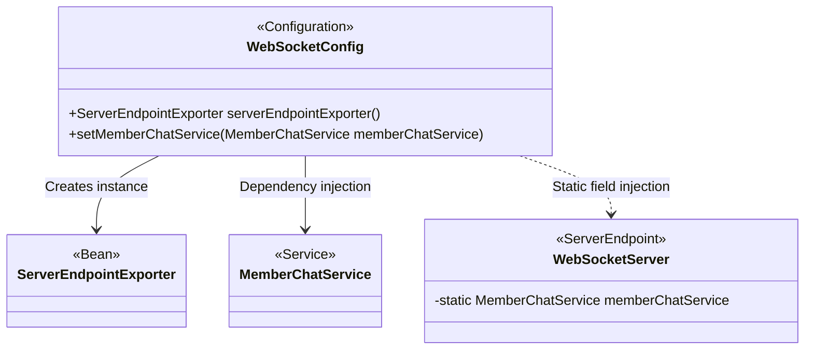
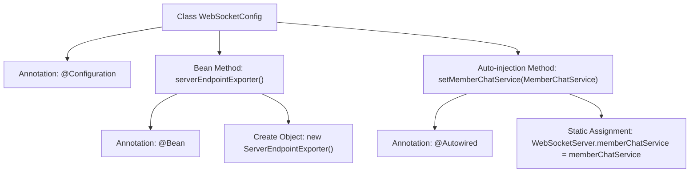

# Basic Information

|      |      |
|------|------|
| Name | WebSocketConfig |
| Language | .java |
| Code Path | WeFe/board/board-service/src/main/java/com/welab/wefe/board/service/config/WebSocketConfig.java |
| Package Name | com.welab.wefe.board.service.config |
| Dependencies | ['com.welab.wefe.board.service.service.MemberChatService', 'com.welab.wefe.board.service.service.WebSocketServer', 'org.springframework.beans.factory.annotation.Autowired', 'org.springframework.context.annotation.Bean', 'org.springframework.context.annotation.Configuration', 'org.springframework.web.socket.server.standard.ServerEndpointExporter'] |
| Brief Description | WebSocket configuration class, registering endpoint exporters and manually injecting chat service into global variables. |

# Description

This configuration class is used for WebSocket server setup. Firstly, it defines a ServerEndpointExporter Bean to automatically register WebSocket endpoints annotated with @ServerEndpoint. Secondly, through autowiring, it injects MemberChatService into the static variable of WebSocketServer, resolving the dependency injection failure issue caused by SpringBoot WebSocket creating separate instances for each client connection.

# Class Summary

| Name   | Type  | Description |
|-------|------|-------------|
| WebSocketConfig | class | WebSocket configuration class, registers ServerEndpointExporter to support WebSocket endpoints, and automatically injects MemberChatService as a global setting for WebSocketServer. |

## Class WebSocketConfig

|      |      |
|------|------|
| Access Modifier | @Configuration;public |
| Type | class |
| Name | WebSocketConfig |
| Description | WebSocket configuration class, registers ServerEndpointExporter to support WebSocket endpoints, and automatically injects MemberChatService as a global setting for WebSocketServer. |

### UML Class Diagram

This code demonstrates the WebSocketConfig configuration class in Spring Boot, which registers ServerEndpointExporter via the @Bean annotation to scan endpoints annotated with @ServerEndpoint, and statically injects MemberChatService into WebSocketServer through a setter method. The class diagram clearly illustrates the relationships between the configuration class and three key components (ServerEndpointExporter, MemberChatService, and WebSocketServer), where WebSocketServer, as a service endpoint, holds a static reference to MemberChatService. This design resolves the conflict between WebSocket singleton and Spring Bean management.

### Internal Method Call Graph

This flowchart illustrates the core structure of a SpringBoot WebSocket configuration class. The class is marked as a configuration class with @Configuration, providing two key functionalities: 1) Registering ServerEndpointExporter via @Bean to support @ServerEndpoint annotations; 2) Automatically injecting MemberChatService into WebSocketServer's static variable using @Autowired, resolving dependency injection issues caused by WebSocket multi-instancing. The arrows clearly depict the hierarchical invocation relationships between annotations, methods, and internal logic.

### Field List

| Name  | Type  | Description |
|-------|-------|------|

### Method List

| Name  | Type  | Description |
|-------|-------|------|
| setMemberChatService | void | Inject the MemberChatService using the @Autowired annotation and assign it to the static member variable memberChatService of WebSocketServer. |
| serverEndpointExporter | ServerEndpointExporter | The code defines a Spring Bean for exporting a WebSocket endpoint to enable WebSocket communication. |

