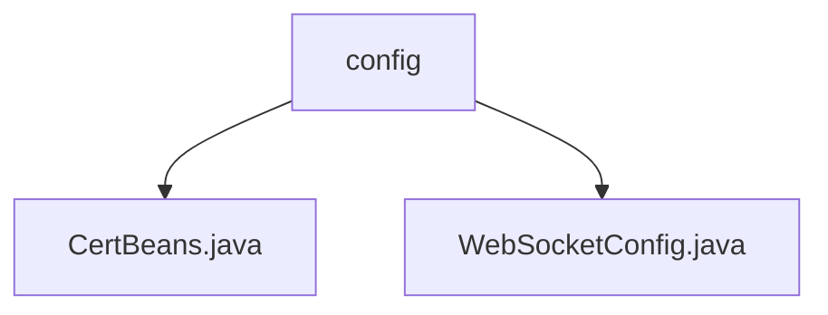

# Basic Information

|      |      |
|------|------|
| Name | config |
| Language | .java |
| Code Path | WeFe/board/board-service/src/main/java/com/welab/wefe/board/service/config |
| Package Name | docs.board.board-service.src.main.java.com.welab.wefe.board.service.config |
| Brief Description | CertBeans is a Java configuration class that provides the Bean definition for CertService. The WebSocketConfig configuration class registers WebSocket endpoints and resolves dependency injection issues. |

# Description

## Overview  
The core responsibility of this module is to provide Spring container-managed Bean configurations, including two types of configurations: certificate services and WebSocket services. The interface specification involves @Bean method definitions and static dependency injection, with key data structures including CertService and ServerEndpointExporter. External dependencies only require basic Spring framework components. For example, CertBeans creates a no-argument CertService instance, while WebSocketConfig resolves WebSocket dependency injection issues through static variables.  

## Main Business Scenarios  
The module supports two typical scenarios: certificate service initialization and WebSocket service deployment. The business process adopts the standard Spring Bean management mechanism, similar to the factory pattern for generating service instances. Interaction modes include automatic registration (e.g., @ServerEndpoint processing) and cross-instance dependency sharing (e.g., static MemberChatService injection). The complete functionality covers requirements from basic configurations to real-time communication, such as the integration of certificate verification and member chat services.

### Package Internal Structure View

This flowchart illustrates the configuration file structure of the board-service module in the WeFe project. The root node "config" contains two Java configuration files: CertBeans.java and WebSocketConfig.java, which are used for certificate management and WebSocket configuration respectively. This hierarchical relationship clearly reflects the organization of the project's configuration module, making it easier for developers to quickly locate relevant configuration files.

# File List

| Name   | Type  | Description |
|-------|------|-------------|
| [CertBeans.java](CertBeans.md) | file | The Java configuration class CertBeans defines a Bean method getCertService, which returns a CertService instance. |
| [WebSocketConfig.java](WebSocketConfig.md) | file | WebSocket configuration class, registering endpoint exporter and manually injecting chat service into global variables. |

