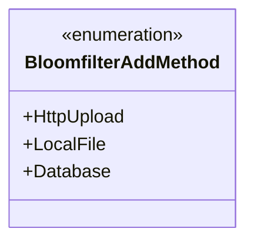
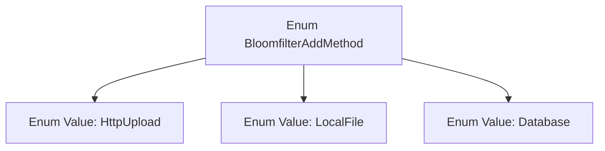

# Basic Information

|      |      |
|------|------|
| Name | BloomfilterAddMethod |
| Language | .java |
| Code Path | WeFe/board/board-service/src/main/java/com/welab/wefe/board/service/constant/BloomfilterAddMethod.java |
| Package Name | com.welab.wefe.board.service.constant |
| Dependencies | [] |
| Brief Description | The BloomfilterAddMethod enumeration defines three addition methods: HttpUpload, LocalFile, and Database. |

# Description

This is an enumeration type named BloomfilterAddMethod, which defines three methods for adding data to a Bloom filter: HttpUpload indicates addition via HTTP upload, LocalFile indicates addition via local file, and Database indicates addition via database. The enumeration clearly and concisely lists three different data source approaches.

# Class Summary

| Name   | Type  | Description |
|-------|------|-------------|
| BloomfilterAddMethod | enum | The BloomfilterAddMethod enumeration defines three Bloom filter addition methods: HttpUpload, LocalFile, and Database. |

## Class BloomfilterAddMethod

|      |      |
|------|------|
| Access Modifier | public |
| Type | enum |
| Name | BloomfilterAddMethod |
| Description | The BloomfilterAddMethod enumeration defines three Bloom filter addition methods: HttpUpload, LocalFile, and Database. |

### UML Class Diagram

This class diagram illustrates an enumeration type named BloomfilterAddMethod, which includes three enum constants: HttpUpload, LocalFile, and Database. The enumeration likely represents different source methods for adding data to a Bloom filter, such as via HTTP upload, local file loading, or database reading. In the class diagram, the enumeration is marked with <<enumeration>>, clearly indicating its non-instantiable nature and fixed-value characteristics.

### Internal Method Call Graph

This flowchart illustrates the structure of the BloomfilterAddMethod enum, which includes three enum values: HttpUpload, LocalFile, and Database. The enum is used to define three distinct methods for adding data to a Bloom filter, corresponding to three data source approaches: HTTP upload, local file reading, and database query. Each enum value is an instance of this enum type and can be used for type-safe configuration options or mode selection.

### Field List

| Name  | Type  | Description |
|-------|-------|------|

### Method List

| Name  | Type  | Description |
|-------|-------|------|

