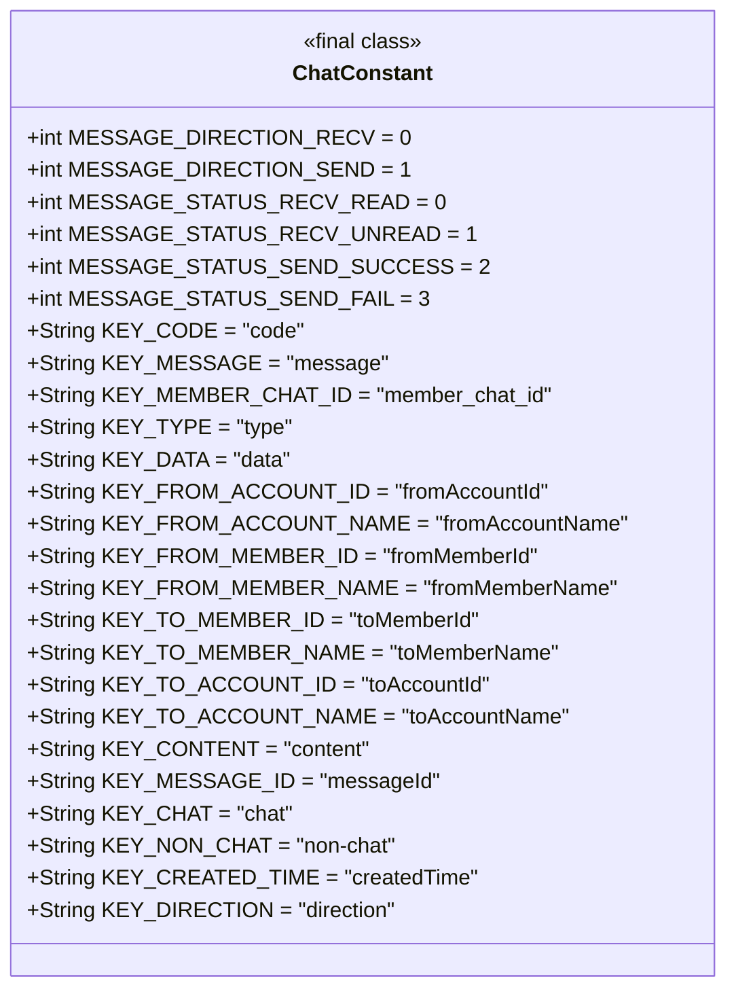
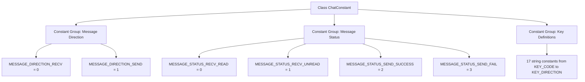

# Basic Information

|      |      |
|------|------|
| Name | ChatConstant |
| Language | .java |
| Code Path | WeFe/board/board-service/src/main/java/com/welab/wefe/board/service/constant/ChatConstant.java |
| Package Name | com.welab.wefe.board.service.constant |
| Dependencies | [] |
| Brief Description | The ChatConstant class defines message direction, status constants, and key names, which are used for message transmission/reception processing and data structure identification. |

# Description

The code defines a public class named ChatConstant, which contains static constants for message direction and status, as well as string constants for key-value pairs used in a chat system. The message direction constants distinguish between received and sent messages, while the status constants cover read, unread, sent successfully, and failed to send. The key-value pair constants are used to identify critical fields such as code, message content, member ID, account information, message ID, chat type, creation time, and direction. These constants provide standardized naming and values for chat functionality.

# Class Summary

| Name   | Type  | Description |
|-------|------|-------------|
| ChatConstant | class | The ChatConstant class defines message direction, status constants, and key names, including received/sent states, read/unread identifiers, and various message-related key values. |

## Class ChatConstant

|      |      |
|------|------|
| Access Modifier | public |
| Type | class |
| Name | ChatConstant |
| Description | The ChatConstant class defines message direction, status constants, and key names, including received/sent states, read/unread identifiers, and various message-related key values. |

### UML Class Diagram

This code defines a final class named ChatConstant, which contains multiple static constant fields representing message directions, statuses, and various key names. These constants are used in the chat system to identify message attributes, states, and key-value pairs in data structures, facilitating unified reference and maintenance in the code. The class diagram displays all public static constant fields along with their types and default values.

### Internal Method Call Graph

This flowchart illustrates the structure of three constant groups defined in the ChatConstant class: message direction constants (receive/send), message status constants (read/unread/send success/failure), and a group of key name string constants. All constants are public final static types, used to uniformly manage protocol fields and status codes in the chat module, forming a clear hierarchical classification of constants.

### Field List

| Name  | Type  | Description |
|-------|-------|------|
| KEY_CONTENT = "content" | String | Defined a public static constant string KEY_CONTENT with the value "content". |
| KEY_MESSAGE = "message" | String | Define a static constant string KEY_MESSAGE with the value "message". |
| KEY_CODE = "code" | String | Define a constant string KEY_CODE with the value "code". |
| KEY_FROM_MEMBER_ID = "fromMemberId" | String | Define a static constant string KEY_FROM_MEMBER_ID with the value "fromMemberId". |
| KEY_TYPE = "type" | String | Defined a public static immutable string constant KEY_TYPE with the value "type". |
| MESSAGE_DIRECTION_RECV = 0 | int | Define the static constant MESSAGE_DIRECTION_RECV with a value of 0, indicating the message receiving direction. |
| KEY_FROM_MEMBER_NAME = "fromMemberName" | String | Define a static constant string KEY_FROM_MEMBER_NAME with the value "fromMemberName". |
| KEY_DATA = "data" | String | Define a constant string KEY_DATA with the value "data". |
| KEY_FROM_ACCOUNT_ID = "fromAccountId" | String | Define a static constant string KEY_FROM_ACCOUNT_ID with the value "fromAccountId". |
| KEY_TO_ACCOUNT_ID = "toAccountId" | String | Define a constant string KEY_TO_ACCOUNT_ID with the value "toAccountId", used to identify the target account ID. |
| KEY_FROM_ACCOUNT_NAME = "fromAccountName" | String | Define a static constant string KEY_FROM_ACCOUNT_NAME with the value "fromAccountName". |
| MESSAGE_STATUS_RECV_UNREAD = 1 | int | Message status constant: Unread received message, value is 1. |
| MESSAGE_STATUS_SEND_SUCCESS = 2 | int | The status code for a successful message send is 2. |
| MESSAGE_STATUS_RECV_READ = 0 | int | Message status: Received and read, value is 0. |
| KEY_TO_ACCOUNT_NAME = "toAccountName" | String | Define a static constant string KEY_TO_ACCOUNT_NAME with the value "toAccountName". |
| KEY_MEMBER_CHAT_ID = "member_chat_id" | String | Define the constant string KEY_MEMBER_CHAT_ID with the value "member_chat_id". |
| KEY_TO_MEMBER_ID = "toMemberId" | String | Define a static constant string KEY_TO_MEMBER_ID with the value "toMemberId". |
| MESSAGE_STATUS_SEND_FAIL = 3 | int | Define the static constant MESSAGE_STATUS_SEND_FAIL with a value of 3, representing the message send failure status. |
| KEY_TO_MEMBER_NAME = "toMemberName" | String | Define a static constant string KEY_TO_MEMBER_NAME with the value "toMemberName". |
| MESSAGE_DIRECTION_SEND = 1 | int | Define the static constant MESSAGE_DIRECTION_SEND with a value of 1, indicating the message sending direction. |
| KEY_MESSAGE_ID = "messageId" | String | Define a constant string KEY_MESSAGE_ID with the value "messageId", used to identify the message ID. |
| KEY_CHAT = "chat" | String | Define a static constant KEY_CHAT with the value "chat", which cannot be modified. |
| KEY_NON_CHAT = "non-chat" | String | Define an immutable static string constant KEY_NON_CHAT with the value "non-chat". |
| KEY_CREATED_TIME = "createdTime" | String | Define a constant string KEY_CREATED_TIME with the value "createdTime", representing the key name for creation time. |
| KEY_DIRECTION = "direction" | String | Define a static constant string KEY_DIRECTION with the value "direction". |

### Method List

| Name  | Type  | Description |
|-------|-------|------|

