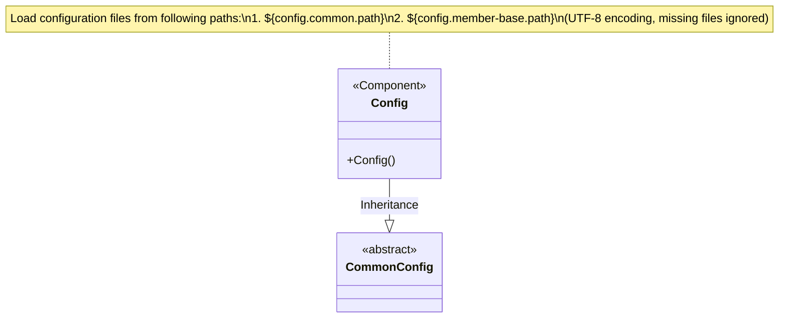
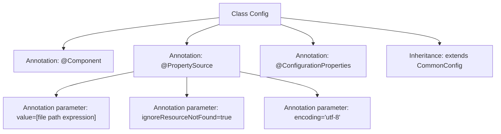

# Basic Information

|      |      |
|------|------|
| Name | Config |
| Language | .java |
| Code Path | WeFe/board/board-service/src/main/java/com/welab/wefe/board/service/constant/Config.java |
| Package Name | com.welab.wefe.board.service.constant |
| Dependencies | ['com.welab.wefe.common.web.config.CommonConfig', 'org.springframework.boot.context.properties.ConfigurationProperties', 'org.springframework.context.annotation.PropertySource', 'org.springframework.stereotype.Component'] |
| Brief Description | The code defines a configuration class Config, which inherits from CommonConfig, loads external configuration files via @PropertySource, supports UTF-8 encoding, and ignores missing files. |

# Description

This code snippet defines a Spring component class named Config, which extends CommonConfig. It is registered as a Spring-managed Bean through the @Component annotation. The @PropertySource annotation is used to load two external configuration file paths, dynamically specified via the ${config.common.path} and ${config.member-base.path} properties. Setting ignoreResourceNotFound to true allows the absence of configuration files without throwing errors, and the file encoding is specified as UTF-8. The @ConfigurationProperties annotation indicates that this class will bind external configuration properties. Overall, it implements an extensible configuration class supporting multi-environment configuration file loading.

# Class Summary

| Name   | Type  | Description |
|-------|------|-------------|
| Config | class | Java configuration class, loading external property files, supporting UTF-8 encoding, ignoring missing files, inheriting common configurations. |

## Class Config

|      |      |
|------|------|
| Access Modifier | @Component;@PropertySource(;        value = {;                "file:${config.common.path}",;                "file:${config.member-base.path}";        },;        ignoreResourceNotFound = true,;        encoding = "utf-8";);@ConfigurationProperties;public |
| Type | class |
| Name | Config |
| Description | Java configuration class, loading external property files, supporting UTF-8 encoding, ignoring missing files, inheriting common configurations. |

### UML Class Diagram

This class diagram illustrates the inheritance relationship of configuration classes in the Spring framework. The Config class, as a @Component, dynamically loads configurations from two external file paths through @PropertySource annotation (supporting UTF-8 encoding and allowing missing files), while inheriting from the abstract parent class CommonConfig. This design achieves hierarchical management of configuration information, reusing the parent class's common configuration structure while supporting flexible property value overrides through external files, representing a typical Spring Boot configuration solution.

### Internal Method Call Graph

This flowchart illustrates the structure of the Config class, which is a Spring component (@Component) that loads external configuration files via the @PropertySource annotation, supporting multiple path configurations while ignoring missing files and specifying UTF-8 encoding. It is also marked as a configuration properties class (@ConfigurationProperties) and inherits from the parent class CommonConfig. The diagram clearly presents the hierarchical relationships of annotations and the class inheritance system.

### Field List

| Name  | Type  | Description |
|-------|-------|------|

### Method List

| Name  | Type  | Description |
|-------|-------|------|

