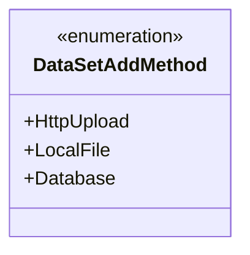
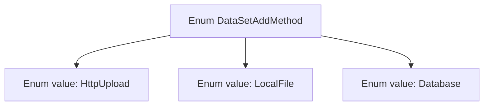

# Basic Information

|      |      |
|------|------|
| Name | DataSetAddMethod |
| Language | .java |
| Code Path | WeFe/board/board-service/src/main/java/com/welab/wefe/board/service/constant/DataSetAddMethod.java |
| Package Name | com.welab.wefe.board.service.constant |
| Dependencies | [] |
| Brief Description | The enumeration DataSetAddMethod defines three dataset addition methods: HttpUpload, LocalFile, and Database. |

# Description

This is an enumeration type named DataSetAddMethod, which defines three dataset addition methods: HttpUpload indicates adding data via HTTP upload, LocalFile indicates adding data via local files, and Database indicates adding data via a database. Each method corresponds to a different data source approach.

# Class Summary

| Name   | Type  | Description |
|-------|------|-------------|
| DataSetAddMethod | enum | The enumeration DataSetAddMethod defines three methods for adding datasets: HttpUpload, LocalFile, and Database. |

## Class DataSetAddMethod

|      |      |
|------|------|
| Access Modifier | public |
| Type | enum |
| Name | DataSetAddMethod |
| Description | The enumeration DataSetAddMethod defines three methods for adding datasets: HttpUpload, LocalFile, and Database. |

### UML Class Diagram

This code defines an enumeration type named DataSetAddMethod, which contains three enumeration constants: HttpUpload, LocalFile, and Database. The enumeration represents different methods for adding datasets, corresponding to three data source approaches: HTTP upload, local file, and database. In the class diagram, the enumeration type is marked with <<enumeration>>, and its constants are listed as public static members. This design is commonly used to restrict parameter options or configuration types, ensuring type safety and improving code readability.

### Internal Method Call Graph

This flowchart describes an enum type named DataSetAddMethod, which contains three predefined constant values: HttpUpload, LocalFile, and Database. Each enum value represents a distinct dataset addition method, corresponding to three data source approaches: HTTP upload, local file, and database. Enum types in Java are used to define a fixed set of constants, and this example clearly illustrates the structure and available values of the enum.

### Field List

| Name  | Type  | Description |
|-------|-------|------|

### Method List

| Name  | Type  | Description |
|-------|-------|------|

