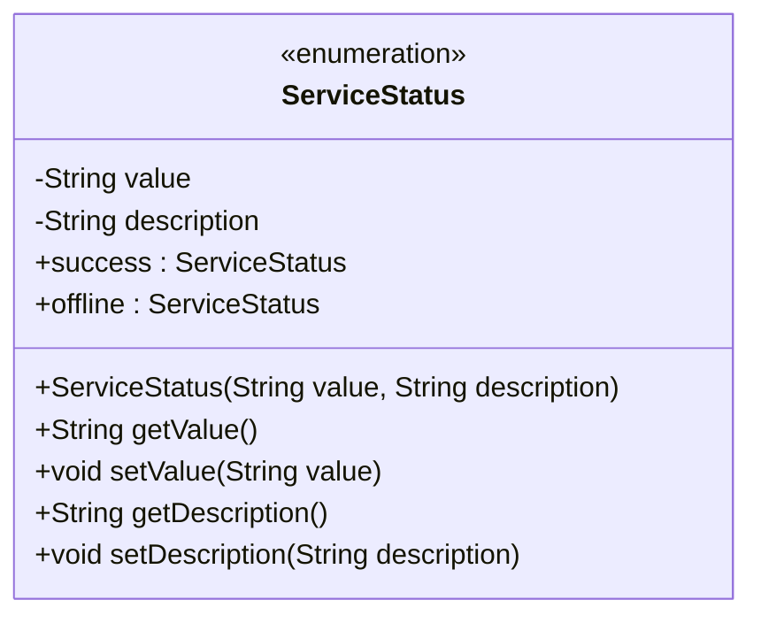
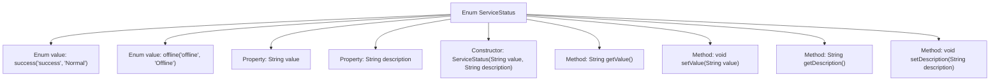

# Basic Information

|      |      |
|------|------|
| Name | ServiceStatus |
| Language | .java |
| Code Path | WeFe/board/board-service/src/main/java/com/welab/wefe/board/service/constant/ServiceStatus.java |
| Package Name | com.welab.wefe.board.service.constant |
| Dependencies | [] |
| Brief Description | Define the ServiceStatus enumeration, containing two states: success and offline, corresponding to values and descriptions respectively. Provide getter and setter methods to access the properties. |

# Description

This is a Java enum class named ServiceStatus, used to represent service states. It contains two enum values: success (normal) and offline (offline). Each enum value has corresponding value and description attributes, representing the status value and description information respectively. The class provides a constructor to initialize these two attributes, along with getter and setter methods for each attribute to retrieve and modify their values.

# Class Summary

| Name   | Type  | Description |
|-------|------|-------------|
| ServiceStatus | enum | The enumeration ServiceStatus defines two states: success (normal) and offline (offline), including the value and description attributes along with their corresponding getter/setter methods. |

## Class ServiceStatus

|      |      |
|------|------|
| Access Modifier | public |
| Type | enum |
| Name | ServiceStatus |
| Description | The enumeration ServiceStatus defines two states: success (normal) and offline (offline), including the value and description attributes along with their corresponding getter/setter methods. |

### UML Class Diagram

This code defines an enumeration class named ServiceStatus, containing two enum constants: success (operational) and offline (unavailable). Each enum constant has two private attributes: value and description, representing the status value and descriptive information respectively. The class provides a constructor to initialize these attributes, along with corresponding getter and setter methods. This enumeration class is primarily used to represent service statuses, enabling convenient retrieval and modification of status values and their descriptions.

### Internal Method Call Graph

This flowchart illustrates the structure of the ServiceStatus enum, which includes two enum values (success and offline), two private properties (value and description), a constructor, and four accessor methods. The enum initializes status values and descriptions through the constructor and provides getter/setter methods for property access. This design is commonly used to define limited, predefined sets of states, where each state carries specific value and description information.

### Field List

| Name  | Type  | Description |
|-------|-------|------|

### Method List

| Name  | Type  | Description |
|-------|-------|------|

