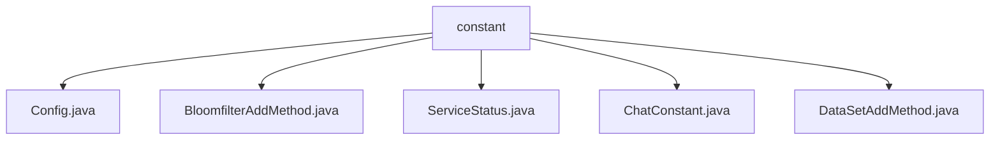

# Basic Information

|      |      |
|------|------|
| Name | constant |
| Language | .java |
| Code Path | WeFe/board/board-service/src/main/java/com/welab/wefe/board/service/constant |
| Package Name | docs.board.board-service.src.main.java.com.welab.wefe.board.service.constant |
| Brief Description | The Config class inherits from CommonConfig, loads dynamic path configuration files, and supports multiple environments. The BloomfilterAddMethod enum defines three data addition methods: HTTP upload, local file, and database. The ServiceStatus enum includes normal and offline states along with their descriptions. The ChatConstant class provides constants for chat message direction, status, and key-value pairs. The DataSetAddMethod enum defines three dataset addition methods. |

# Description

## Overview  
The core responsibility of this module is to provide configuration management and enumeration constant definitions, supporting multi-environment configuration loading and standardized business status descriptions. Interface specifications include Spring's `@PropertySource` for dynamic configuration loading, `@ConfigurationProperties` for property binding, and standardized methods for enumeration class definitions (e.g., `BloomfilterAddMethod` with three data addition approaches: HTTP upload, local file, and database). Key data structures encompass the configuration class `Config`, enumeration classes such as `ServiceStatus` (success/offline status) and `ChatConstant` (message direction/status constants). External dependencies are limited to the Spring framework. For example, `Config` supports loading UTF-8 encoded configuration files while ignoring missing files.  

## Key Business Scenarios  
The module serves general scenarios driven by configuration and state management, resembling a simplified implementation of a configuration center. Business processes include dynamically loading multi-environment configurations (e.g., `Config`) and passing standardized enumeration values (e.g., `DataSetAddMethod` defining data source approaches). Interaction patterns unify field naming through constant classes (e.g., `ChatConstant`), such as distinguishing between received and sent messages. Typical applications include chat system state management and Bloom filter data source selection. API types are primarily configuration classes and enumerations, such as the `ServiceStatus` enumeration supporting service health status checks.

### Package Internal Structure View

This flowchart illustrates the hierarchical structure of the constant directory under the board-service module in the WeFe project. The parent node "constant" contains five Java constant class files: Config.java, BloomfilterAddMethod.java, ServiceStatus.java, ChatConstant.java, and DataSetAddMethod.java. These files reside at the same level, directly subordinate to the constant directory, and are used to store static definitions such as service configurations, enumeration types, and business constants.

# File List

| Name   | Type  | Description |
|-------|------|-------------|
| [Config.java](Config.md) | file | The code defines a configuration class Config, which inherits from CommonConfig, loads external configuration files via @PropertySource with UTF-8 encoding support, and ignores missing files. |
| [BloomfilterAddMethod.java](BloomfilterAddMethod.md) | file | The BloomfilterAddMethod enumeration defines three addition methods: HttpUpload, LocalFile, and Database. |
| [ServiceStatus.java](ServiceStatus.md) | file | Define the ServiceStatus enumeration, including two states: success and offline, corresponding to values and descriptions respectively. Provide getter and setter methods to access the properties. |
| [ChatConstant.java](ChatConstant.md) | file | The ChatConstant class defines message direction, status constants, and key names for message transmission/reception processing and data structure identification. |
| [DataSetAddMethod.java](DataSetAddMethod.md) | file | The enumeration DataSetAddMethod defines three dataset addition methods: HttpUpload, LocalFile, and Database. |

