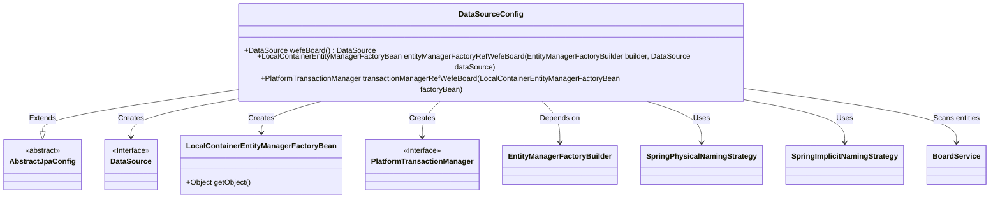
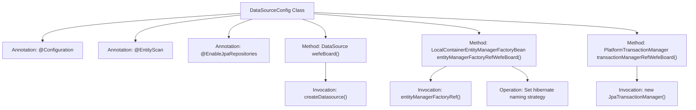

# Basic Information

|      |      |
|------|------|
| Name | DataSourceConfig |
| Language | .java |
| Code Path | WeFe/board/board-service/src/main/java/com/welab/wefe/board/service/database/DataSourceConfig.java |
| Package Name | com.welab.wefe.board.service.database |
| Dependencies | ['com.welab.wefe.board.service.BoardService', 'com.welab.wefe.board.service.database.repository.base.BaseRepositoryFactoryBean', 'com.welab.wefe.common.data.mysql.config.AbstractJpaConfig', 'org.springframework.beans.factory.annotation.Qualifier', 'org.springframework.boot.autoconfigure.domain.EntityScan', 'org.springframework.boot.context.properties.ConfigurationProperties', 'org.springframework.boot.orm.jpa.EntityManagerFactoryBuilder', 'org.springframework.boot.orm.jpa.hibernate.SpringImplicitNamingStrategy', 'org.springframework.boot.orm.jpa.hibernate.SpringPhysicalNamingStrategy', 'org.springframework.context.annotation.Bean', 'org.springframework.context.annotation.Configuration', 'org.springframework.context.annotation.Primary', 'org.springframework.data.jpa.repository.config.EnableJpaRepositories', 'org.springframework.orm.jpa.JpaTransactionManager', 'org.springframework.orm.jpa.LocalContainerEntityManagerFactoryBean', 'org.springframework.transaction.PlatformTransactionManager', 'javax.sql.DataSource', 'java.util.Map'] |
| Brief Description | The configuration class DataSourceConfig extends AbstractJpaConfig, defining the primary data source "board" and JPA-related Beans, including the entity manager factory and transaction manager, while setting the naming strategy. |

# Description

This configuration class defines JPA data source-related configurations, including primary data source creation, entity manager factory, and transaction manager setup. It uses `@EntityScan` to specify the entity scanning package path and configures JPA repository parameters via `@EnableJpaRepositories`. The primary data source "board" injects properties with the prefix "db.mysql", the entity factory sets Hibernate naming strategies, and the transaction manager is bound to the specified entity factory. All Beans are marked as `@Primary` to ensure priority usage.

# Class Summary

| Name   | Type  | Description |
|-------|------|-------------|
| DataSourceConfig | class | The configuration class DataSourceConfig extends AbstractJpaConfig, defining the primary data source "board," setting the JPA entity scanning path, repository factory, and transaction manager, while also configuring the Hibernate naming strategy. |

## Class DataSourceConfig

|      |      |
|------|------|
| Access Modifier | @Configuration;@EntityScan("com.welab.wefe.board.service");@EnableJpaRepositories(basePackageClasses = BoardService.class,;        repositoryFactoryBeanClass = BaseRepositoryFactoryBean.class,;        entityManagerFactoryRef = "entityManagerFactoryRefBoard",;        transactionManagerRef = "transactionManagerRefWefeBoard");public |
| Type | class |
| Name | DataSourceConfig |
| Description | The configuration class DataSourceConfig extends AbstractJpaConfig, defining the primary data source "board," setting the JPA entity scanning path, repository factory, and transaction manager, while also configuring the Hibernate naming strategy. |

### UML Class Diagram

This diagram illustrates the structure of a multi-datasource configuration class DataSourceConfig in Spring Boot, which inherits from the abstract class AbstractJpaConfig. It is primarily responsible for creating and managing three core Beans: the primary datasource, entity manager factory, and transaction manager. Through annotation-based configuration, it achieves JPA integration with a specific datasource, including the setup of physical and implicit naming strategies, while specifying the base package for entity scanning. The class diagram clearly presents the dependency and creation relationships between the configuration class and various Spring/JPA components.

### Internal Method Call Graph

This code represents a Spring Boot JPA datasource configuration class, primarily implementing three core functions: 1) Creating primary datasource; 2) Configuring entity manager factory; 3) Setting up transaction manager. It marks primary Beans with @Primary annotation, employs custom hibernate naming strategy, and inherits AbstractJpaConfig for reusable base configurations. The complete workflow starts from datasource creation and concludes with transaction manager initialization, forming an end-to-end JPA persistence configuration chain.

### Field List

| Name  | Type  | Description |
|-------|-------|------|

### Method List

| Name  | Type  | Description |
|-------|-------|------|
| entityManagerFactoryRefWefeBoard | LocalContainerEntityManagerFactoryBean | Define the primary entity manager factory Bean, configure the naming strategy, use the specified data source and properties, and return a custom factory instance. |
| wefeBoard | DataSource | This is a method in a Spring configuration class that uses the @Bean annotation to create a data source named "board" with the configuration prefix "db.mysql" and marks it as the @Primary master data source. |
| transactionManagerRefWefeBoard | PlatformTransactionManager | Define the primary transaction manager, using the specified entity factory to create a JPA transaction manager. |

