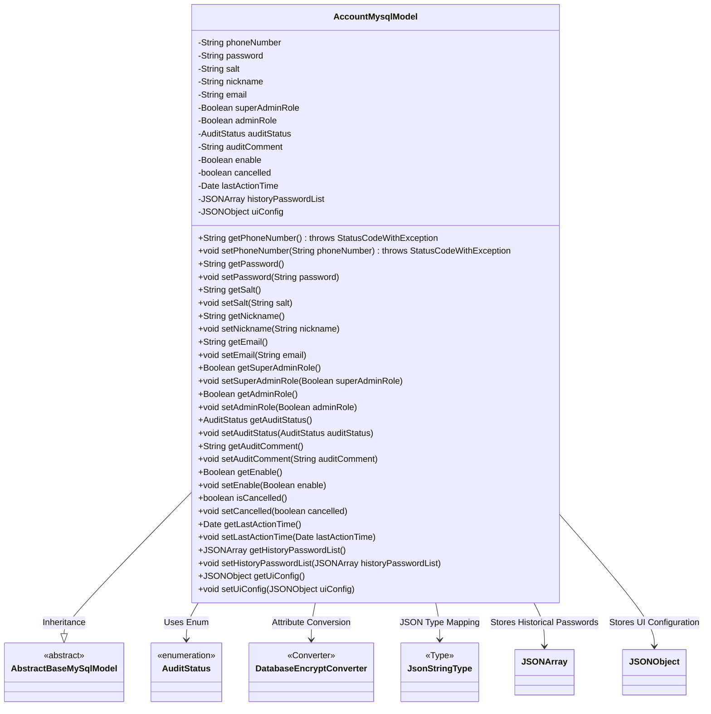

# Basic Information

|      |      |
|------|------|
| Name | AccountMysqlModel |
| Language | .java |
| Code Path | WeFe/board/board-service/src/main/java/com/welab/wefe/board/service/database/entity/AccountMysqlModel.java |
| Package Name | com.welab.wefe.board.service.database.entity |
| Dependencies | ['com.alibaba.fastjson.JSONArray', 'com.alibaba.fastjson.JSONObject', 'com.vladmihalcea.hibernate.type.json.JsonStringType', 'com.welab.wefe.board.service.database.entity.base.AbstractBaseMySqlModel', 'com.welab.wefe.common.exception.StatusCodeWithException', 'com.welab.wefe.common.web.util.DatabaseEncryptConverter', 'com.welab.wefe.common.wefe.enums.AuditStatus', 'org.hibernate.annotations.Type', 'org.hibernate.annotations.TypeDef', 'javax.persistence', 'java.util.Date'] |
| Brief Description | Account entity class, including fields such as phone number, password, role, approval status, activity time, etc., supports JSON storage and encrypted conversion. |

# Description

This is an entity class named AccountMysqlModel, used to represent account information. The class inherits from AbstractBaseMySqlModel and is marked as a database entity with the @Entity annotation. The class defines multiple attributes, including mobile number (encrypted storage), password, salt value, nickname, email, super administrator flag, administrator flag, review status, review comments, availability status, deactivation status, last activity time, historical password list, and UI configuration information. Among these, the mobile number uses an encryption converter, while the historical password list and UI configuration information are stored in JSON format. The class also includes getter and setter methods for all attributes, enabling access and modification of these attribute values.

# Class Summary

| Name   | Type  | Description |
|-------|------|-------------|
| AccountMysqlModel | class | Account entity class, containing basic information such as phone number, password, nickname, and email. It stores phone numbers in encrypted form, supports administrator roles, review status, and UI configuration, and records historical passwords and last activity time. |

## Class AccountMysqlModel

|      |      |
|------|------|
| Access Modifier | @Entity(name = "account");@TypeDef(name = "json", typeClass = JsonStringType.class);public |
| Type | class |
| Name | AccountMysqlModel |
| Description | Account entity class, containing basic information such as phone number, password, nickname, and email. It stores phone numbers in encrypted form, supports administrator roles, review status, and UI configuration, and records historical passwords and last activity time. |

### UML Class Diagram

This code demonstrates a MySQL-based account entity class `AccountMysqlModel`, which inherits from the abstract base class `AbstractBaseMySqlModel`. The class contains core user account attributes such as phone number (encrypted storage), password, role identifiers, audit status, etc., and uses JSON types to store historical passwords and UI configurations. Database field mapping is implemented through JPA annotations, including enumeration type handling, JSON field conversion, and sensitive data encryption conversion. The class provides complete getter/setter methods, with phone number operations potentially throwing business exceptions, reflecting special handling logic for sensitive data.

### Internal Method Call Graph

```mermaid
graph TD
    A["Class AccountMysqlModel"]
    B["Inherits: AbstractBaseMySqlModel"]
    C["Annotation: @Entity(name='account')"]
    D["Annotation: @TypeDef(name='json', typeClass=JsonStringType.class)"]
    E["Field: String phoneNumber @Convert"]
    F["Field: String password"]
    G["Field: String salt"]
    H["Field: String nickname"]
    I["Field: String email"]
    J["Field: Boolean superAdminRole"]
    K["Field: Boolean adminRole"]
    L["Field: AuditStatus auditStatus @Enumerated"]
    M["Field: String auditComment"]
    N["Field: Boolean enable"]
    O["Field: boolean cancelled"]
    P["Field: Date lastActionTime"]
    Q["Field: JSONArray historyPasswordList @Type @Column"]
    R["Field: JSONObject uiConfig @Type @Column"]
    S["Method: getPhoneNumber() throws"]
    T["Method: setPhoneNumber() throws"]
    U["Method: getPassword()"]
    V["Method: setPassword()"]
    W["Method: getSalt()"]
    X["Method: setSalt()"]
    Y["Method: getNickname()"]
    Z["Method: setNickname()"]
    AA["Method: getEmail()"]
    AB["Method: setEmail()"]
    AC["Method: getSuperAdminRole()"]
    AD["Method: setSuperAdminRole()"]
    AE["Method: getAdminRole()"]
    AF["Method: setAdminRole()"]
    AG["Method: getAuditStatus()"]
    AH["Method: setAuditStatus()"]
    AI["Method: getAuditComment()"]
    AJ["Method: setAuditComment()"]
    AK["Method: getEnable()"]
    AL["Method: setEnable()"]
    AM["Method: isCancelled()"]
    AN["Method: setCancelled()"]
    AO["Method: getLastActionTime()"]
    AP["Method: setLastActionTime()"]
    AQ["Method: getHistoryPasswordList()"]
    AR["Method: setHistoryPasswordList()"]
    AS["Method: getUiConfig()"]
    AT["Method: setUiConfig()"]

    A --> B
    A --> C
    A --> D
    A --> E
    A --> F
    A --> G
    A --> H
    A --> I
    A --> J
    A --> K
    A --> L
    A --> M
    A --> N
    A --> O
    A --> P
    A --> Q
    A --> R
    A --> S
    A --> T
    A --> U
    A --> V
    A --> W
    A --> X
    A --> Y
    A --> Z
    A --> AA
    A --> AB
    A --> AC
    A --> AD
    A --> AE
    A --> AF
    A --> AG
    A --> AH
    A --> AI
    A --> AJ
    A --> AK
    A --> AL
    A --> AM
    A --> AN
    A --> AO
    A --> AP
    A --> AQ
    A --> AR
    A --> AS
    A --> AT
```

This code defines a JPA entity class named AccountMysqlModel, which inherits from AbstractBaseMySqlModel and represents account information. The class contains multiple fields such as phone number, password, nickname, etc. Some fields use special annotations like @Convert for encryption conversion, and @Type with @Column for handling JSON-type fields. Each field has corresponding getter and setter methods, with the phoneNumber's getter and setter potentially throwing StatusCodeWithException. The class is mapped to the database table "account" via the @Entity annotation and uses @TypeDef to define a custom type handler named "json".

### Field List

| Name  | Type  | Description |
|-------|-------|------|
| uiConfig | JSONObject | The entity class field uiConfig uses the JSON type, and the database column is defined in json format. |
| superAdminRole | Boolean | Private boolean variable indicating whether it is a super administrator role. |
| cancelled | boolean | The boolean variable `cancelled` indicates whether it has been canceled. |
| email | String | private String email |
| auditStatus | AuditStatus | Define an enumeration type field `auditStatus` in the entity class, and use the `@Enumerated` annotation to specify mapping to the database by string value. |
| enable | Boolean | The private boolean variable `enable` is used to control the feature switch. |
| adminRole | Boolean | Private boolean variable indicating administrator role. |
| nickname | String | Declare a private string variable nickname. |
| salt | String | Private string variable salt, used to store the encryption salt value. |
| phoneNumber | String | The field phoneNumber is encrypted and converted using the DatabaseEncryptConverter class. |
| lastActionTime | Date | Private variable, records the time of the last operation. |
| password | String | Private string type variable password |
| auditComment | String | The private string-type variable auditComment is used to store audit comments. |
| historyPasswordList | JSONArray | The field `historyPasswordList` uses JSON type to store the historical password list, and the database column is defined in json format. |

### Method List

| Name  | Type  | Description |
|-------|-------|------|
| getSalt | String | Public method to obtain the salt value, returns a string type. |
| getPassword | String | This is a Java method that returns the value of the string-type variable `password`. |
| setEnable | void | Methods for setting boolean activation status. |
| setEmail | void | This is a Java method used to set the email property of an object. The method takes a String parameter email and assigns it to the email field of the current object. |
| getNickname | String | Methods to obtain the nickname, returning the value of the nickname variable as a string type. |
| setSalt | void | Set the salt value of string type. |
| getEnable | Boolean | This is a Java method that returns the boolean value of the enable variable. |
| getSuperAdminRole | Boolean | Methods to obtain the super administrator role status, returning a boolean value indicating whether it is a super administrator. |
| isCancelled | boolean | Check if the task has been canceled and return the boolean state of `cancelled`. |
| getPhoneNumber | String | Method to obtain phone number, returns a string type, may throw a StatusCodeWithException. |
| setNickname | void | The method to set the user nickname assigns the input parameter to the member variable `nickname`. |
| setAuditStatus | void | The method for setting the audit status assigns the passed-in `auditStatus` to the `auditStatus` property of the current object. |
| setPassword | void | Method for setting password, assigns the input string to the class member variable password. |
| getAdminRole | Boolean | Methods to obtain administrator role status, returning a boolean value indicating whether it is an administrator. |
| setAdminRole | void | The method to set the administrator role, which accepts a boolean parameter and assigns it to the member variable adminRole. |
| setSuperAdminRole | void | Methods for setting the super administrator role status. |
| setCancelled | void | Method to set the cancellation status, with a boolean parameter `cancelled` for updating the internal state. |
| getLastActionTime | Date | Method to get the last operation time, returns the lastActionTime variable. |
| setLastActionTime | void | Method to set the last action time, assigning the parameter lastActionTime to the class member variable of the same name. |
| getHistoryPasswordList | JSONArray | Methods to retrieve the historical password list, returning data in JSONArray format. |
| setHistoryPasswordList | void | Method for setting the historical password list, which accepts a JSONArray parameter and assigns it to the member variable. |
| getUiConfig | JSONObject | Method for obtaining the JSON object of UI configuration. |
| setUiConfig | void | The method `setUiConfig` takes a JSONObject parameter `uiConfig` and assigns it to the `uiConfig` property of the current object. |
| setAuditComment | void | This is a Java method used to set the value of the auditComment property. The method accepts a string parameter named auditComment and assigns it to the property of the same name in the current object. |
| setPhoneNumber | void | Java method: Set phone number, parameter is a string, may throw StatusCodeWithException. |
| getAuditComment | String | Method to obtain the audit comment, returns the auditComment string. |
| getAuditStatus | AuditStatus | The method to obtain the current audit status returns the value of the auditStatus property. |
| getEmail | String | Public method to obtain the email value. |

