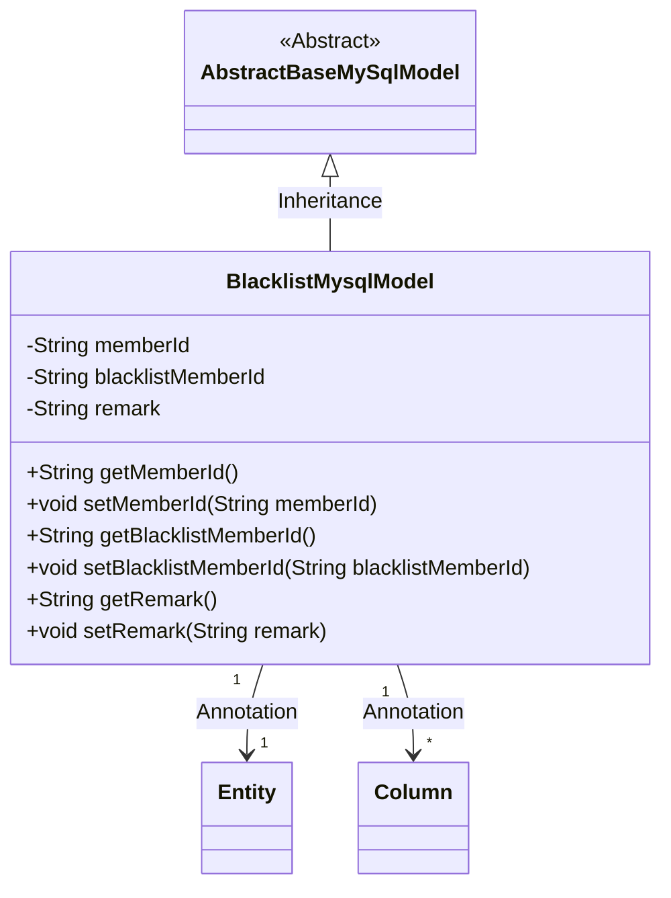
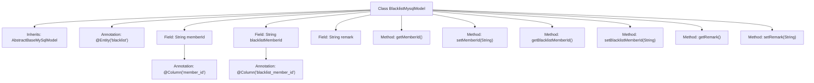

# Basic Information

|      |      |
|------|------|
| Name | BlacklistMysqlModel |
| Language | .java |
| Code Path | WeFe/board/board-service/src/main/java/com/welab/wefe/board/service/database/entity/BlacklistMysqlModel.java |
| Package Name | com.welab.wefe.board.service.database.entity |
| Dependencies | ['com.welab.wefe.board.service.database.entity.base.AbstractBaseMySqlModel', 'javax.persistence.Column', 'javax.persistence.Entity'] |
| Brief Description | Blacklist entity class, containing member ID, blacklisted member ID, and remark fields, with getter and setter methods provided. |

# Description

This is a JPA entity class named BlacklistMysqlModel, mapped to the database table blacklist. It inherits from the base class AbstractBaseMySqlModel and contains three main fields: memberId represents the current member ID, blacklistMemberId indicates the ID of the member added to the blacklist, and remark stores note information. Each field has corresponding getter and setter methods, with memberId and blacklistMemberId specifying database column names via the @Column annotation.

# Class Summary

| Name   | Type  | Description |
|-------|------|-------------|
| BlacklistMysqlModel | class | Blacklist entity class, containing member ID, blacklisted member ID, and remark fields, providing getter and setter methods. |

## Class BlacklistMysqlModel

|      |      |
|------|------|
| Access Modifier | @Entity(name = "blacklist");public |
| Type | class |
| Name | BlacklistMysqlModel |
| Description | Blacklist entity class, containing member ID, blacklisted member ID, and remark fields, providing getter and setter methods. |

### UML Class Diagram

This code defines an entity class named BlacklistMysqlModel, which represents blacklist information and inherits from the abstract base class AbstractBaseMySqlModel. The class contains three private fields: memberId represents the current member ID, blacklistMemberId denotes the ID of the member added to the blacklist, and remark stores note information. It is marked as a JPA entity using the @Entity annotation and maps database fields with the @Column annotation. The class provides getter and setter methods for each field, enabling encapsulation and manipulation of blacklist data.

### Internal Method Call Graph

This code defines an entity class named BlacklistMysqlModel, which inherits from AbstractBaseMySqlModel and represents blacklist data. The class contains three main fields: memberId (current member ID), blacklistMemberId (blacklisted member ID), and remark (notes), each with corresponding getter and setter methods. The class is marked as a JPA entity using the @Entity annotation, and fields are annotated with @Column to specify database column names. This model is primarily used for ORM framework mapping operations with the database table "blacklist".

### Field List

| Name  | Type  | Description |
|-------|-------|------|
| remark | String | Private string type remark field. |
| blacklistMemberId | String | Database field mapping: blacklistMemberId corresponds to the table column blacklist_member_id. |
| memberId | String | The database field member_id is mapped to the member ID string. |

### Method List

| Name  | Type  | Description |
|-------|-------|------|
| getRemark | String | Public method for retrieving remark information, returns a string variable named remark. |
| setBlacklistMemberId | void | The method to set the blacklist member ID involves assigning the parameter to the class member variable `blacklistMemberId`. |
| getMemberId | String | Methods to obtain member ID, returns the member ID string. |
| getBlacklistMemberId | String | Method to obtain the blacklisted member ID, returns a string-type blacklistMemberId. |
| setMemberId | void | The method to set the member ID assigns the passed string parameter to the class's member variable `memberId`. |
| setRemark | void | This is a Java method used to set the value of the remark property of an object. The method takes a string parameter and assigns it to the remark field of the object. |

