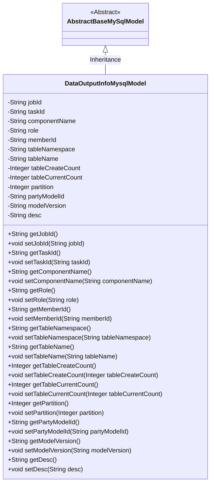

# Basic Information

|      |      |
|------|------|
| Name | DataOutputInfoMysqlModel |
| Language | .java |
| Code Path | WeFe/board/board-service/src/main/java/com/welab/wefe/board/service/database/entity/DataOutputInfoMysqlModel.java |
| Package Name | com.welab.wefe.board.service.database.entity |
| Dependencies | ['com.welab.wefe.board.service.database.entity.base.AbstractBaseMySqlModel', 'javax.persistence.Entity'] |
| Brief Description | The DataOutputInfoMysqlModel class stores task output information, including fields such as task ID, component, role, table information, and model version. |

# Description

The content defines a Java class named `DataOutputInfoMysqlModel`, which extends `AbstractBaseMySqlModel` and is marked as a database entity using the `@Entity` annotation. The class includes multiple fields representing the task ID, subtask ID, component name, role, member ID, tablespace, table name, initial quantity, current quantity, partition count, model ID, model version, and description. Each field has corresponding getter and setter methods for accessing and modifying the field values. This class is primarily used for storing and managing data output-related information.

# Class Summary

| Name   | Type  | Description |
|-------|------|-------------|
| DataOutputInfoMysqlModel | class | The DataOutputInfoMysqlModel class contains fields such as task, subtask, component, role, member, table information, partition, model, and version, used for storing data output-related information. |

## Class DataOutputInfoMysqlModel

|      |      |
|------|------|
| Access Modifier | @Entity(name = "data_output_info");public |
| Type | class |
| Name | DataOutputInfoMysqlModel |
| Description | The DataOutputInfoMysqlModel class contains fields such as task, subtask, component, role, member, table information, partition, model, and version, used for storing data output-related information. |

### UML Class Diagram

Class diagram description: The DataOutputInfoMysqlModel class inherits from the abstract base class AbstractBaseMySqlModel. It is an entity class used to store data output information, containing private fields such as task ID, component name, role, table information, model version, etc., and provides corresponding getter and setter methods for each field. The class is marked as a JPA entity with the @Entity annotation and mapped to the data_output_info table in the database.

### Internal Method Call Graph

```mermaid
graph TD
    A["Class DataOutputInfoMysqlModel"]
    B["Inheritance: AbstractBaseMySqlModel"]
    C["Annotation: @Entity('data_output_info')"]
    D["Attribute: String jobId"]
    E["Attribute: String taskId"]
    F["Attribute: String componentName"]
    G["Attribute: String role"]
    H["Attribute: String memberId"]
    I["Attribute: String tableNamespace"]
    J["Attribute: String tableName"]
    K["Attribute: Integer tableCreateCount"]
    L["Attribute: Integer tableCurrentCount"]
    M["Attribute: Integer partition"]
    N["Attribute: String partyModelId"]
    O["Attribute: String modelVersion"]
    P["Attribute: String desc"]
    Q["Method: getJobId/setJobId"]
    R["Method: getTaskId/setTaskId"]
    S["Method: getComponentName/setComponentName"]
    T["Method: getRole/setRole"]
    U["Method: getMemberId/setMemberId"]
    V["Method: getTableNamespace/setTableNamespace"]
    W["Method: getTableName/setTableName"]
    X["Method: getTableCreateCount/setTableCreateCount"]
    Y["Method: getTableCurrentCount/setTableCurrentCount"]
    Z["Method: getPartition/setPartition"]
    AA["Method: getPartyModelId/setPartyModelId"]
    AB["Method: getModelVersion/setModelVersion"]
    AC["Method: getDesc/setDesc"]

    A --> B
    A --> C
    A --> D
    A --> E
    A --> F
    A --> G
    A --> H
    A --> I
    A --> J
    A --> K
    A --> L
    A --> M
    A --> N
    A --> O
    A --> P
    A --> Q
    A --> R
    A --> S
    A --> T
    A --> U
    A --> V
    A --> W
    A --> X
    A --> Y
    A --> Z
    A --> AA
    A --> AB
    A --> AC
```

This flowchart illustrates the complete structure of the DataOutputInfoMysqlModel class, including its inheritance relationship, entity annotation, 12 private attribute fields, and corresponding getter/setter methods. This JPA entity class is used to store metadata related to data output, containing key fields such as task identifiers, component information, table structure, and model versions. It provides property access interfaces through standard JavaBean specifications and is suitable for database persistence operations.

### Field List

| Name  | Type  | Description |
|-------|-------|------|
| memberId | String | Declare a private string-type variable memberId. |
| tableNamespace | String | Private string variable used to store the namespace of the table. |
| taskId | String | The private string-type variable taskId is used to store the task identifier. |
| role | String | The private string variable `role` is used to store role information. |
| tableName | String | Private string variable storing the table name. |
| tableCurrentCount | Integer | Private integer variable, recording the current number of tables. |
| partyModelId | String | The private string type variable partyModelId. |
| desc | String | Private string type variable desc |
| tableCreateCount | Integer | Private integer variable, recording the number of table creation times. |
| componentName | String | The private string variable `componentName` is used to store the component name. |
| modelVersion | String | The private string variable modelVersion is used to store model version information. |
| jobId | String | The private string-type variable jobId is used to store the task ID. |
| partition | Integer | Private integer partition variable. |

### Method List

| Name  | Type  | Description |
|-------|-------|------|
| setMemberId | void | The method to set the member ID assigns the input string to the member variable `memberId`. |
| getMemberId | String | Methods to obtain member ID, returns the member ID string. |
| setPartyModelId | void | The method to set the member model ID assigns the input parameter to the class member variable `partyModelId`. |
| setPartition | void | Methods for setting partition values, assigning input parameters to the class's partition variables. |
| setTaskId | void | This is a Java method used to set the value of the taskId property in a class. The method takes a string parameter taskId and assigns it to the member variable taskId of the class. |
| getTableCurrentCount | Integer | Methods to obtain the current table count value, returns an integer type. |
| getRole | String | Methods to obtain role information, returns a string-type role value. |
| setJobId | void | The method to set the task ID assigns the input parameter jobId to the jobId property of the current object. |
| getJobId | String | The method getJobId returns the jobId string. |
| setTableCreateCount | void | The method to set the number of table creations, used to update the value of the instance variable tableCreateCount. |
| getTableName | String | Method returns a table name string. |
| getComponentName | String | Methods to obtain the component name, returning a string-type componentName. |
| getTableCreateCount | Integer | Get the integer value of table creation count. |
| getPartyModelId | String | Get the string value of partyModelId. |
| getTableNamespace | String | Methods to obtain the table namespace, returning a string-type tableNamespace value. |
| setComponentName | void | The method to set the component name assigns the passed string to the class member variable `componentName`. |
| setTableNamespace | void | This is a Java method used to set the namespace of a table. The method takes a string parameter `tableNamespace` and assigns it to the class member variable of the same name. |
| setTableName | void | This is a Java method used to set the tableName property value of a class. The method takes a string parameter tableName and assigns it to the member variable of the same name in the class. |
| setRole | void | This is a Java method used to set the role property of an object. The method accepts a string parameter `role` and assigns it to the `role` field of the current object. |
| getPartition | Integer | Methods to obtain the partition number, returning an integer-type partition value. |
| setTableCurrentCount | void | Methods for setting the current count value of a table. |
| getTaskId | String | Methods to obtain the task ID, returns a string-type taskId. |
| getModelVersion | String | Methods to obtain the model version number, returning a string-type modelVersion value. |
| setModelVersion | void | Methods for setting the model version, with the parameter being of string type. |
| getDesc | String | This is a Java method that returns the desc attribute value of type String. |
| setDesc | void | This is a Java method used to set the description property of an object. The method is named setDesc, which takes a String parameter desc and assigns it to the desc member variable of the current object. |

