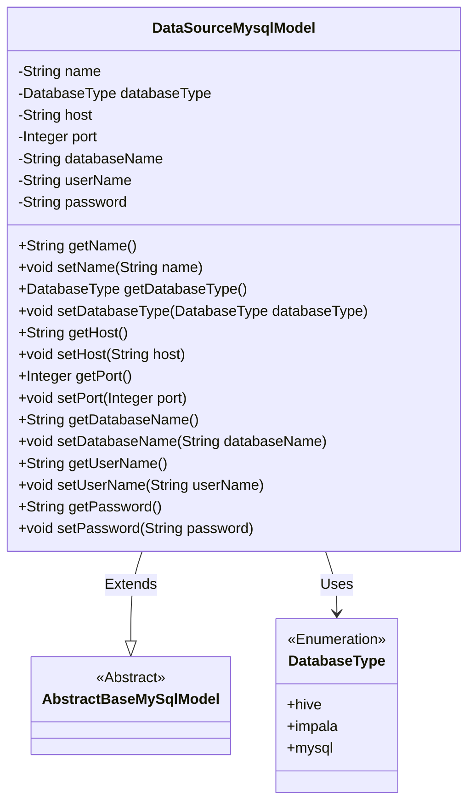

# Basic Information

|      |      |
|------|------|
| Name | DataSourceMysqlModel |
| Language | .java |
| Code Path | WeFe/board/board-service/src/main/java/com/welab/wefe/board/service/database/entity/DataSourceMysqlModel.java |
| Package Name | com.welab.wefe.board.service.database.entity |
| Dependencies | ['com.welab.wefe.board.service.database.entity.base.AbstractBaseMySqlModel', 'com.welab.wefe.common.jdbc.base.DatabaseType', 'com.welab.wefe.common.web.util.DatabaseEncryptConverter', 'javax.persistence.Convert', 'javax.persistence.Entity', 'javax.persistence.EnumType', 'javax.persistence.Enumerated'] |
| Brief Description | MySQL data source entity class, including fields such as name, type, host, port, database name, username, and encrypted password, along with corresponding getter/setter methods. |

# Description

This is a Java entity class named DataSourceMysqlModel, which extends AbstractBaseMySqlModel and corresponds to the database table `data_source`. The class defines various attributes of a data source, including name, database type (enum values: hive, impala, mysql), host address, port number, database name, username, and password. The password field is encrypted using the DatabaseEncryptConverter. The class provides standard getter and setter methods for each attribute to access and modify these property values.

# Class Summary

| Name   | Type  | Description |
|-------|------|-------------|
| DataSourceMysqlModel | class | The DataSourceMysqlModel class represents a data source entity, containing attributes such as name, database type (hive, impala, mysql), host address, port, database name, username, and encrypted password, along with their corresponding getter/setter methods. |

## Class DataSourceMysqlModel

|      |      |
|------|------|
| Access Modifier | @Entity(name = "data_source");public |
| Type | class |
| Name | DataSourceMysqlModel |
| Description | The DataSourceMysqlModel class represents a data source entity, containing attributes such as name, database type (hive, impala, mysql), host address, port, database name, username, and encrypted password, along with their corresponding getter/setter methods. |

### UML Class Diagram

This code defines an entity class named DataSourceMysqlModel, which inherits from the abstract class AbstractBaseMySqlModel, representing the configuration information of a MySQL data source. The class includes private fields such as data source name, database type enumeration, host address, port number, database name, username, and password, along with public getter and setter methods for each field. The password field uses an encryption converter, and the databaseType field employs the DatabaseType enumeration. The class diagram clearly illustrates the inheritance relationship and the usage of the enumeration type.

### Internal Method Call Graph

```mermaid
graph TD
    A["Class DataSourceMysqlModel"]
    B["Inherits: AbstractBaseMySqlModel"]
    C["Annotation: @Entity('data_source')"]
    D["Property: String name"]
    E["Property: DatabaseType databaseType"]
    F["Annotation: @Enumerated(EnumType.STRING)"]
    G["Property: String host"]
    H["Property: Integer port"]
    I["Property: String databaseName"]
    J["Property: String userName"]
    K["Property: String password"]
    L["Annotation: @Convert(converter=DatabaseEncryptConverter.class)"]
    M["Method: getName/setName"]
    N["Method: getDatabaseType/setDatabaseType"]
    O["Method: getHost/setHost"]
    P["Method: getPort/setPort"]
    Q["Method: getDatabaseName/setDatabaseName"]
    R["Method: getUserName/setUserName"]
    S["Method: getPassword/setPassword"]

    A --> B
    A --> C
    A --> D
    A --> E
    E --> F
    A --> G
    A --> H
    A --> I
    A --> J
    A --> K
    K --> L
    A --> M
    A --> N
    A --> O
    A --> P
    A --> Q
    A --> R
    A --> S
```

This code defines a JPA entity class named DataSourceMysqlModel, which inherits from AbstractBaseMySqlModel and represents data source configuration information. The class includes properties such as data source name, database type, host address, port, database name, username, and password. The password field is processed using an encryption converter, and the database type is annotated with an enumeration. Each property has corresponding getter and setter methods, enabling encapsulation and persistence support for data source configuration information.

### Field List

| Name  | Type  | Description |
|-------|-------|------|
| host | String | private string variable host |
| name | String | Declare a private string variable name. |
| databaseName | String | Declare a private string variable databaseName. |
| databaseType | DatabaseType | Define an enum type field databaseType, using string format to store enum values. |
| password | String | Database field encryption annotation: Use the DatabaseEncryptConverter class to encrypt and store the password field. |
| userName | String | Declare a private string variable userName. |
| port | Integer | Private integer port variable. |

### Method List

| Name  | Type  | Description |
|-------|-------|------|
| setDatabaseName | void | Methods for setting the database name, assigning the input parameter to the class member variable databaseName. |
| setPort | void | The method to set the port number is to assign the parameter `port` to the class's `port` attribute. |
| getDatabaseType | DatabaseType | Methods to obtain the current database type, with the return value being a DatabaseType object. |
| getPort | Integer | Methods to obtain the port number, returns an integer value. |
| getPassword | String | Methods to obtain the password, returns a string-type password value. |
| getName | String | This is a Java method that returns the value of the string variable named "name". |
| setHost | void | This is a Java method used to set the host property of a class. The method takes a string parameter host and assigns it to the member variable this.host of the class. |
| getDatabaseName | String | The method returns the database name string. |
| getUserName | String | Public method to get the username, returns a string-type userName. |
| setUserName | void | Java method for setting the username, which assigns the input parameter `userName` to the `userName` property of the current object. |
| setDatabaseType | void | The method to set the database type assigns the input parameter to the class member variable `databaseType`. |
| getHost | String | This method returns the value of the host variable as a string type. |
| setName | void | This is a Java method used to set the name property of an object. It takes a string parameter name and assigns it to the object's member variable name. |
| setPassword | void | Method for setting password: Assign the input string to the class member variable password. |

