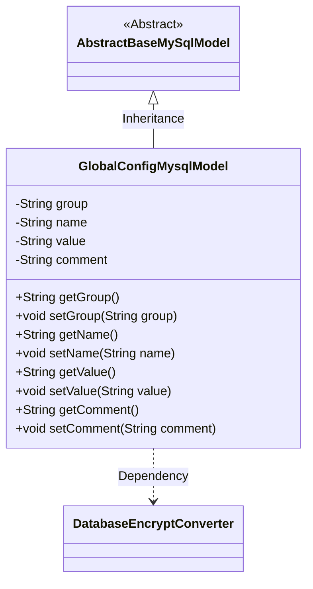
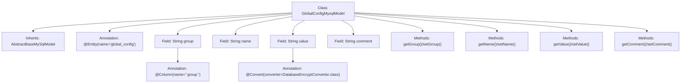

# Basic Information

|      |      |
|------|------|
| Name | GlobalConfigMysqlModel |
| Language | .java |
| Code Path | WeFe/board/board-service/src/main/java/com/welab/wefe/board/service/database/entity/GlobalConfigMysqlModel.java |
| Package Name | com.welab.wefe.board.service.database.entity |
| Dependencies | ['com.welab.wefe.board.service.database.entity.base.AbstractBaseMySqlModel', 'com.welab.wefe.common.web.util.DatabaseEncryptConverter', 'javax.persistence.Column', 'javax.persistence.Convert', 'javax.persistence.Entity'] |
| Brief Description | The GlobalConfigMysqlModel is an entity class for storing global configurations, containing fields for group name, configuration name, encrypted value, and description, along with corresponding getter/setter methods. |

# Description

This is a JPA entity class named GlobalConfigMysqlModel, mapped to the database table global_config. It inherits from AbstractBaseMySqlModel and contains four main fields: group represents the group to which the configuration item belongs, name denotes the name of the configuration item, value stores the configuration value and uses DatabaseEncryptConverter for encryption conversion, and comment is used to store explanatory notes for the configuration item. The class provides standard getter and setter methods for each field.

# Class Summary

| Name   | Type  | Description |
|-------|------|-------------|
| GlobalConfigMysqlModel | class | The GlobalConfigMysqlModel is a MySQL entity class that includes fields for group, name, encrypted value, and comments, along with their corresponding getter/setter methods. |

## Class GlobalConfigMysqlModel

|      |      |
|------|------|
| Access Modifier | @Entity(name = "global_config");public |
| Type | class |
| Name | GlobalConfigMysqlModel |
| Description | The GlobalConfigMysqlModel is a MySQL entity class that includes fields for group, name, encrypted value, and comments, along with their corresponding getter/setter methods. |

### UML Class Diagram

This code defines an entity class named GlobalConfigMysqlModel, which represents global configuration items in the database. The class inherits from the abstract base class AbstractBaseMySqlModel and contains four private fields: group (configuration group), name (configuration name), value (configuration value, encrypted and converted using DatabaseEncryptConverter), and comment (configuration description). Each field has corresponding getter and setter methods. The class is marked as a JPA entity with the @Entity annotation, while @Column and @Convert annotations are used to specify database mapping details. This model class is primarily used for storing and managing system-wide configuration information in a MySQL database.

### Internal Method Call Graph

This flowchart illustrates the structure of the GlobalConfigMysqlModel class, including its inheritance relationship, field definitions with annotations, and getter/setter methods. The class inherits from AbstractBaseMySqlModel and contains four main fields: group (with column name annotation), name, value (with encryption converter annotation), and comment. Each field has corresponding getter and setter methods for data access operations.

### Field List

| Name  | Type  | Description |
|-------|-------|------|
| comment | String | Declare a private string variable comment. |
| group | String | Database field mapping: the group column corresponds to the String-type group variable. |
| value | String | Database field encryption annotation, using the DatabaseEncryptConverter class to convert the value. |
| name | String | private String variable name |

### Method List

| Name  | Type  | Description |
|-------|-------|------|
| getGroup | String | Common methods for obtaining group values. |
| setGroup | void | Set the grouping properties of the object. |
| setName | void | The method to set the object name is to assign the parameter `name` to the `name` property of the object. |
| getValue | String | Common methods for obtaining value. |
| getName | String | This is a Java method that returns the value of the string variable named "name". |
| setValue | void | Set the value of a member variable of string type. |
| getComment | String | Methods to obtain the comment string. |
| setComment | void | This is a Java method used to set the comment property value of an object. The method takes a string parameter named comment and assigns it to the comment member variable of the current object. |

