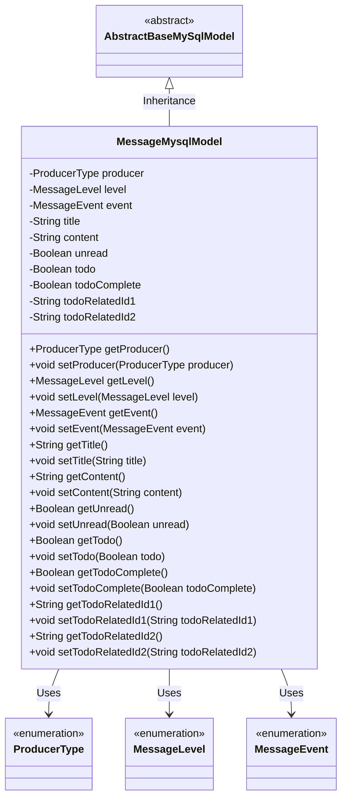

# Basic Information

|      |      |
|------|------|
| Name | MessageMysqlModel |
| Language | .java |
| Code Path | WeFe/board/board-service/src/main/java/com/welab/wefe/board/service/database/entity/MessageMysqlModel.java |
| Package Name | com.welab.wefe.board.service.database.entity |
| Dependencies | ['com.welab.wefe.board.service.database.entity.base.AbstractBaseMySqlModel', 'com.welab.wefe.common.wefe.enums.MessageEvent', 'com.welab.wefe.common.wefe.enums.MessageLevel', 'com.welab.wefe.common.wefe.enums.ProducerType', 'javax.persistence.Entity', 'javax.persistence.EnumType', 'javax.persistence.Enumerated'] |
| Brief Description | Message entity class, including producer type, message level, event, title, content, unread status, to-do marker and completion status, as well as two associated IDs. |

# Description

This is a JPA entity class named MessageMysqlModel, mapped to the database table "message". It inherits from AbstractBaseMySqlModel and includes multiple attributes: producer indicates the message producer type (enum values include board/gateway); level represents the message level (enum values include info/success/error/warning); event denotes the associated event type; title and content store the message title and content respectively; unread flags whether the message is unread; todo indicates if it is a to-do item; todoComplete represents the completion status of the to-do item; todoRelatedId1 and todoRelatedId2 store the IDs of two objects associated with the to-do item. The class provides getter and setter methods for each attribute.

# Class Summary

| Name   | Type  | Description |
|-------|------|-------------|
| MessageMysqlModel | class | Message entity class, including producer, level, event, title, content, unread status, to-do marker and completion status, as well as two associated ID fields. |

## Class MessageMysqlModel

|      |      |
|------|------|
| Access Modifier | @Entity(name = "message");public |
| Type | class |
| Name | MessageMysqlModel |
| Description | Message entity class, including producer, level, event, title, content, unread status, to-do marker and completion status, as well as two associated ID fields. |

### UML Class Diagram

This code defines an entity class named MessageMysqlModel, which inherits from the abstract class AbstractBaseMySqlModel. The class represents message records in a database, containing attributes such as message producer type, message level, event type, title, content, and corresponding getter and setter methods. The fields producer, level, and event are enumeration types, representing message source, message level, and associated event respectively. Additionally, it includes todo-related fields such as todo, todoComplete, etc. The class is marked as a persistent entity with the JPA annotation @Entity and mapped to the message table in the database.

### Internal Method Call Graph

```mermaid
graph TD
    A["Class MessageMysqlModel"]
    B["Inheritance: AbstractBaseMySqlModel"]
    C["Annotation: @Entity('message')"]
    D["Enum Property: ProducerType producer"]
    E["Enum Property: MessageLevel level"]
    F["Enum Property: MessageEvent event"]
    G["Property: String title"]
    H["Property: String content"]
    I["Property: Boolean unread"]
    J["Property: Boolean todo"]
    K["Property: Boolean todoComplete"]
    L["Property: String todoRelatedId1"]
    M["Property: String todoRelatedId2"]
    N["Getter/Setter Method Group"]

    A --> B
    A --> C
    A --> D
    A --> E
    A --> F
    A --> G
    A --> H
    A --> I
    A --> J
    A --> K
    A --> L
    A --> M
    A --> N
```

This flowchart illustrates the complete structure of the MessageMysqlModel class, including inheritance relationships, entity annotations, 11 property fields (with 3 enum types), and corresponding Getter/Setter method groups. As a JPA entity class, it implements enum type persistence through the @Enumerated annotation and extends the base model class. Its primary function is to encapsulate the data model for a messaging system, containing core fields such as message source, level, event type, as well as business fields related to to-do items. All properties provide access interfaces through standard JavaBean specifications.

### Field List

| Name  | Type  | Description |
|-------|-------|------|
| todo | Boolean | Private boolean variable indicating the to-do status. |
| unread | Boolean | Boolean type field indicating unread status. |
| todoRelatedId2 | String | The private string variable todoRelatedId2 is used to store the related ID of a to-do item. |
| title | String | Private string variable title |
| level | MessageLevel | The enumeration type field `level` stores enumeration values in string format. |
| event | MessageEvent | The code defines an enumerated type field `event`, which stores enumeration values in string format. |
| todoComplete | Boolean | Boolean type field indicating the completion status of a to-do item. |
| content | String | Private string variable content. |
| producer | ProducerType | The enumeration type producer uses string values mapped to database fields. |
| todoRelatedId1 | String | Private string type variable, storing the ID1 related to the to-do item. |

### Method List

| Name  | Type  | Description |
|-------|-------|------|
| getLevel | MessageLevel | Methods for obtaining the message level, returning the value of the level field. |
| getEvent | MessageEvent | Methods to obtain the event object, returns an instance of MessageEvent type. |
| getTitle | String | Methods to obtain the title, returning a string-type title variable. |
| getContent | String | Method to obtain content, returns a string variable named content. |
| setTodoComplete | void | This is a Java method used to set the completion status of a to-do item. The method accepts a boolean parameter and assigns it to the class member variable todoComplete. |
| setUnread | void | Set the boolean method for unread status. |
| getTodo | Boolean | Methods for obtaining the status of to-do items, returning a boolean value `todo`. |
| setProducer | void | Methods for setting the producer object, assigning the input parameters to the member variable producer of the class. |
| setEvent | void | The method `setEvent` takes a `MessageEvent` parameter and assigns it to the `event` property of the current object. |
| getProducer | ProducerType | Methods to obtain the producer type, returning a producer object. |
| setTodo | void | Methods for setting the to-do status, with a boolean parameter. |
| setContent | void | Methods for setting content attributes, assigning the input string to the class variable content. |
| getTodoRelatedId1 | String | Method to obtain the associated to-do ID1, returns a string type. |
| setTitle | void | This is a Java method used to set the title property of an object. It accepts a string parameter title and assigns it to the title field of the current object. |
| getUnread | Boolean | Method to get the boolean value of unread status, returns the value of the unread field. |
| getTodoComplete | Boolean | The method getTodoComplete returns the state of the boolean todoComplete. |
| setLevel | void | Method for setting the message level, which assigns the input parameter 'level' to the 'level' property of the current object. |
| setTodoRelatedId1 | void | The method to set the to-do associated ID1, with the parameter being of string type. |
| getTodoRelatedId2 | String | Methods to obtain the associated to-do ID2, returning a string type value. |
| setTodoRelatedId2 | void | The method to set the to-do related ID2 assigns the parameter value to the class member variable `todoRelatedId2`. |

