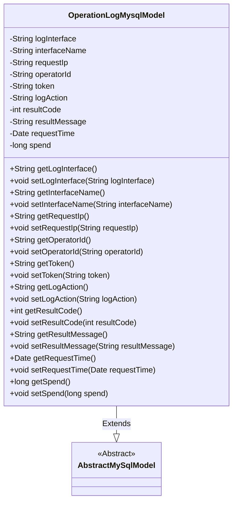

# Basic Information

|      |      |
|------|------|
| Name | OperationLogMysqlModel |
| Language | .java |
| Code Path | WeFe/board/board-service/src/main/java/com/welab/wefe/board/service/database/entity/OperationLogMysqlModel.java |
| Package Name | com.welab.wefe.board.service.database.entity |
| Dependencies | ['com.welab.wefe.board.service.database.entity.base.AbstractMySqlModel', 'javax.persistence.Entity', 'java.util.Date'] |
| Brief Description | Operation log entity class, containing information such as interface, IP, operator, action, result, and time consumed. |

# Description

This is a Java entity class named OperationLogMysqlModel, which maps to the database table operator_log and inherits from AbstractMySqlModel. It records detailed information of operation logs, including the request interface, interface name, request IP, operator ID, request token, operation behavior, request result code, request result message, request time, and processing duration. Each field has corresponding getter and setter methods for retrieving and setting property values.

# Class Summary

| Name   | Type  | Description |
|-------|------|-------------|
| OperationLogMysqlModel | class | Operation log entity class, including fields such as interface, IP, operator, action, result, and time consumed. |

## Class OperationLogMysqlModel

|      |      |
|------|------|
| Access Modifier | @Entity(name = "operator_log");public |
| Type | class |
| Name | OperationLogMysqlModel |
| Description | Operation log entity class, including fields such as interface, IP, operator, action, result, and time consumed. |

### UML Class Diagram

Class diagram description: The OperationLogMysqlModel class extends the AbstractMySqlModel abstract class and is used to record operation log information. It contains private attributes such as log interface, interface name, request IP, operator ID, token, log action, result code, result message, request time, and time spent, with corresponding getter and setter methods provided for each attribute. The class is marked as a JPA entity with the @Entity annotation, corresponding to the database table "operator_log".

### Internal Method Call Graph

```mermaid
graph TD
    A["Class OperationLogMysqlModel"]
    B["Inherits: AbstractMySqlModel"]
    C["Annotation: @Entity(name='operator_log')"]
    D["Field: String logInterface"]
    E["Field: String interfaceName"]
    F["Field: String requestIp"]
    G["Field: String operatorId"]
    H["Field: String token"]
    I["Field: String logAction"]
    J["Field: int resultCode"]
    K["Field: String resultMessage"]
    L["Field: Date requestTime"]
    M["Field: long spend"]
    N["Getter/Setter Method Group (11 pairs in total)"]

    A --> B
    A --> C
    A --> D
    A --> E
    A --> F
    A --> G
    A --> H
    A --> I
    A --> J
    A --> K
    A --> L
    A --> M
    A -.-> N
```

This flowchart illustrates the complete structure of the OperationLogMysqlModel class, a JPA entity class designed for recording operation logs. It inherits from the AbstractMySqlModel base class and contains 11 core fields that document interface information, operator details, request parameters, and result data, with standard Getter/Setter methods provided for each field. The class is mapped to the database table 'operator_log' via the @Entity annotation, adhering to JPA entity specifications in its overall design.

### Field List

| Name  | Type  | Description |
|-------|-------|------|
| token | String | Declare a private string variable token. |
| operatorId | String | The private string variable operatorId is used to store the operator ID. |
| interfaceName | String | The private string variable `interfaceName` is used to store the interface name. |
| resultMessage | String | The private string variable resultMessage is used to store result information. |
| logInterface | String | Private string variable for the log interface. |
| spend | long | Private long integer variable `spend`, used to store numerical values such as time or monetary amounts. |
| resultCode | int | The private integer variable resultCode is used to store the result code. |
| requestIp | String | Declare a private string variable requestIp to store the IP address of the request. |
| requestTime | Date | The private date-type variable `requestTime` is used to record the request time. |
| logAction | String | The private string variable logAction is used to record log operations. |

### Method List

| Name  | Type  | Description |
|-------|-------|------|
| setLogAction | void | Defines a public method setLogAction for setting the value of the logAction property. |
| setInterfaceName | void | The method to set the interface name assigns the parameter `interfaceName` to the property of the same name in the current object. |
| setResultMessage | void | Defined a public method setResultMessage for setting the value of the member variable resultMessage. The parameter is of string type. |
| setOperatorId | void | The method to set the operator ID assigns the parameter operatorId to the operatorId property of the current object. |
| getLogInterface | String | Methods to obtain the log interface, returning the logInterface string. |
| getOperatorId | String | Common method to obtain operatorId, returns the operatorId value as a string. |
| getLogAction | String | Methods for obtaining log actions, returns the logAction string. |
| getRequestIp | String | Methods to obtain the request IP address, returning the value of the requestIp variable. |
| getToken | String | Common method to obtain the token, returns a string-type token. |
| getResultMessage | String | Method returns the result message string. |
| getRequestTime | Date | Methods to obtain the request time, returning the requestTime of Date type. |
| getResultCode | int | This is a Java method that returns the value of the integer variable resultCode. |
| setRequestIp | void | This is a Java method used to set the request IP address, which assigns the incoming string to the class's member variable requestIp. |
| setLogInterface | void | Java Method: Set Log Interface String Variable. |
| setToken | void | Methods for setting token string values. |
| setResultCode | void | Method to set the result code, which assigns the passed integer value to the `resultCode` member variable of the class. |
| getInterfaceName | String | Methods to obtain the interface name, returning a string-type interfaceName. |
| setRequestTime | void | Methods for setting the request time, assign the passed Date object to the requestTime member variable of the class. |
| getSpend | long | This is a Java method that returns the value of a long-type variable named spend. |
| setSpend | void | Method to set the spending amount, with the parameter being a long integer `spend`. |

