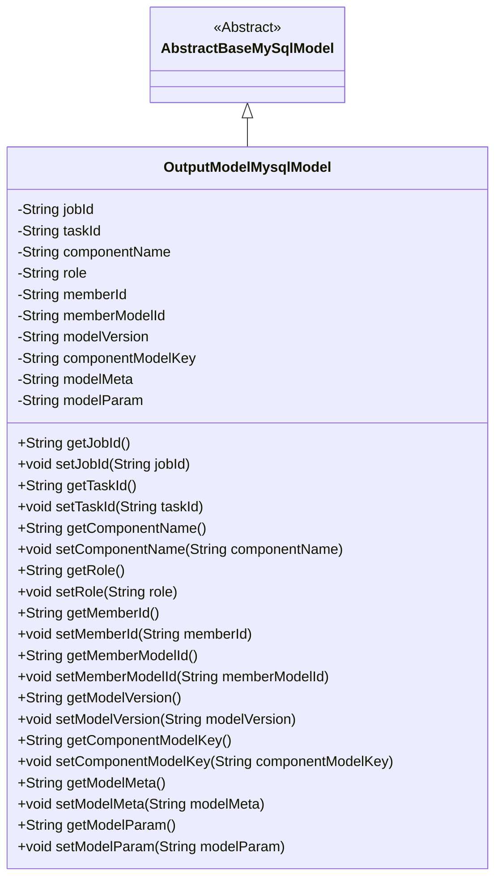

# Basic Information

|      |      |
|------|------|
| Name | OutputModelMysqlModel |
| Language | .java |
| Code Path | WeFe/board/board-service/src/main/java/com/welab/wefe/board/service/database/entity/OutputModelMysqlModel.java |
| Package Name | com.welab.wefe.board.service.database.entity |
| Dependencies | ['com.welab.wefe.board.service.database.entity.base.AbstractBaseMySqlModel', 'javax.persistence.Entity'] |
| Brief Description | The OutputModelMysqlModel class inherits from AbstractBaseMySqlModel and includes fields such as task ID, subtask ID, component name, role, member ID, model ID, version, key, metadata, and parameters, along with their corresponding getter/setter methods. |

# Description

This is a Java entity class named OutputModelMysqlModel, which extends AbstractBaseMySqlModel and is used to map the database table `output_model`. The class includes multiple fields: `jobId` represents the job ID, `taskId` represents the subtask ID, `componentName` represents the component name, `role` represents the role, `memberId` represents the member ID, `memberModelId` represents the model ID, `modelVersion` represents the model version, `componentModelKey` represents the model key, `modelMeta` represents the model metadata, and `modelParam` represents the model parameters. Each field has corresponding getter and setter methods for accessing and modifying the property values.

# Class Summary

| Name   | Type  | Description |
|-------|------|-------------|
| OutputModelMysqlModel | class | The `OutputModelMysqlModel` class inherits from `AbstractBaseMySqlModel` and includes fields such as task ID, subtask ID, component name, role, member ID, model ID, version, key, metadata, and parameters, along with their corresponding getter/setter methods. |

## Class OutputModelMysqlModel

|      |      |
|------|------|
| Access Modifier | @Entity(name = "output_model");public |
| Type | class |
| Name | OutputModelMysqlModel |
| Description | The `OutputModelMysqlModel` class inherits from `AbstractBaseMySqlModel` and includes fields such as task ID, subtask ID, component name, role, member ID, model ID, version, key, metadata, and parameters, along with their corresponding getter/setter methods. |

### UML Class Diagram

This class diagram illustrates the inheritance relationship where OutputModelMysqlModel extends AbstractBaseMySqlModel, containing 12 private fields with their corresponding getter/setter methods. It represents a typical JPA entity class design for storing metadata related to task output models, including key fields such as task ID, component name, role information, and model version, demonstrating the principles of encapsulation and inheritance in object-oriented programming.

### Internal Method Call Graph

```mermaid
graph TD
    A["Class OutputModelMysqlModel"]
    B["Inherits: AbstractBaseMySqlModel"]
    C["Annotation: @Entity(name='output_model')"]
    D["Attribute: String jobId"]
    E["Attribute: String taskId"]
    F["Attribute: String componentName"]
    G["Attribute: String role"]
    H["Attribute: String memberId"]
    I["Attribute: String memberModelId"]
    J["Attribute: String modelVersion"]
    K["Attribute: String componentModelKey"]
    L["Attribute: String modelMeta"]
    M["Attribute: String modelParam"]
    N["Method: getJobId/setJobId"]
    O["Method: getTaskId/setTaskId"]
    P["Method: getComponentName/setComponentName"]
    Q["Method: getRole/setRole"]
    R["Method: getMemberId/setMemberId"]
    S["Method: getMemberModelId/setMemberModelId"]
    T["Method: getModelVersion/setModelVersion"]
    U["Method: getComponentModelKey/setComponentModelKey"]
    V["Method: getModelMeta/setModelMeta"]
    W["Method: getModelParam/setModelParam"]

    A --> B
    A --> C
    A --> D
    A --> E
    A --> F
    A --> G
    A --> H
    A --> I
    A --> J
    A --> K
    A --> L
    A --> M
    A --> N
    A --> O
    A --> P
    A --> Q
    A --> R
    A --> S
    A --> T
    A --> U
    A --> V
    A --> W
```

This flowchart illustrates the complete structure of the OutputModelMysqlModel class, including inheritance relationship, entity annotation, 11 private attribute fields, and corresponding getter/setter methods. As a database entity class, it inherits basic functionality from AbstractBaseMySqlModel and maps to a database table named 'output_model' via the @Entity annotation. Each attribute has standard accessor methods for managing various metadata information related to tasks, models, and members.

### Field List

| Name  | Type  | Description |
|-------|-------|------|
| role | String | private string variable role |
| memberId | String | Declare a private string type variable memberId. |
| componentName | String | Private string variable componentName. |
| modelVersion | String | The private string variable modelVersion is used to store model version information. |
| jobId | String | Private string type variable jobId. |
| memberModelId | String | Member model ID string variable |
| componentModelKey | String | The private string-type variable componentModelKey is used to store the component model key value. |
| modelParam | String | The private string type variable modelParam. |
| taskId | String | Task ID string variable |
| modelMeta | String | The private string variable modelMeta is used to store model metadata. |

### Method List

| Name  | Type  | Description |
|-------|-------|------|
| getModelMeta | String | Methods to obtain the modelMeta string. |
| getRole | String | Methods for obtaining role information, returns the role value as a string. |
| getModelVersion | String | The method to obtain the model version number directly returns the value of the modelVersion variable. |
| setRole | void | Methods for setting character attributes, with the parameter being a character string. |
| setTaskId | void | Methods for setting the task ID: Assign the input parameter `taskId` to the `taskId` property of the current object. |
| setModelVersion | void | Methods for setting the model version, with the parameter being of string type. |
| setJobId | void | Methods for setting the task ID: assign the parameter jobId to the jobId property of the current object. |
| setMemberModelId | void | This is a Java method used to set the value of the member variable memberModelId. The method takes a string parameter and assigns it to the memberModelId property of the current object. |
| getJobId | String | This is a Java method that returns the value of the string-type member variable jobId. |
| setComponentName | void | This is a Java method used to set the component name. The method takes a string parameter `componentName` and assigns it to the class member variable `this.componentName`. |
| getTaskId | String | Methods to obtain the task ID, returns a string-type taskId. |
| getComponentModelKey | String | Methods for Obtaining Component Model Key Values. |
| setMemberId | void | Methods for setting member ID, assigning the input parameter to the class's member variable memberId. |
| setComponentModelKey | void | This is a Java method used to set the value of the component model key. The method takes a string parameter and assigns it to the member variable `componentModelKey` of the class. |
| getMemberId | String | Methods to obtain member ID, returns a memberId of string type. |
| getMemberModelId | String | Methods to obtain the member model ID, returns a string-type memberModelId. |
| getComponentName | String | Methods to obtain the component name, returns a string-type componentName. |
| setModelMeta | void | Java Method: Set the value of the modelMeta property. |
| getModelParam | String | Methods to obtain model parameters, returns the modelParam value. |
| setModelParam | void | This is a Java method used to set the value of the modelParam property of a class. The method takes a string parameter modelParam and assigns it to the member variable of the same name in the class. |

