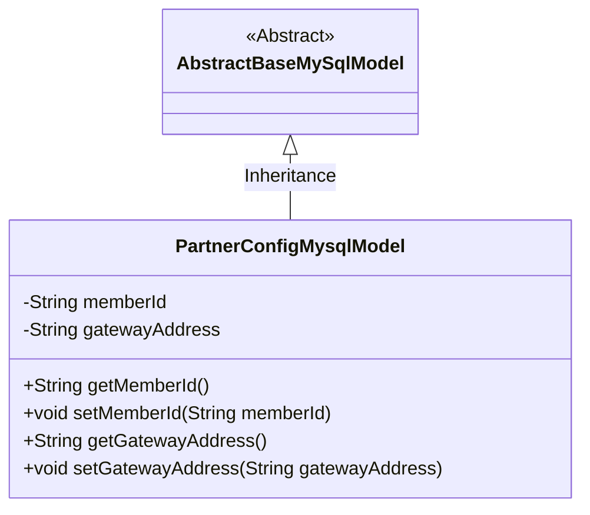
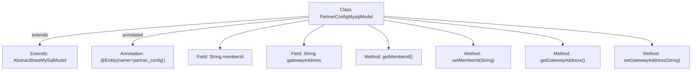

# Basic Information

|      |      |
|------|------|
| Name | PartnerConfigMysqlModel |
| Language | .java |
| Code Path | WeFe/board/board-service/src/main/java/com/welab/wefe/board/service/database/entity/PartnerConfigMysqlModel.java |
| Package Name | com.welab.wefe.board.service.database.entity |
| Dependencies | ['com.welab.wefe.board.service.database.entity.base.AbstractBaseMySqlModel', 'javax.persistence.Entity'] |
| Brief Description | This is a JPA entity class named partner_config, which inherits from AbstractBaseMySqlModel. It includes two fields, memberId and gatewayAddress, along with their corresponding getter/setter methods. |

# Description

This is a JPA entity class named PartnerConfigMysqlModel, mapped to the database table partner_config. It inherits from the base class AbstractBaseMySqlModel and contains two private string fields: memberId and gatewayAddress. The class provides complete getter and setter methods for these two fields to access and modify their values. This entity class is used to store partner configuration information, where memberId represents the member ID and gatewayAddress represents the gateway address.

# Class Summary

| Name   | Type  | Description |
|-------|------|-------------|
| PartnerConfigMysqlModel | class | The PartnerConfigMysqlModel entity class includes memberId and gatewayAddress fields along with their corresponding getter/setter methods. |

## Class PartnerConfigMysqlModel

|      |      |
|------|------|
| Access Modifier | @Entity(name = "partner_config");public |
| Type | class |
| Name | PartnerConfigMysqlModel |
| Description | The PartnerConfigMysqlModel entity class includes memberId and gatewayAddress fields along with their corresponding getter/setter methods. |

### UML Class Diagram

This class diagram illustrates the inheritance relationship where PartnerConfigMysqlModel extends AbstractBaseMySqlModel. PartnerConfigMysqlModel is an entity class containing two private attributes, memberId and gatewayAddress, along with their corresponding getter and setter methods. The class is marked as a JPA entity via the @Entity annotation, mapping to the partner_config table in the database. As a subclass of the abstract base class, it inherits all features from the parent while extending its own business fields and methods.

### Internal Method Call Graph

This code defines an entity class named PartnerConfigMysqlModel, which extends AbstractBaseMySqlModel and is annotated as a JPA entity mapped to the database table 'partner_config'. The class contains two String-type fields: memberId and gatewayAddress, along with their corresponding getter and setter methods. The flowchart illustrates the inheritance relationship, field declarations, and method definitions, clearly presenting the structural composition of this entity class.

### Field List

| Name  | Type  | Description |
|-------|-------|------|
| gatewayAddress | String | The private string variable gatewayAddress is used to store the gateway address. |
| memberId | String | Member ID string variable |

### Method List

| Name  | Type  | Description |
|-------|-------|------|
| getGatewayAddress | String | Methods to obtain the gateway address, returning a string-type variable `gatewayAddress`. |
| getMemberId | String | Methods to obtain the member ID, which returns a string-type memberId. |
| setMemberId | void | The method to set the member ID assigns the input parameter to the class's member variable memberId. |
| setGatewayAddress | void | The method to set the gateway address assigns the input parameter `gatewayAddress` to the class member variable of the same name. |

