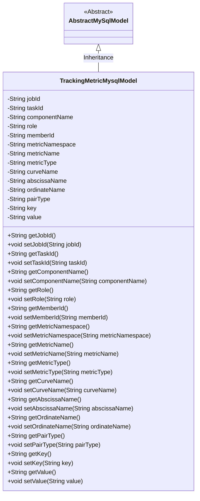

# Basic Information

|      |      |
|------|------|
| Name | TrackingMetricMysqlModel |
| Language | .java |
| Code Path | WeFe/board/board-service/src/main/java/com/welab/wefe/board/service/database/entity/TrackingMetricMysqlModel.java |
| Package Name | com.welab.wefe.board.service.database.entity |
| Dependencies | ['com.welab.wefe.board.service.database.entity.base.AbstractMySqlModel', 'javax.persistence.Entity'] |
| Brief Description | The `TrackingMetricMysqlModel` class is used to store task tracking metric data, containing fields such as task ID, component, role, metric type, and coordinate name. |

# Description

This is a MySQL entity class named TrackingMetricMysqlModel, which inherits from AbstractMySqlModel. It contains multiple fields for tracking task metric data, including task ID, subtask ID, component name, role, member ID, metric namespace, metric name, metric type, curve name, horizontal and vertical axis names, pairing type, key-value pairs, etc. Each field has corresponding getter and setter methods for accessing and modifying data. This entity class maps to the `tracking_metric` table in the database.

# Class Summary

| Name   | Type  | Description |
|-------|------|-------------|
| TrackingMetricMysqlModel | class | The TrackingMetricMysqlModel class is used to store task metric data, containing fields such as task ID, component name, role, metric type, and coordinate name. |

## Class TrackingMetricMysqlModel

|      |      |
|------|------|
| Access Modifier | @Entity(name = "tracking_metric");public |
| Type | class |
| Name | TrackingMetricMysqlModel |
| Description | The TrackingMetricMysqlModel class is used to store task metric data, containing fields such as task ID, component name, role, metric type, and coordinate name. |

### UML Class Diagram

This code defines an entity class named `TrackingMetricMysqlModel` for storing tracking metric-related data. The class inherits from the abstract class `AbstractMySqlModel` and contains multiple private fields such as task ID, component name, metric type, etc., with public getter and setter methods provided for each field. Marked as a JPA entity via the @Entity annotation, it indicates this class will be mapped to the `tracking_metric` table in the database. This model class is primarily used for persistently storing structured data related to task metric tracking.

### Internal Method Call Graph

```mermaid
graph TD
    A["Class TrackingMetricMysqlModel"]
    B["Inherits: AbstractMySqlModel"]
    C["Annotation: @Entity(name='tracking_metric')"]
    D["Field: String jobId"]
    E["Field: String taskId"]
    F["Field: String componentName"]
    G["Field: String role"]
    H["Field: String memberId"]
    I["Field: String metricNamespace"]
    J["Field: String metricName"]
    K["Field: String metricType"]
    L["Field: String curveName"]
    M["Field: String abscissaName"]
    N["Field: String ordinateName"]
    O["Field: String pairType"]
    P["Field: String key"]
    Q["Field: String value"]
    R["Getter/Setter method group (14 pairs)"]

    A --> B
    A --> C
    A --> D
    A --> E
    A --> F
    A --> G
    A --> H
    A --> I
    A --> J
    A --> K
    A --> L
    A --> M
    A --> N
    A --> O
    A --> P
    A --> Q
    A -.-> R
```

This code defines a JPA entity class named TrackingMetricMysqlModel, which inherits from AbstractMySqlModel and is used to store task tracking-related metric data. The class contains 14 String-type fields, each with corresponding getter and setter methods. These fields record task IDs, component names, role information, metric metadata (such as namespace, name, type), as well as axis and key-value pair information. The entity maps to the tracking_metric table in the database, serving as a typical data persistence model class suitable for distributed system scenarios requiring multi-dimensional task metric tracking.

### Field List

| Name  | Type  | Description |
|-------|-------|------|
| value | String | Private string variable value. |
| metricType | String | The private string type variable metricType. |
| curveName | String | The private string variable curveName is used to store the curve name. |
| metricName | String | The private string variable metricName is used to store the metric name. |
| jobId | String | Private string type variable jobId. |
| taskId | String | The private string-type variable taskId is used to store the task identifier. |
| ordinateName | String | Private string variable ordinateName |
| abscissaName | String | Private string variable representing the name of the horizontal coordinate. |
| memberId | String | Member ID string type private variable. |
| role | String | Declare a private string variable role. |
| metricNamespace | String | The private string variable metricNamespace is used to store the metric namespace. |
| key | String | Private string type variable key. |
| pairType | String | Declare a private string variable pairType. |
| componentName | String | The private string variable componentName is used to store the component name. |

### Method List

| Name  | Type  | Description |
|-------|-------|------|
| setComponentName | void | Java Method: Set Component Name Attribute. Assigns the input parameter componentName to the class member variable with the same name. |
| setMetricNamespace | void | The method for setting the metric namespace assigns the input parameter to the class member variable `metricNamespace`. |
| getMemberId | String | Methods to obtain the member ID, which returns a string-type memberId. |
| getTaskId | String | Methods to obtain the task ID, which returns a string-type taskId. |
| setMetricType | void | Java method: Set the metricType attribute value, with the parameter being of string type. |
| getMetricNamespace | String | The method returns the metricNamespace string value. |
| getAbscissaName | String | Method to obtain the abscissa name, returns the value of the variable abscissaName. |
| getRole | String | This is a Java method that returns the value of the string variable `role`. |
| setTaskId | void | Methods for setting the task ID: Assign the passed-in `taskId` to the `taskId` property of the current object. |
| getComponentName | String | Methods to obtain the component name, returns a string-type componentName. |
| setAbscissaName | void | The method to set the name of the horizontal axis assigns the input string to the class member variable abscissaName. |
| setRole | void | Methods for setting role attributes, assigning the input parameter `role` to the `role` property of the current object. |
| getMetricName | String | The method to obtain metricName, which returns the metricName value of string type. |
| getCurveName | String | Methods to obtain the curve name, returning the value of the variable curveName. |
| getMetricType | String | Methods to obtain metricType, returns a string type. |
| setMetricName | void | The method to set the metric name assigns the input parameter to the class member variable metricName. |
| getOrdinateName | String | Methods to obtain the ordinate name, returns a string ordinateName. |
| setJobId | void | Define a public method `setJobId` that accepts a string parameter `jobId` and assigns it to the class member variable of the same name. |
| setMemberId | void | The method to set the member ID assigns the input parameter to the class's member variable `memberId`. |
| setCurveName | void | The method to set the curve name assigns the input parameter `curveName` to the `curveName` property of the current object. |
| setOrdinateName | void | The method to set the ordinate name assigns the input string to the class member variable `ordinateName`. |
| getPairType | String | The method returns a string-type pairType value. |
| setPairType | void | Methods for setting the pairType attribute, where the parameter is of string type. |
| getKey | String | This method returns a key value of string type. |
| setKey | void | This is a Java method used to set the key property value of a class. The method takes a String parameter key and assigns it to the member variable this.key of the class. |
| getValue | String | The method returns a value of type string. |
| setValue | void | This is a Java method used to set the value of the class member variable `value`. The method takes a string parameter `value` and assigns it to the `value` property of the current object. |
| getJobId | String | Get the unique identifier jobId of the current task. |

