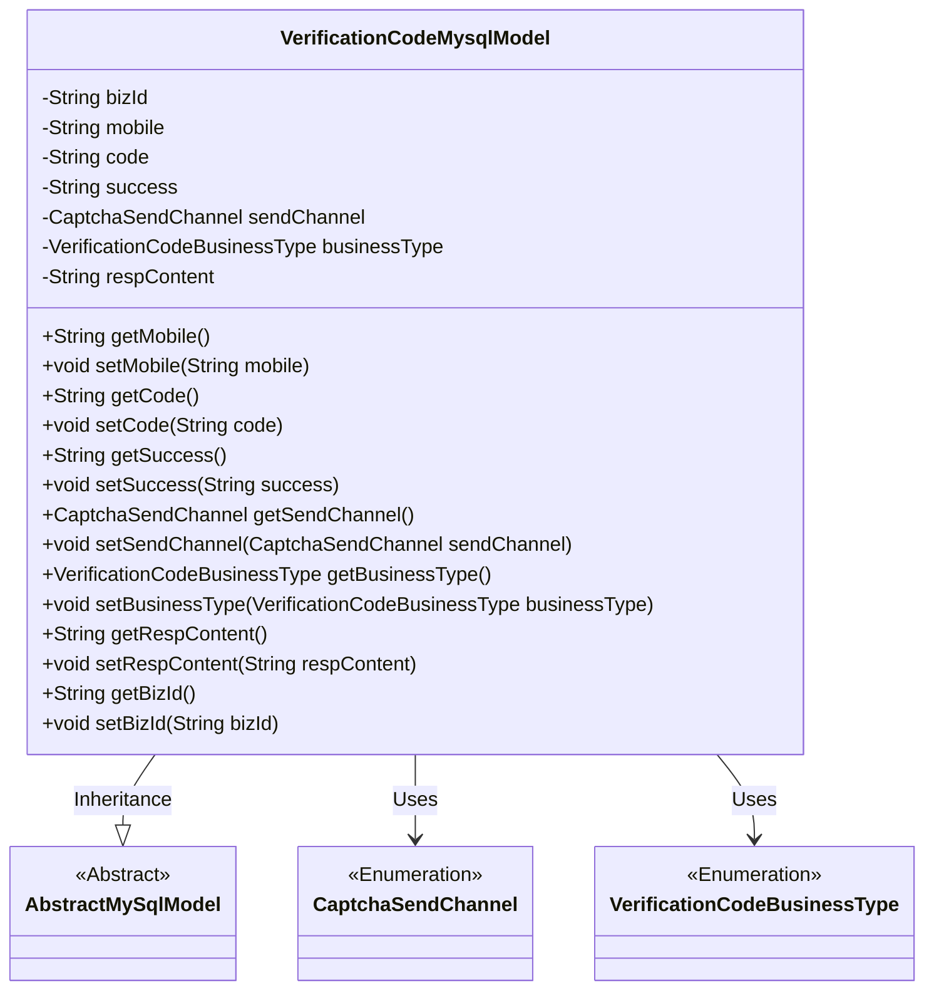

# Basic Information

|      |      |
|------|------|
| Name | VerificationCodeMysqlModel |
| Language | .java |
| Code Path | WeFe/board/board-service/src/main/java/com/welab/wefe/board/service/database/entity/VerificationCodeMysqlModel.java |
| Package Name | com.welab.wefe.board.service.database.entity |
| Dependencies | ['com.welab.wefe.board.service.database.entity.base.AbstractMySqlModel', 'com.welab.wefe.common.verification.code.common.CaptchaSendChannel', 'com.welab.wefe.common.verification.code.common.VerificationCodeBusinessType', 'com.welab.wefe.common.web.util.DatabaseEncryptConverter', 'javax.persistence.Convert', 'javax.persistence.Entity', 'javax.persistence.EnumType', 'javax.persistence.Enumerated'] |
| Brief Description | VerificationCodeMysqlModel is an entity class for storing verification codes, containing fields such as business ID, encrypted phone number, verification code, sending status, sending channel, business type, and response content. |

# Description

The content defines an entity class named `verification_code` called `VerificationCodeMysqlModel`, which inherits from `AbstractMySqlModel`. The class includes multiple fields: `bizId` for associating business information, `mobile` stored after encryption conversion, `code` representing the verification code, `success` indicating the sending status, `sendChannel` and `businessType` as enumerated types representing the sending channel and business type respectively, and `respContent` storing the response content. Each field has corresponding getter and setter methods for accessing and modifying the property values.

# Class Summary

| Name   | Type  | Description |
|-------|------|-------------|
| VerificationCodeMysqlModel | class | Database entity class for storing verification code information, including fields such as business ID, encrypted phone number, verification code, sending status, channel, business type, and response content. |

## Class VerificationCodeMysqlModel

|      |      |
|------|------|
| Access Modifier | @Entity(name = "verification_code");public |
| Type | class |
| Name | VerificationCodeMysqlModel |
| Description | Database entity class for storing verification code information, including fields such as business ID, encrypted phone number, verification code, sending status, channel, business type, and response content. |

### UML Class Diagram

This code defines an entity class named VerificationCodeMysqlModel, which is used to store verification code-related information, including business ID, mobile number, verification code, sending status, sending channel, business type, and response content. The class inherits from AbstractMySqlModel and utilizes two enumeration types, CaptchaSendChannel and VerificationCodeBusinessType, to represent the verification code's sending channel and business type. All fields have corresponding getter and setter methods, facilitating data access and modification.

### Internal Method Call Graph

```mermaid
graph TD
    A["Class VerificationCodeMysqlModel"]
    B["Inherits: AbstractMySqlModel"]
    C["Property: String bizId"]
    D["Property: String mobile"]
    E["Property: String code"]
    F["Property: String success"]
    G["Property: CaptchaSendChannel sendChannel"]
    H["Property: VerificationCodeBusinessType businessType"]
    I["Property: String respContent"]
    J["Method: getMobile/setMobile"]
    K["Method: getCode/setCode"]
    L["Method: getSuccess/setSuccess"]
    M["Method: getSendChannel/setSendChannel"]
    N["Method: getBusinessType/setBusinessType"]
    O["Method: getRespContent/setRespContent"]
    P["Method: getBizId/setBizId"]

    A --> B
    A --> C
    A --> D
    A --> E
    A --> F
    A --> G
    A --> H
    A --> I
    A --> J
    A --> K
    A --> L
    A --> M
    A --> N
    A --> O
    A --> P
```

This code defines an entity class named VerificationCodeMysqlModel for storing verification code-related data. The class inherits from AbstractMySqlModel and includes multiple properties such as bizId, mobile, code, success, etc., representing business ID, phone number, verification code, sending status, and other information. Each property has corresponding getter and setter methods for retrieving and setting property values. The mobile property uses a database encryption converter, while the sendChannel and businessType properties use enumerated types. This class is primarily used to store and manage verification code-related business data in MySQL databases.

### Field List

| Name  | Type  | Description |
|-------|-------|------|
| success | String | Private string variable success |
| businessType | VerificationCodeBusinessType | The enumeration type field `businessType` is stored in string format, corresponding to the business type `VerificationCodeBusinessType`. |
| code | String | Private string variable code |
| sendChannel | CaptchaSendChannel | The enumeration type field `sendChannel` stores enumeration values in string format. |
| bizId | String | Private string type variable bizId. |
| mobile | String | The field mobile is encrypted and converted using the DatabaseEncryptConverter class. |
| respContent | String | The private string variable respContent is used to store response content. |

### Method List

| Name  | Type  | Description |
|-------|-------|------|
| getCode | String | Common methods for obtaining code values. |
| getSuccess | String | Methods to obtain the success status, returning a string-type variable `success`. |
| setMobile | void | This is a Java method used to set the mobile property value of a class. The method takes a string parameter named mobile and assigns it to the member variable of the same name in the class. |
| getRespContent | String | String methods for obtaining response content. |
| getMobile | String | Methods to obtain the phone number, returning a string-type variable named mobile. |
| setSuccess | void | Methods for setting the success state, assigning the input string to the success variable. |
| getBusinessType | VerificationCodeBusinessType | The method to obtain the business type returns the `businessType` field value of type `VerificationCodeBusinessType`. |
| setCode | void | This is a Java method used to set the value of the object's code property. The method takes a string parameter code and assigns it to the code member variable of the current object. |
| setRespContent | void | Defined a public method setRespContent for setting the value of the respContent property. |
| setSendChannel | void | Set the method for sending verification codes, with the parameter being the sending channel object. |
| setBusinessType | void | The method for setting the business type assigns the incoming VerificationCodeBusinessType to the businessType property of the current object. |
| getBizId | String | Methods to obtain the business ID, returns bizId. |
| getSendChannel | CaptchaSendChannel | Methods for obtaining the verification code sending channel, returning a sendChannel object. |
| setBizId | void | Method to set the business ID: Assign the passed bizId to the bizId property of the current object. |

