# Basic Information

|      |      |
|------|------|
| Name | entity |
| Language | .java |
| Code Path | WeFe/board/board-service/src/main/java/com/welab/wefe/board/service/database/entity |
| Package Name | docs.board.board-service.src.main.java.com.welab.wefe.board.service.database.entity |
| Brief Description | The module manages the entire lifecycle of digital certificates, including key storage and application issuance. The data structure includes entities such as CertKeyInfoMysqlModel and relies on the JPA framework. It supports scenarios like consortium blockchain network access authentication. |

# Description

## Overview  
This module serves as the core data persistence layer of the federated learning platform, employing JPA entity specifications to uniformly manage multi-domain data. Its core responsibilities encompass CRUD operations for business entities such as digital certificate lifecycle management, heterogeneous data resource modeling, federated learning task flows, and instant messaging systems, akin to an enterprise-level data mid-platform model. The interface specifications adhere to JPA standards, commonly utilizing @Column field mapping, JSON type conversion, and enum persistence. The foundational models implement audit field inheritance through AbstractBaseMySqlModel. Key data structures form three major systems: certificate management (e.g., CertKeyInfoMysqlModel), federated learning (e.g., JobMySqlModel), and data resources (e.g., TableDataSetMysqlModel). External dependencies are concentrated on MySQL databases, the JPA framework, and encryption components (e.g., DatabaseEncryptConverter). For instance, GlobalConfigMysqlModel enables encrypted storage of configuration items, while AccountMysqlModel securely processes phone numbers.

## Key Business Scenarios  
The module supports the entire federated learning workflow and collaboration with peripheral systems, resembling a combination of a workflow engine and a message bus. Typical scenarios include: certificate issuance (CA review → key storage), data fusion (task scheduling → field analysis → result export), and process orchestration (template definition → DAG node construction → action log tracking). Interaction modes manifest in three dimensions: resource-oriented (e.g., ImageDataSetMysqlModel managing annotations), task-oriented (e.g., FusionTaskMySqlModel monitoring progress), and message-oriented (e.g., MessageMysqlModel handling pending tasks). API integration examples are abundant, such as implementing operational audits via OperationLogMysqlModel, maintaining gateway addresses with PartnerConfigMysqlModel, and recording training metrics with TrackingMetricMysqlModel. The complete functional chain covers the full闭环 from data preparation (DataSourceMysqlModel), task execution (OutputModelMysqlModel), to result application (DataOutputInfoMysqlModel).

### Package Internal Structure View

```mermaid
graph TD
    entity --> cert
    entity --> data_resource
    entity --> job
    entity --> chat
    entity --> data_set
    entity --> flow
    entity --> fusion
    entity --> base
    entity --> MessageMysqlModel.java
    entity --> PartnerConfigMysqlModel.java
    entity --> OutputModelMysqlModel.java
    entity --> GlobalConfigMysqlModel.java
    entity --> BlacklistMysqlModel.java
    entity --> OperationLogMysqlModel.java
    entity --> VerificationCodeMysqlModel.java
    entity --> DataSourceMysqlModel.java
    entity --> TrackingMetricMysqlModel.java
    entity --> AccountMysqlModel.java
    entity --> DataOutputInfoMysqlModel.java
    cert --> CertKeyInfoMysqlModel.java
    cert --> CertRequestInfoMysqlModel.java
    cert --> CertInfoMysqlModel.java
    data_resource --> DataResourceUploadTaskMysqlModel.java
    data_resource --> BloomFilterMysqlModel.java
    data_resource --> TableDataSetMysqlModel.java
    data_resource --> DataResourceMysqlModel.java
    data_resource --> ImageDataSetMysqlModel.java
    job --> ModelOotRecordMysqlModel.java
    job --> TaskMySqlModel.java
    job --> JobMemberMySqlModel.java
    job --> TaskResultMySqlModel.java
    job --> ProjectMemberAuditMySqlModel.java
    job --> JobMySqlModel.java
    job --> ProjectFlowNodeMySqlModel.java
    job --> ProjectFlowMySqlModel.java
    job --> ProjectDataSetMySqlModel.java
    job --> TaskProgressMysqlModel.java
    job --> TaskContextMySqlModel.java
    job --> ProjectMySqlModel.java
    job --> ProjectMemberMySqlModel.java
    chat --> ChatUnreadMessageMySqlModel.java
    chat --> MemberChatMySqlModel.java
    chat --> ChatLastAccountMysqlModel.java
    chat --> MessageQueueMySqlModel.java
    data_set --> ImageDataSetSampleMysqlModel.java
    data_set --> DataSetColumnMysqlModel.java
    flow --> FlowActionLogMySqlModel.java
    flow --> FlowTemplateMySqlModel.java
    flow --> FlowActionQueueMySqlModel.java
    fusion --> bloomfilter
    fusion --> FusionActuatorInfoMySqlModel.java
    fusion --> FusionTaskMySqlModel.java
    fusion --> FusionResultMySqlModel.java
    fusion --> FieldInfoMySqlModel.java
    fusion --> ExportProgressMySqlModel.java
    bloomfilter --> BloomFilterTaskMysqlModel.java
    bloomfilter --> BloomFilterColumnMysqlModel.java
    base --> AbstractBaseMySqlModel.java
    base --> AbstractMySqlModel.java
```

This flowchart illustrates the hierarchical structure of database entity classes in the board-service module of the WeFe project. The root node is the entity directory, which contains 11 subdirectories such as cert, data_resource, and job. Each subdirectory further includes multiple entity class files. Notably, the fusion directory has a two-level nested structure containing the bloomfilter subdirectory. The overall structure clearly reflects the organization of entity classes across different business domains (e.g., task management, data resources, chat system, etc.).

# File List

| Name   | Type  | Description |
|-------|------|-------------|
| [MessageMysqlModel.java](MessageMysqlModel.md) | file | Message entity class, including producer type, message level, event, title, content, unread status, to-do marker and completion status, as well as two associated IDs. |
| [PartnerConfigMysqlModel.java](PartnerConfigMysqlModel.md) | file | This is a JPA entity class named partner_config, which extends AbstractBaseMySqlModel. It includes two fields, memberId and gatewayAddress, along with their corresponding getter and setter methods. |
| [OutputModelMysqlModel.java](OutputModelMysqlModel.md) | file | The `OutputModelMysqlModel` class inherits from `AbstractBaseMySqlModel` and includes fields such as task ID, subtask ID, component name, role, member ID, model ID, version, key, metadata, and parameters, along with their corresponding getter/setter methods. |
| [GlobalConfigMysqlModel.java](GlobalConfigMysqlModel.md) | file | The GlobalConfigMysqlModel is an entity class for storing global configurations, containing fields such as group name, configuration name, encrypted value, and description, with corresponding getter/setter methods provided. |
| [BlacklistMysqlModel.java](BlacklistMysqlModel.md) | file | Blacklist entity class, containing member ID, blacklisted member ID, and remark fields, providing getter and setter methods. |
| [OperationLogMysqlModel.java](OperationLogMysqlModel.md) | file | Operation log entity class, containing information such as interface, IP, operator, action, result, and time consumed. |
| [VerificationCodeMysqlModel.java](VerificationCodeMysqlModel.md) | file | VerificationCodeMysqlModel is an entity class for storing verification codes, containing fields such as business ID, encrypted phone number, verification code, sending status, sending channel, business type, and response content. |
| [DataSourceMysqlModel.java](DataSourceMysqlModel.md) | file | MySQL data source entity class, including fields such as name, type, host, port, database name, username, and encrypted password, along with their corresponding getter/setter methods. |
| [TrackingMetricMysqlModel.java](TrackingMetricMysqlModel.md) | file | The TrackingMetricMysqlModel class is used to store task tracking metric data, containing fields such as task ID, component, role, metric type, and coordinate name. |
| [AccountMysqlModel.java](AccountMysqlModel.md) | file | Account entity class, including fields such as phone number, password, role, audit status, activity time, etc., supports JSON storage and encrypted conversion. |
| [DataOutputInfoMysqlModel.java](DataOutputInfoMysqlModel.md) | file | The DataOutputInfoMysqlModel class stores task output information, including fields such as task ID, component, role, table information, and model version. |
| [chat](chat/_module.md) | package | Four JPA entity classes are defined: ChatUnreadMessageMySqlModel (unread messages), MemberChatMySqlModel (member chat information), ChatLastAccountMysqlModel (account contacts), and MessageQueueMySqlModel (message queue). All inherit from AbstractMySqlModel and contain relevant fields along with getter/setter methods. |
| [base](base/_module.md) | package | AbstractBaseMySqlModel extends AbstractMySqlModel, manages creator and updater IDs, automatically sets operators and updates record timestamps. AbstractMySqlModel is an abstract base class containing ID, creation, and update time fields, which can be inherited and reused by other entity classes. |
| [fusion](fusion/_module.md) | package | This module manages Bloom filter tasks and field metadata, including models for task progress and field characteristics, supporting CRUD operations and statistical analysis. It involves multiple MySQL entity classes, such as task status, merge tasks, results, field information, and export progress, all inheriting from the base model and mapped to database tables. |
| [flow](flow/_module.md) | package | The FlowActionLogMySqlModel records flow logs, including fields such as producer, priority, and status. The FlowTemplateMySqlModel maps to the project_flow_template table, containing attributes like template name and type. The FlowActionQueueMySqlModel manages flow action queues, with fields such as producer and priority. |
| [data_set](data_set/_module.md) | package | The ImageDataSetSampleMysqlModel entity class stores image dataset sample information, including fields such as ID, filename, and labels, inheriting from AbstractBaseMySqlModel. The DataSetColumnMysqlModel maps to the data_set_column table, containing attributes like dataset ID, field name, and data type, inheriting from the same base class. Both entities use JSON format to store partial data. |
| [job](job/_module.md) | package | ModelOotRecordMysqlModel maps to the model_oot_record table, containing fields such as process ID, job ID, and node ID. TaskMySqlModel represents the task entity, with attributes like name, depth, and status. JobMemberMySqlModel maps to the job_member table, including fields such as project ID and role. TaskResultMySqlModel corresponds to the task_result table, with fields like task ID and result type. ProjectMemberAuditMySqlModel records member audit information. JobMySqlModel represents federated learning tasks. ProjectFlowNodeMySqlModel denotes process nodes. ProjectFlowMySqlModel maps to the project_flow table. ProjectDataSetMySqlModel represents project datasets. TaskProgressMysqlModel records task progress. TaskContextMySqlModel stores task context. ProjectMySqlModel represents project data. ProjectMemberMySqlModel records project member information. |
| [data_resource](data_resource/_module.md) | package | The `DataResourceUploadTaskMysqlModel` class maps to the data resource upload task table, containing attributes such as progress and status. The `BloomFilterMysqlModel` class represents the Bloom filter model, including fields like RSA keys. The `TableDataSetMysqlModel` class stores dataset information, including features and Y values. `DataResourceMysqlModel` is the base class, encompassing common resource attributes and usage statistics. The `ImageDataSetMysqlModel` class is specialized for image datasets, containing annotation details, among others. All classes inherit from the base model and provide complete getter/setter methods. |
| [cert](cert/_module.md) | package | The CertKeyInfoMysqlModel stores key PEM, member ID, and algorithm; the CertRequestInfoMysqlModel records certificate request information such as private key ID, organization name, etc.; the CertInfoMysqlModel manages certificate data like public key, serial number, etc. All three inherit from AbstractBaseMySqlModel and use JPA annotations to map database fields. |

