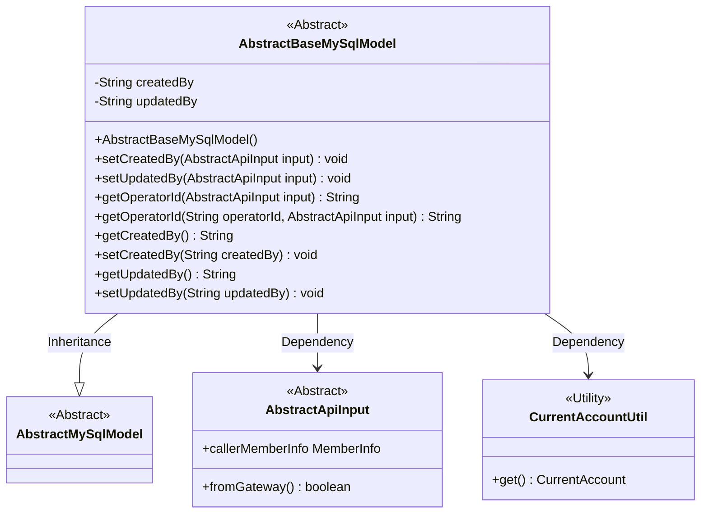
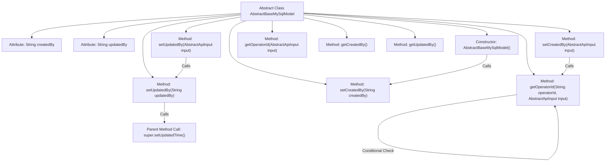

# Basic Information

|      |      |
|------|------|
| Name | AbstractBaseMySqlModel |
| Language | .java |
| Code Path | WeFe/board/board-service/src/main/java/com/welab/wefe/board/service/database/entity/base/AbstractBaseMySqlModel.java |
| Package Name | com.welab.wefe.board.service.database.entity.base |
| Dependencies | ['com.welab.wefe.board.service.service.CacheObjects', 'com.welab.wefe.common.web.dto.AbstractApiInput', 'com.welab.wefe.common.web.util.CurrentAccountUtil', 'javax.persistence.MappedSuperclass', 'java.util.Date'] |
| Brief Description | The abstract class `AbstractBaseMySqlModel` extends `AbstractMySqlModel`, containing creator and updater fields, providing logic for setting operator IDs, and automatically handling gateway and current account information. |

# Description

AbstractBaseMySqlModel is an abstract base class that inherits from AbstractMySqlModel, designed to manage creator and updater information. The class includes createdBy and updatedBy fields, which record the IDs of the creator and last updater, respectively. The constructor automatically sets createdBy to the current account ID. It provides the getOperatorId method based on AbstractApiInput to set the operator ID, with logic that prioritizes using the cached member ID, then retrieves it from the gateway input, and finally falls back to the current account ID. When updating updatedBy, the update time is automatically set. It includes standard getter and setter methods.

# Class Summary

| Name   | Type  | Description |
|-------|------|-------------|
| AbstractBaseMySqlModel | class | The abstract class AbstractBaseMySqlModel inherits from AbstractMySqlModel, includes creator and updater fields, provides logic for setting operator IDs, and automatically records creation and update times. |

## Class AbstractBaseMySqlModel

|      |      |
|------|------|
| Access Modifier | @MappedSuperclass;public abstract |
| Type | class |
| Name | AbstractBaseMySqlModel |
| Description | The abstract class AbstractBaseMySqlModel inherits from AbstractMySqlModel, includes creator and updater fields, provides logic for setting operator IDs, and automatically records creation and update times. |

### UML Class Diagram

This class diagram illustrates `AbstractBaseMySqlModel` as an abstract subclass of `AbstractMySqlModel`, containing fields for creator and updater along with related operation methods. It depends on the `AbstractApiInput` interface to obtain operator information and utilizes the `CurrentAccountUtil` utility class to fetch the current account ID. The class implements intelligent operator ID retrieval logic that returns appropriate operator IDs based on different scenarios (cache, gateway calls, or current account), while automatically maintaining update timestamps.

### Internal Method Call Graph

This code represents an abstract base class for MySQL database models, primarily handling operations related to creators and updaters. The flowchart illustrates the class attributes, constructor, and method invocation relationships, including the logic for setting creators and updaters, as well as the process of obtaining operator IDs via the getOperatorId method. Notably, the setUpdatedBy method simultaneously updates the parent class's update time, while the getOperatorId method contains complex conditional logic to determine the final operator ID.

### Field List

| Name  | Type  | Description |
|-------|-------|------|
| updatedBy | String | Updater information, stored as string type. |
| createdBy | String | Private string-type variable, recording creator information. |

### Method List

| Name  | Type  | Description |
|-------|-------|------|
| setCreatedBy | void | Define the method setCreatedBy to set the value of the member variable createdBy. |
| setCreatedBy | void | The method `setCreatedBy` accepts an `AbstractApiInput` parameter, retrieves the operator ID via `getOperatorId`, and assigns it to the `createdBy` field. |
| getOperatorId | String | This method determines the operator ID to return based on the operator ID and input parameters: if the operator ID is a member ID, it is returned directly; if the input comes from a gateway, the caller's member ID is returned; otherwise, the current account ID is returned. |
| getCreatedBy | String | Public method to retrieve creator information, returns a string-type variable createdBy. |
| getUpdatedBy | String | This is a Java method that returns the value of the updatedBy variable as a string. |
| setUpdatedBy | void | This method sets the updater ID based on the input parameters, first obtaining the ID via getOperatorId, then calling setUpdatedBy to complete the assignment. |
| getOperatorId | String | The method `getOperatorId` accepts an `AbstractApiInput` parameter, calls the method of the same name with `null` and `input` as arguments, and returns the operator ID. |
| setUpdatedBy | void | The method `setUpdatedBy` accepts a string parameter `updatedBy`, updates the `updatedBy` property of the current object, and invokes the parent class method to set the current time as the update time. |

