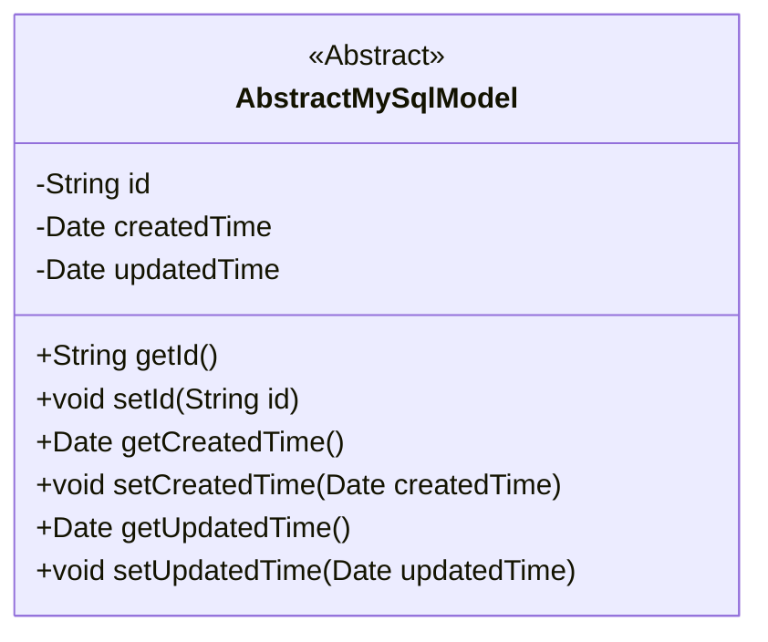
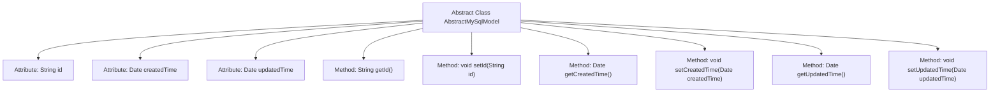

# Basic Information

|      |      |
|------|------|
| Name | AbstractMySqlModel |
| Language | .java |
| Code Path | WeFe/board/board-service/src/main/java/com/welab/wefe/board/service/database/entity/base/AbstractMySqlModel.java |
| Package Name | com.welab.wefe.board.service.database.entity.base |
| Dependencies | ['javax.persistence.Column', 'javax.persistence.Id', 'javax.persistence.MappedSuperclass', 'java.io.Serializable', 'java.util.Date', 'java.util.UUID'] |
| Brief Description | Abstract MySQL model base class, including ID, creation time, and update time fields along with corresponding getter/setter methods. The ID is auto-generated, and the creation time defaults to the current time. |

# Description

This is an abstract class named AbstractMySqlModel, annotated with @MappedSuperclass and implementing the Serializable interface. The class contains three core fields: id serves as a globally unique identifier, generated using UUID with hyphens removed, annotated as @Id and non-updatable; createdTime records the creation time, defaulting to the current time; updatedTime records the update time. Standard getter and setter methods are provided for these three fields. As a foundational abstract class for MySQL models, it can be inherited and reused by other entity classes.

# Class Summary

| Name   | Type  | Description |
|-------|------|-------------|
| AbstractMySqlModel | class | Abstract MySQL model base class, including ID, creation time, and update time fields with getter/setter methods. The ID defaults to generating a UUID without hyphens. |

## Class AbstractMySqlModel

|      |      |
|------|------|
| Access Modifier | @MappedSuperclass;public abstract |
| Type | class |
| Name | AbstractMySqlModel |
| Description | Abstract MySQL model base class, including ID, creation time, and update time fields with getter/setter methods. The ID defaults to generating a UUID without hyphens. |

### UML Class Diagram

This code defines an abstract class named `AbstractMySqlModel`, which implements the `Serializable` interface and serves as a base class for MySQL database models. The class includes three private fields: `id` (generated using UUID with hyphens removed), `createdTime` (automatically set to the current date), and `updatedTime` (update time), along with their corresponding getter and setter methods. It is marked as the parent class of JPA entity classes via the `@MappedSuperclass` annotation, while the `@Id` and `@Column` annotations are used to identify primary key and column attributes. This abstract class primarily provides common fields and methods for other entity classes, reducing code duplication.

### Internal Method Call Graph

This code defines an abstract class named AbstractMySqlModel, which implements the Serializable interface, indicating that its instances can be serialized. The class contains three main attributes: id (a unique identifier generated using UUID with hyphens removed), createdTime (creation time, defaulting to the current time), and updatedTime (update time). The class provides corresponding getter and setter methods for each attribute to retrieve and set their values. This class uses the JPA annotations @MappedSuperclass and @Id, indicating that it is a mapped superclass and the id attribute is its primary key.

### Field List

| Name  | Type  | Description |
|-------|-------|------|
| id = UUID.randomUUID().toString().replaceAll("-", "") | String | Entity ID field, generated using UUID with hyphens removed, database column name is id and not updatable. |
| updatedTime | Date | Date type variable for update time. |
| createdTime = new Date() | Date | Declare a private Date type variable named createdTime, initialized to the current time. |

### Method List

| Name  | Type  | Description |
|-------|-------|------|
| getUpdatedTime | Date | Method to obtain the update time, returns a Date type variable updatedTime. |
| setId | void | Methods for setting the object ID, assigning the parameter `id` to the `id` property of the current object. |
| getId | String | Methods to obtain the object ID, returning the id value as a string type. |
| setUpdatedTime | void | The method to set the update time involves assigning the parameter updatedTime to the member variable updatedTime of the class. |
| setCreatedTime | void | Methods for setting object creation time, with the parameter being of type Date. |
| getCreatedTime | Date | Methods to obtain the creation time, returns the createdTime date object. |

