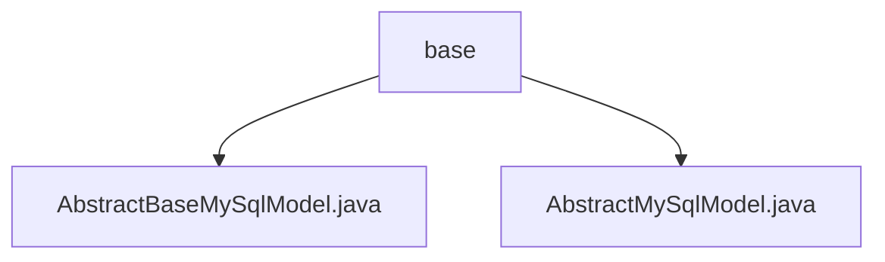

# Basic Information

|      |      |
|------|------|
| Name | base |
| Language | .java |
| Code Path | WeFe/board/board-service/src/main/java/com/welab/wefe/board/service/database/entity/base |
| Package Name | docs.board.board-service.src.main.java.com.welab.wefe.board.service.database.entity.base |
| Brief Description | AbstractBaseMySqlModel extends AbstractMySqlModel, manages creator and updater IDs, automatically sets operators and updates record timestamps. AbstractMySqlModel is an abstract base class containing ID, creation, and update time fields, which can be inherited and reused by other entity classes. |

# Description

## Overview  
This module provides an abstract base class system for MySQL entity classes, with the core responsibility of uniformly managing basic table fields and operator information. The `AbstractMySqlModel` defines a generic field structure (e.g., UUID primary key, timestamps), while `AbstractBaseMySqlModel` extends its functionality by adding operator tracking capabilities (similar to an audit log pattern).  

The interface specification adheres to JPA annotation standards, such as `@MappedSuperclass` for inheritance mapping and `@Id` for primary key designation. Key data structures include: base fields (id/createdTime/updatedTime) and operator fields (createdBy/updatedBy). External dependencies require only JPA and Java serialization support. For example, the `getOperatorId` method implements a three-tier operator ID retrieval strategy.  

## Primary Business Scenarios  
Primarily used in business scenarios requiring traceability of data changes, such as user operation auditing or collaborative editing systems. A typical interaction pattern involves automatically populating `createdBy` and `createdTime` during entity creation, while triggering maintenance of `updatedBy`/`updatedTime` during updates. For instance, in form submission scenarios, entities inheriting from the base class automatically record the current operator ID.  

API integration is manifested through standardized getter/setter methods, supporting JPA queries. The complete functionality covers entity lifecycle management—from creation and updates to persistence—forming a closed-loop data tracking capability. The typical application pattern resembles an enhanced CRUD, layering operator context atop basic operations.

### Package Internal Structure View

This flowchart illustrates the foundational database entity structure of the board-service module in the WeFe project. The root node is the base directory, which contains two abstract base class files: AbstractBaseMySqlModel.java and AbstractMySqlModel.java. These files provide the base implementation for MySQL data models. The hierarchical relationship clearly demonstrates the organization of foundational entity classes, adhering to the typical layered architecture design of Java projects.

# File List

| Name   | Type  | Description |
|-------|------|-------------|
| [AbstractBaseMySqlModel.java](AbstractBaseMySqlModel.md) | file | The abstract class `AbstractBaseMySqlModel` extends `AbstractMySqlModel`, containing creator and updater fields, and provides logic for setting operator IDs, automatically handling gateway and current account information. |
| [AbstractMySqlModel.java](AbstractMySqlModel.md) | file | Abstract MySQL model base class, containing ID, creation time, and update time fields along with corresponding getter/setter methods. The ID is auto-generated, and the creation time defaults to the current time. |

