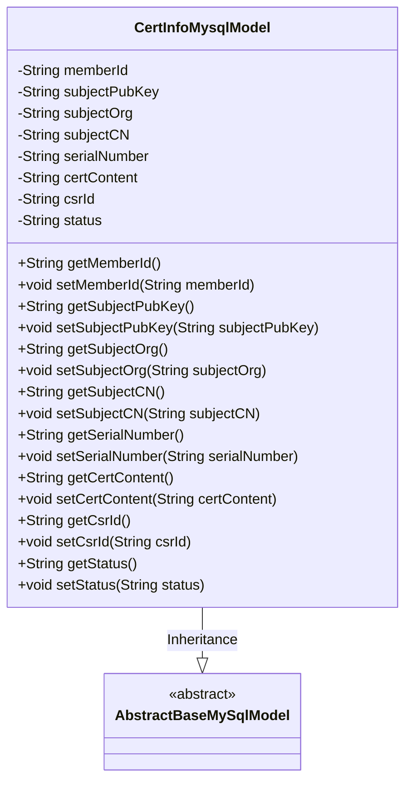

# Basic Information

|      |      |
|------|------|
| Name | CertInfoMysqlModel |
| Language | .java |
| Code Path | WeFe/board/board-service/src/main/java/com/welab/wefe/board/service/database/entity/cert/CertInfoMysqlModel.java |
| Package Name | com.welab.wefe.board.service.database.entity.cert |
| Dependencies | ['javax.persistence.Column', 'javax.persistence.Entity', 'org.hibernate.annotations.TypeDef', 'com.vladmihalcea.hibernate.type.json.JsonStringType', 'com.welab.wefe.board.service.database.entity.base.AbstractBaseMySqlModel'] |
| Brief Description | The `CertInfoMysqlModel` is a MySQL entity class for storing certificate information, containing fields such as user ID, public key, organization name, common name, serial number, certificate content, request ID, and status. |

# Description

This is a Java entity class named CertInfoMysqlModel, mapped to the database table `cert_info`. It inherits from `AbstractBaseMySqlModel` and contains fields related to certificate information: user ID, applicant public key, organization name, common name, certificate serial number, certificate content, certificate request ID, and status. Each field has corresponding getter and setter methods and uses JPA annotations for database column mapping. The class also defines JSON type support and includes a serial version UID.

# Class Summary

| Name   | Type  | Description |
|-------|------|-------------|
| CertInfoMysqlModel | class | CertInfoMysqlModel is a MySQL entity class for storing certificate information, containing fields such as user ID, public key, organization name, common name, serial number, certificate content, request ID, and status. |

## Class CertInfoMysqlModel

|      |      |
|------|------|
| Access Modifier | @Entity(name = "cert_info");@TypeDef(name = "json", typeClass = JsonStringType.class);public |
| Type | class |
| Name | CertInfoMysqlModel |
| Description | CertInfoMysqlModel is a MySQL entity class for storing certificate information, containing fields such as user ID, public key, organization name, common name, serial number, certificate content, request ID, and status. |

### UML Class Diagram

This code defines an entity class named CertInfoMysqlModel, which represents certificate information in a database. The class inherits from the abstract class AbstractBaseMySqlModel and contains 8 private fields (such as memberId, subjectPubKey, etc.) along with their corresponding getter and setter methods. Through the @Entity and @Column annotations, this class establishes a mapping relationship with the database table "cert_info" and its columns. The @TypeDef annotation specifies the handler class for the json type. This class is primarily used by ORM frameworks to interact with MySQL databases for storing and manipulating certificate-related data.

### Internal Method Call Graph

```mermaid
graph TD
    A["Class CertInfoMysqlModel"]
    B["Parent Class: AbstractBaseMySqlModel"]
    C["Annotation: @Entity(name='cert_info')"]
    D["Annotation: @TypeDef(name='json', typeClass=JsonStringType.class)"]
    E["Field: String memberId"]
    F["Field: String subjectPubKey"]
    G["Field: String subjectOrg"]
    H["Field: String subjectCN"]
    I["Field: String serialNumber"]
    J["Field: String certContent"]
    K["Field: String csrId"]
    L["Field: String status"]
    M["Method: getMemberId/setMemberId"]
    N["Method: getSubjectPubKey/setSubjectPubKey"]
    O["Method: getSubjectOrg/setSubjectOrg"]
    P["Method: getSubjectCN/setSubjectCN"]
    Q["Method: getSerialNumber/setSerialNumber"]
    R["Method: getCertContent/setCertContent"]
    S["Method: getCsrId/setCsrId"]
    T["Method: getStatus/setStatus"]

    A --> B
    A --> C
    A --> D
    A --> E
    A --> F
    A --> G
    A --> H
    A --> I
    A --> J
    A --> K
    A --> L
    A --> M
    A --> N
    A --> O
    A --> P
    A --> Q
    A --> R
    A --> S
    A --> T
```

This flowchart illustrates the complete structure of the CertInfoMysqlModel class, including its inheritance relationship, class-level annotations, 8 private fields, and corresponding getter/setter methods. As a JPA entity class, it maps to the database table "cert_info" via the @Entity annotation and defines a JSON type handler using @TypeDef. All fields are mapped to database columns through @Column annotations, forming a standard ORM entity model structure.

### Field List

| Name  | Type  | Description |
|-------|-------|------|
| subjectCN | String | Database field mapping: subjectCN corresponds to the table column subject_cn, with a string type. |
| certContent | String | The database field cert_content is mapped to a string-type variable certContent. |
| subjectPubKey | String | The database field `subject_pub_key` is mapped to the private string variable `subjectPubKey`. |
| status | String | Database field mapping: The status field corresponds to the status column in the table, with a type of String. |
| subjectOrg | String | Database field mapping: subject_org corresponds to the string attribute subjectOrg in the entity class. |
| memberId | String | Database table field mapping: Member ID, corresponding column name member_id, type is string. |
| serialNumber | String | Database field mapping: serialNumber corresponds to the table column serial_number. |
| serialVersionUID = 3983194628565221216L | long | Declare a private static final serial version UID with the value 3983194628565221216L. |
| csrId | String | Database field mapping: csrId corresponds to the table column csr_id. |

### Method List

| Name  | Type  | Description |
|-------|-------|------|
| getMemberId | String | The method to obtain the member ID, which returns a string-type memberId. |
| getSubjectPubKey | String | Method to obtain the subject public key, returns the subjectPubKey of string type. |
| setSerialNumber | void | The method to set the device serial number assigns the input parameter to the member variable serialNumber. |
| setSubjectCN | void | The method setSubjectCN is used to set the value of the subjectCN attribute, with the parameter being of string type. |
| getSubjectOrg | String | The method getSubjectOrg returns the value of the string subjectOrg. |
| getSerialNumber | String | The method to obtain the serial number directly returns the value of the serialNumber variable. |
| setMemberId | void | The method to set the member ID assigns the input string to the class's member variable `memberId`. |
| getSubjectCN | String | Get the string value of topic CN. |
| setSubjectPubKey | void | The method to set the subject public key assigns the input string to the class member variable `subjectPubKey`. |
| setCertContent | void | The method to set the certificate content assigns the input string to the class member variable certContent. |
| getCsrId | String | Get the string value of csrId. |
| setCsrId | void | Method to set CSR ID: Assign the parameter csrId to the class member variable csrId. |
| getStatus | String | Methods to obtain the current status value, returning status information of string type. |
| setStatus | void | This is a Java method used to set the value of the status property of an object. The method takes a string parameter status and assigns it to the status field of the current object. |
| getCertContent | String | Methods to obtain certificate content, returns the certContent string. |
| setSubjectOrg | void | Methods for organizing strings by setting themes. |

